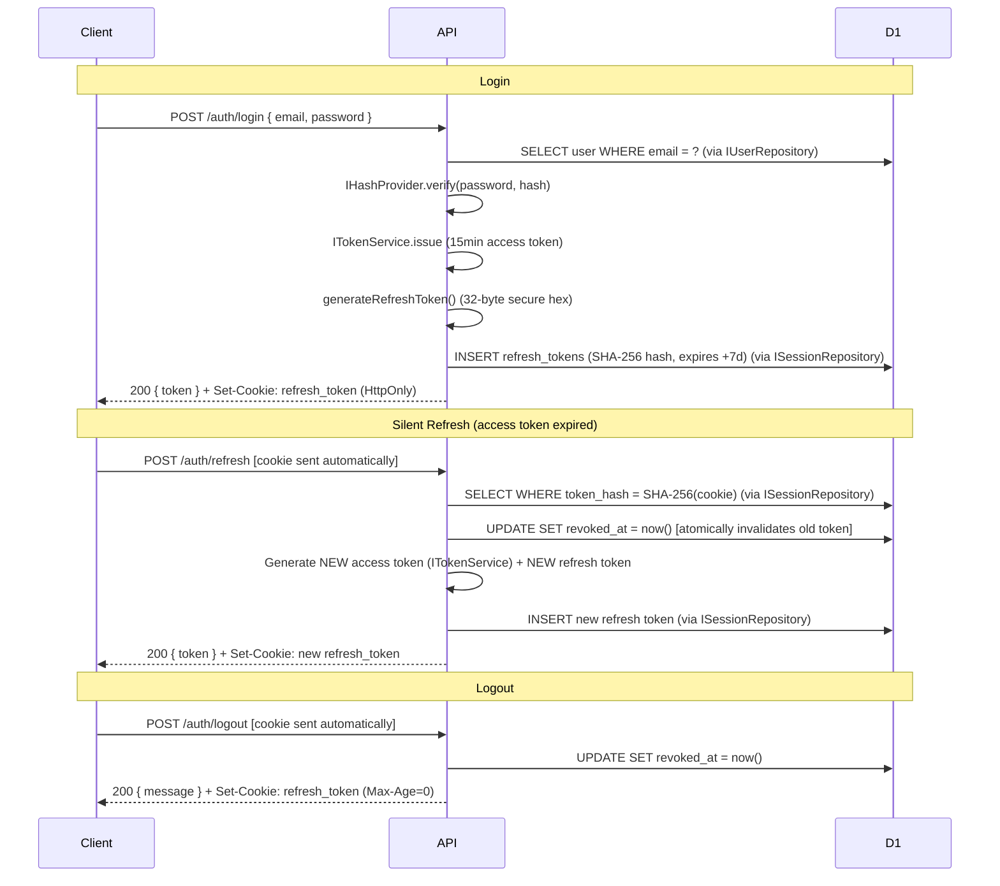

# API Reference — Beech CMS

This document is the authoritative reference for the Beech CMS REST API. It covers two distinct surfaces: the **Internal API** (JWT-authenticated, used by the dashboard) and the **Public API** (API-key-gated, designed for external consumers). All error responses conform to [RFC 7807 Problem Details](https://www.rfc-editor.org/rfc/rfc7807).

## Base URLs & Environments

| Environment | Base URL |
|---|---|
| Local (Wrangler dev) | `http://localhost:8787` |
| Production | Configured per deployment via Cloudflare Workers route |

All endpoints are served from a single Cloudflare Worker. The routing is handled by Hono.

---

## 2. Security Stack

### 2.1 JWT Authentication

The internal API uses **JSON Web Tokens** signed with HMAC-SHA256 (`HS256`). Token issuance and verification are handled by `ITokenService` (implemented by `JoseTokenService` using the `jose` library — the only file in the project that imports jose). The middleware in `apps/api/src/middleware/auth.middleware.ts` intercepts every protected request:

```typescript
// apps/api/src/middleware/auth.middleware.ts
export function authMiddleware() {
  return async (c: Context<AppEnv>, next: Next) => {
    const auth = c.req.header('Authorization')
    if (!auth?.startsWith('Bearer ')) throw new HTTPException(401, { res: unauthorizedResponse() })

    const token = auth.slice(7)
    const claims = await c.get('tokenService').verify(token)
    if (!claims) throw new HTTPException(401, { res: unauthorizedResponse() })

    c.set('jwtPayload', claims)
    await next()
  }
}
```

`ITokenService.verify()` returns `null` on any failure (expired, wrong signature, malformed) — it never throws. The concrete `JoseTokenService` enforces `typ: JWT` in the protected header and locks the algorithm to `HS256`. Both the secret and issuer/audience options are injected at startup via `authProvidersMiddleware`.

Access tokens have a **15-minute TTL**. They are stored **in-memory only** (`_accessToken` module variable in `apps/dashboard/src/lib/api.ts`) — never in `localStorage` or `sessionStorage`. The short TTL minimizes the attack window if a token is intercepted.

**Token payload shape:**

```typescript
export interface JwtClaims {
  sub: string;     // User ID (UUID)
  email?: string;
  name?: string;
  surname?: string;
  role?: string;
  [key: string]: unknown;
}
```

### 2.2 Refresh Token Rotation

Beech implements **single-use refresh token rotation**. The protocol is:



**Parallel request protection:** Only the first concurrent refresh request succeeds. Subsequent requests using the same (already-revoked) token receive `401 Invalid refresh token`. This is the primary defence against refresh token theft.

Refresh tokens are stored **hashed** (SHA-256) in D1. The plaintext token never persists beyond the HTTP response.

```sql
-- apps/api/migrations/0003_refresh_tokens.sql
CREATE TABLE refresh_tokens (
  id          TEXT PRIMARY KEY,
  user_id     TEXT NOT NULL REFERENCES users(id) ON DELETE CASCADE,
  token_hash  TEXT NOT NULL,   -- SHA-256 of the plaintext token
  expires_at  INTEGER NOT NULL,
  created_at  INTEGER DEFAULT (unixepoch()),
  revoked_at  INTEGER DEFAULT NULL  -- NULL = active
);
-- Indexes: idx_refresh_hash (token_hash), idx_refresh_user (user_id)
```

**Cleanup:** Expired and revoked tokens should be purged periodically (e.g., via a Cloudflare Workers Cron Trigger):

```sql
DELETE FROM refresh_tokens WHERE expires_at < unixepoch() OR revoked_at IS NOT NULL;
```

### 2.3 Security Hardening Summary

| Measure | Implementation |
|---|---|
| Password hashing | bcrypt, 10 salt rounds via `IHashProvider` (`BcryptHashProvider`) — passwords never stored in plaintext |
| Timing attack prevention | `IHashProvider.verify` always runs against a dummy hash when the user does not exist (`DUMMY_PASSWORD_HASH`) |
| SQL injection prevention | All D1 queries use `.bind(...)` prepared statements — no string interpolation |
| User enumeration prevention | `401 Invalid credentials` for both "user not found" and "wrong password" |
| Token storage | Refresh token: `HttpOnly`, `Secure`, `SameSite=Strict` cookie. Access token: in-memory only (`_accessToken` in dashboard client, never in `localStorage`/`sessionStorage`) |
| JWT hardening | Algorithm locked to `HS256`; `typ: JWT` header required |
| Short-lived access tokens | 15-minute TTL reduces the attack window |
| Rate limiting (login) | 5 attempts per IP+email per 60 seconds (Cloudflare Rate Limiting API) |
| Rate limiting (refresh) | 20 requests per IP per 60 seconds |
| Production error masking | All 500 errors return `"An error occurred"` — no stack traces or system details |

---

## 3. Auth Endpoints

### `POST /auth/login`

Authenticates a user and issues an access token + refresh token.

**Request**

```http
POST /auth/login
Content-Type: application/json

{
  "email": "admin@beech.local",
  "password": "password123"
}
```

**Validation rules:** Email must match `/.+@.+\..+/`; password must be 8–128 characters.

**Responses**

| Status | Condition | Body |
|---|---|---|
| `200` | Login successful | `{ "token": "eyJ...", "expiresIn": "15m" }` |
| `400` | Malformed body / missing fields / password out of range | `{ "error": "Invalid request" }` |
| `401` | Wrong credentials | `{ "error": "Invalid credentials" }` |
| `429` | Rate limit exceeded (5/min per IP+email) | `{ "error": "Too many requests" }` |
| `500` | Internal error | `{ "error": "An error occurred" }` |

**Headers on 200:** `Set-Cookie: refresh_token=<uuid>; HttpOnly; SameSite=Strict; Max-Age=604800; Path=/auth; Secure`

---

### `POST /auth/refresh`

Exchanges a valid refresh token cookie for a new access token. Rotates the refresh token.

**Request:** No body required. The `refresh_token` cookie is sent automatically by the browser.

**Responses**

| Status | Condition | Body |
|---|---|---|
| `200` | Refresh successful | `{ "token": "eyJ...", "expiresIn": "15m" }` |
| `401` | Token missing, expired, revoked, or user not found | `{ "error": "Invalid refresh token" }` |
| `429` | Rate limit exceeded (20/min per IP) | `{ "error": "Too many requests" }` |

---

### `POST /auth/logout`

Revokes the refresh token and clears the cookie.

**Request:** No body. Sends cookie automatically.

**Responses**

| Status | Body |
|---|---|
| `200` | `{ "message": "Logged out" }` |

---

### `GET /auth/features`

Returns feature flags for the dashboard. Used to conditionally show UI elements such as the "forgot password" link. **No authentication required.**

**Response `200`**

```json
{ "passwordReset": true }
```

`passwordReset` is `true` if and only if the `RESEND_API_KEY` environment variable is set on the Worker. When `false`, the forgot-password flow is entirely disabled — the dashboard hides the link and both password-reset endpoints return `503`.

---

### `POST /auth/forgot-password`

Triggers a password reset email. **No authentication required.**

**Request**

```http
POST /auth/forgot-password
Content-Type: application/json

{ "email": "user@example.com", "locale": "it" }
```

**Behaviour:**
- If the email does not match any user, the response is still `200` — user existence is never revealed.
- Any existing pending reset tokens for the same user are invalidated before issuing a new one.
- The reset token has a **30-minute TTL** and is stored as SHA-256 hash in D1 (`password_reset_tokens`).
- The email is sent via [Resend](https://resend.com) using the `RESEND_API_KEY` env var (production). In sviluppo locale il provider è Mailpit (vedi `docs/development.md`). Le chiamate seguono lo stesso contratto (`EmailProvider.send`), così la pipeline è identica a quella di produzione.
- The reset link is `${APP_URL}/reset-password?token=<plaintext_token>`.
- The `locale` field selects the email language. Supported values: `en` (default), `it`. Unknown values fall back to `en`.
- Rate limited: **3 requests per IP per 60 seconds** (`FORGOT_PASSWORD_RATE_LIMITER`).

**Required environment variables:**

| Variable | Description |
|---|---|
| `EMAIL_PROVIDER` | `smtp` (dev/test via Mailpit) or `resend` (production). Defaults to `resend` if absent. |
| `RESEND_API_KEY` | Resend API key. Required when `EMAIL_PROVIDER=resend`. If absent (and not using SMTP), the endpoint returns `503` and the dashboard hides the feature. |
| `APP_URL` | Base URL of the dashboard (e.g. `https://dashboard.beechcms.dev`). Used to build the reset link. Defaults to the API origin if not set (incorrect in most deployments — always set this). |
| `EMAIL_FROM` | *(Optional)* Sender address. Defaults to `Beech CMS <onboarding@resend.dev>` (Resend test sender). In production set to a verified domain address. |

**Responses**

| Status | Condition | Body |
|---|---|---|
| `200` | Always (email sent or email not found) | `{ "success": true }` |
| `400` | Missing or empty email | `{ "error": "Invalid request" }` |
| `429` | Rate limit exceeded | `{ "error": "Too many requests" }` |
| `503` | `RESEND_API_KEY` not configured | `{ "error": "Not available" }` |

---

### `POST /auth/reset-password`

Consumes a reset token and updates the user's password. **No authentication required.**

**Request**

```http
POST /auth/reset-password
Content-Type: application/json

{
  "token": "<plaintext_token_from_email_link>",
  "password": "new-secure-password",
  "locale": "it"
}
```

**Behaviour:**
- Looks up the SHA-256 hash of `token` in `password_reset_tokens` (JOIN `users` to retrieve email in one query).
- Token must be unused (`used_at IS NULL`) and not expired (`expires_at > now()`).
- On success, performs three sequential repository operations:
  1. Marks the reset token as used (`IPasswordResetTokenRepository.markUsed`).
  2. Updates `users.password_hash` with a fresh bcrypt hash via `IHashProvider` (`IUserRepository.updatePasswordHash`).
  3. Revokes **all active refresh tokens** for the user via `ISessionRepository.revokeAllForUser` — every existing session is logged out.
- After the batch, sends a **"password changed" security notification email** to the user via Resend (fire-and-forget via `waitUntil` — never blocks the `200` response). The notification email language follows `locale`.
- The `locale` field selects the email language. Supported values: `en` (default), `it`. Unknown values fall back to `en`.
- Password length must be 8–128 characters.
- Rate limited: **5 requests per IP per 60 seconds** (`RESET_PASSWORD_RATE_LIMITER`).

**Responses**

| Status | Condition | Body |
|---|---|---|
| `200` | Password updated | `{ "success": true }` |
| `400` | Missing/empty token or password, password out of range, token invalid/expired/used | `{ "error": "..." }` |
| `429` | Rate limit exceeded (5/min per IP) | `{ "error": "Too many requests" }` |
| `503` | `RESEND_API_KEY` not configured | `{ "error": "Not available" }` |

**D1 table — `password_reset_tokens`:**

```sql
-- apps/api/migrations/0025_password_reset_tokens.sql
CREATE TABLE password_reset_tokens (
  id          TEXT PRIMARY KEY,
  user_id     TEXT NOT NULL REFERENCES users(id) ON DELETE CASCADE,
  token_hash  TEXT NOT NULL,   -- SHA-256 of the plaintext token
  expires_at  INTEGER NOT NULL,
  created_at  INTEGER DEFAULT (unixepoch()),
  used_at     INTEGER DEFAULT NULL  -- NULL = unused
);
-- Indexes: idx_prt_hash (token_hash), idx_prt_user (user_id)
```

---

## 4. Internal Content API

All routes require `Authorization: Bearer <access_token>`.

The content engine uses the Botanical Engine to generate optimized SQL queries. Consumers always use **field aliases** (defined in the Seed).

---

### 4.1 List Entries — `GET /api/content/:seed`

Returns a paginated list of entries for a given content type.

**Request**

```http
GET /api/content/progetti?page=1&limit=20&status=published&orderBy=created_at&orderDir=desc
Authorization: Bearer eyJ...
```

**Query parameters**

| Parameter | Type | Description |
|---|---|---|
| `page` | `number` | Page number, default `1` |
| `limit` | `number` | Items per page, max `100` |
| `has_pending_draft` | `1\|true` | Se presente, restituisce solo le entry con una bozza pendente (`draft_data IS NOT NULL`) |
| `sortBy` | `string` | Field alias o `created_at` / `updated_at` |
| `sortDir` | `asc\|desc` | Sort direction, default `asc` |
| `search` | `string` | Full-text search against `slug`, `status`, `data` |
| `filters` | `string` | JSON serializzato di `QueryFilterGroup[]` — filtri avanzati per colonna |

**Response `200`**

```json
{
  "data": [
    {
      "id": "550e8400-e29b-41d4-a716-446655440000",
      "slug": "hello-world",
      "status": "published",
      "created_at": 1713600000,
      "updated_at": 1713600000,
      "data": {
        "title": "Hello World",
        "budget": 5000,
        "published_at": "2024-04-20"
      }
    }
  ],
  "meta": {
    "total": 42,
    "page": 1,
    "limit": 20,
    "returned": 20
  }
}
```

> **Note:** Although the data is stored in separate SQL columns, the API continues to return a `data` object containing the fields for backward compatibility with the dashboard and public API consumers.

---

### 4.2 Create Entry — `POST /api/content/:seed`

Creates a new content entry. Fields are validated and sanitized via `validateAndSanitizeSeedPayload` in `@beechcms/core`.

**Request**

```http
POST /api/content/progetti
Authorization: Bearer eyJ...
Content-Type: application/json

{
  "status": "draft",
  "slug": "my-project",
  "data": {
    "title": "My Project",
    "budget": 15000,
    "cover_image": "https://cdn.example.com/img.jpg"
  }
}
```

**Rules:**
- `status` must be `draft | review | published`
- `slug` is optional; auto-generated from `title` or `name` if absent, falling back to a short UUID
- `data` keys must be valid aliases defined in the Seed; unknown aliases return `400`
- `required_on_create` fields must be present and non-empty

**Response `201`**

```json
{
  "success": true,
  "id": "550e8400-e29b-41d4-a716-446655440000",
  "slug": "my-project"
}
```

**Error responses**

| Status | Condition |
|---|---|
| `400` | Unknown aliases, type mismatch, missing required fields, empty payload |
| `409` | Slug already exists for this content type |
| `422` | Dangerous markup detected in a richtext field |

---

### 4.3 Update Entry — `PUT /api/content/:seed/:id`

Partially updates an existing entry. Only fields present in the payload are updated — absent fields retain their current values. Fields sent as `null` are cleared.

**Request**

```http
PUT /api/content/progetti/550e8400-e29b-41d4-a716-446655440000
Authorization: Bearer eyJ...
Content-Type: application/json

{
  "status": "published",
  "data": {
    "title": "Updated Title",
    "budget": null
  }
}
```

**Response `200`**

```json
{
  "success": true,
  "id": "550e8400-e29b-41d4-a716-446655440000",
  "slug": "my-project"
}
```

---

### 4.4 Delete Entry — `DELETE /api/content/:seed/:id`

Deletes a content entry and removes all associated R2 media files.

**cascade behaviour:** Before the deletion, the API extracts all media keys from the entry's fields. It sends a `DeleteObjectCommand` per key. If R2 is not configured or a delete fails, **the deletion still proceeds** — media cleanup is best-effort.

> **Limitation:** Images embedded inside `richtext` fields (``) are not parsed during cascade deletion.

**Request**

```http
DELETE /api/content/progetti/550e8400-e29b-41d4-a716-446655440000
Authorization: Bearer eyJ...
```

**Response `200`**

```json
{ "success": true }
```

---

### 4.5 Rotate Hashed Field — `POST /api/content/:seed/:id/rotate-field`

Updates the value of a field marked with `privacy: 'hash'`. The caller must provide the current plaintext value for verification — the API hashes it and compares against the stored digest before accepting the new value. Both `current` and `next` are treated as plaintext and never persisted; only their SHA-256 digests are stored.

**Why this exists:** Fields with `privacy: 'hash'` are write-once through the normal `PUT` endpoint (which blocks any edit of sensitive fields). This endpoint is the only way to update them, and it enforces knowledge of the current value as a prerequisite.

**Request**

```http
POST /api/content/memberships/550e8400-e29b-41d4-a716-446655440000/rotate-field
Authorization: Bearer eyJ...
Content-Type: application/json

{
  "field": "password",
  "current": "old-plaintext",
  "next": "new-plaintext"
}
```

| Field | Type | Description |
|---|---|---|
| `field` | `string` | Alias of the branch to rotate. Must exist in the seed and have `privacy: 'hash'`. |
| `current` | `string` | Current plaintext value. Used to verify identity before the update. |
| `next` | `string` | New plaintext value. Validated against the branch type before hashing. |

**Response `200`**

```json
{ "success": true }
```

**Error responses**

| Status | `type` | Cause |
|---|---|---|
| `400` | `rotate-field-invalid-body` | Missing or empty `field`, `current`, or `next` |
| `400` | `rotate-field-unknown-field` | `field` alias does not exist in the seed |
| `400` | `rotate-field-invalid-next` | `next` fails the branch's Zod type validation |
| `401` | — | Missing or invalid JWT |
| `403` | `rotate-field-current-mismatch` | `current` does not match the stored hash |
| `404` | `content-seed-not-found` | Seed slug does not exist |
| `404` | `content-not-found` | Entry ID does not exist |
| `422` | `rotate-field-not-hashable` | `field` exists but its `privacy` is not `hash` |
| `422` | `rotate-field-not-set` | The field has no stored value (was never written) |

**Implementation note:** This endpoint is implemented as a VSA slice under `apps/api/src/features/rotate-field/`. The `verifyHashField` and `sha256hex` utilities are exported from `@beechcms/core`.

---

Il sistema di bozze pendenti permette di salvare modifiche su un'entry già pubblicata senza renderle immediatamente visibili al pubblico. In v0.4.0, questo è gestito tramite una tabella speculare `content_{slug}_drafts` che contiene le modifiche non ancora pubblicate.

**Prerequisito:** il Seed deve avere `allowDrafts: true` nello schema del Seed (configurabile via Seed Builder nella Dashboard o tramite API `/api/seeds`). Se il flag è assente o `false`, tutti gli endpoint di questa sezione rispondono `405 Method Not Allowed`.

> **Distinzione fondamentale:** `status = 'draft'` identifica un'entry mai pubblicata. Una bozza pendente è invece un'entry **già pubblicata** che ha una riga corrispondente nella tabella dei draft.

---

Crea o sovrascrive la bozza pendente nella tabella `content_{slug}_drafts`. I dati vengono validati e serializzati tramite il Botanical Engine.

**Request**

```http
PUT /api/content/articoli/550e8400-e29b-41d4-a716-446655440000/draft
Authorization: Bearer eyJ...
Content-Type: application/json

{
  "title": "Titolo aggiornato",
  "body": { "schemaVersion": 1, "doc": { "type": "doc", "content": [] } }
}
```

Il payload usa alias (`title`, `body`). Si possono inviare anche solo alcuni campi — non è necessario inviare l'entry completa.

**Response `200`**

```json
{ "success": true }
```

**Error responses**

| Status | `type` | Causa |
|---|---|---|
| `400` | `content-invalid-json` | Body non è JSON valido |
| `400` | `content-validation-failed` | Tipo errato o alias sconosciuto |
| `404` | `content-not-found` | Entry non trovata |
| `405` | `draft-not-allowed` | Il Seed non ha `allowDrafts: true` |
| `422` | `content-sensitive-field-edit` | Il payload include campi con `privacy !== 'plain'` |
| `422` | `content-dangerous-content` | Markup pericoloso rilevato in un campo richtext |

---

#### `GET /api/content/:seed/:id/draft`

Legge la bozza pendente corrente. Utile per mostrare un'anteprima nell'editor prima della pubblicazione.

**Request**

```http
GET /api/content/articoli/550e8400-e29b-41d4-a716-446655440000/draft
Authorization: Bearer eyJ...
```

**Response `200`**

```json
{
  "data": {
    "title": "Titolo aggiornato",
    "body": { "schemaVersion": 1, "doc": { "type": "doc", "content": [] } }
  }
}
```

I campi sono in formato alias, con le policy di visibilità già applicate (`applyVisibility`).

**Error responses**

| Status | `type` | Causa |
|---|---|---|
| `404` | `content-not-found` | Entry non trovata |
| `404` | `draft-not-found` | L'entry esiste ma non ha una bozza pendente (nessuna riga in `content_{slug}_drafts`) |
| `405` | `draft-not-allowed` | Il Seed non ha `allowDrafts: true` |

---

Promuove la bozza pendente al contenuto vivo in un'unica operazione atomica SQL (`INSERT INTO ... SELECT ...`).

Dopo la scrittura, i trigger SQL aggiornano l'indice FTS5 e viene registrata l'attività nel log.

**Request**

```http
POST /api/content/articoli/550e8400-e29b-41d4-a716-446655440000/draft/publish
Authorization: Bearer eyJ...
```

Nessun body richiesto.

**Response `200`**

```json
{ "success": true }
```

**Error responses**

| Status | `type` | Causa |
|---|---|---|
| `404` | `content-not-found` | Entry non trovata |
| `404` | `draft-not-found` | Nessuna bozza pendente da pubblicare |
| `405` | `draft-not-allowed` | Il Seed non ha `allowDrafts: true` |

---

#### `DELETE /api/content/:seed/:id/draft`

Scarta la bozza pendente eliminando la riga dalla tabella dei draft. Il contenuto vivo non viene modificato.

**Request**

```http
DELETE /api/content/articoli/550e8400-e29b-41d4-a716-446655440000/draft
Authorization: Bearer eyJ...
```

**Response `200`**

```json
{ "success": true }
```

**Error responses**

| Status | `type` | Causa |
|---|---|---|
| `404` | `content-not-found` | Entry non trovata |
| `405` | `draft-not-allowed` | Il Seed non ha `allowDrafts: true` |

---

#### Ciclo di vita completo

```
Entry pubblicata
      │
      │  PUT /draft  (salva modifiche nella tabella mirror)
      ▼
content_{slug}_drafts  ←── visibile solo nell'editor (anteprima via GET /draft)
content_{slug}         ←── ancora servita al pubblico
      │
      ├── POST /draft/publish  →  aggiorna riga principale dalla mirror (atomico)
      │
      └── DELETE /draft        →  elimina riga mirror (scarta le modifiche)
```

---

## 5. Media Engine

Il Worker non riceve mai bytes di file. Agisce solo da gatekeeper (auth, validazione, firma). Il client carica direttamente su R2/MinIO tramite URL presigned.

**Client upload sequence:**

```
1. POST /api/upload/presign  →  { uploadUrl, key, expiresIn }
2. PUT <uploadUrl> (diretto a R2)  →  200 OK
3. POST /api/upload/confirm  →  { url }
```

---

### 5.1 Presign — `POST /api/upload/presign`

Genera una URL firmata (Signature V4, TTL 900 s) per upload diretto client → R2. Richiede JWT.

**Request**

```http
POST /api/upload/presign
Authorization: Bearer eyJ...
Content-Type: application/json

{
  "filename": "photo.jpg",
  "mimeType": "image/jpeg",
  "sizeBytes": 204800
}
```

**Response `200`**

```json
{
  "uploadUrl": "https://<bucket>.r2.cloudflarestorage.com/12345-photo.jpg?X-Amz-Signature=...",
  "key": "12345-photo.jpg",
  "expiresIn": 900
}
```

**Error responses**

| Status | Body |
|---|---|
| `400` | `{ "error": "filename is required" }` |
| `400` | `{ "error": "mimeType is required" }` |
| `400` | `{ "error": "sizeBytes must be a positive number" }` |
| `400` | `{ "error": "File too large. Max <N> bytes" }` |
| `400` | `{ "error": "File type not allowed" }` |

**Limiti dimensione:**
- Default: **50 MB** (`DEFAULT_MAX_UPLOAD_BYTES`)
- Configurabile via `MAX_UPLOAD_BYTES` (env/secret)
- Hard cap assoluto: **500 MB** (non superabile via env)

---

### 5.2 Confirm — `POST /api/upload/confirm`

Verifica che l'oggetto sia effettivamente presente su R2 via `HEAD`, quindi registra i metadati in D1. **Idempotente**: un secondo confirm sullo stesso key ritorna 200 senza duplicare tracking o stats.

**Request**

```http
POST /api/upload/confirm
Authorization: Bearer eyJ...
Content-Type: application/json

{ "key": "12345-photo.jpg" }
```

**Response `200`**

```json
{ "url": "https://api.beech.local/api/media/12345-photo.jpg" }
```

**Error responses**

| Status | Body |
|---|---|
| `400` | `{ "error": "key is required" }` |
| `404` | `{ "error": "Object not found in storage" }` |

---

### 5.3 Download URL — `GET /api/upload/download-url/:key`

Genera una URL firmata di **lettura** per asset privati. TTL 900 s. Richiede JWT.

**Response `200`**

```json
{ "downloadUrl": "https://...", "expiresIn": 900 }
```

---

### 5.4 Serve — `GET /api/media/:key`

Proxy pubblico: scarica il file da R2 e lo restituisce con `Content-Type` originale e `Cache-Control: public, max-age=31536000, immutable`. Non richiede autenticazione.

**CDN Support:** Se `MEDIA_CDN_URL` è configurato, le URL pubbliche puntano direttamente al CDN.

---

### 5.5 Delete — `DELETE /api/upload/:key`

Elimina l'oggetto da R2 e rimuove il tracciamento da D1 (`media_objects` + `system_stats`). Richiede JWT.

---

### 5.6 Variabili ambiente

| Variable | Description |
|---|---|
| `R2_ACCESS_KEY_ID` | R2 API token access key |
| `R2_SECRET_ACCESS_KEY` | R2 API token secret key |
| `R2_ENDPOINT` | R2 S3-compatible endpoint URL |
| `R2_BUCKET_NAME` | Target bucket name (e.g. `beech-media`) |
| `MEDIA_CDN_URL` | *(Opzionale)* URL CDN per media pubblici |
| `MAX_UPLOAD_BYTES` | *(Opzionale)* Limite dimensione upload in bytes (default 50 MB, max 500 MB) |

---

### 5.7 Storage Abstraction

BeechCMS usa uno storage layer vendor-agnostic (`BeechBucket`, `@beechcms/core`):

- **`S3Bucket`**: S3-compatible HTTP API. Usato per generare **Presigned URLs (SigV4)** sia in produzione (Cloudflare R2 con API Token) sia in sviluppo locale (MinIO). I file vengono caricati direttamente dal browser su R2 senza impegnare la memoria del Worker.
- **`R2BucketAdapter`**: Wrapper del binding nativo Cloudflare `env.MEDIA_BUCKET` (`R2Bucket`). Ottimizzato per servire file e leggere/eliminare oggetti in-memory all'interno del runtime Worker.
- **`NullBucket`**: Fail-safe — restituisce un errore esplicito 503 con istruzioni di configurazione quando lo storage non è configurato.

**Storage Tracking:** ogni upload e cancellazione è tracciato in `media_objects`. Il counter `total_storage_bytes` in `system_stats` è aggiornato atomicamente al confirm/delete.

---

## 6. Public API

The Public API (`/api/v1/public/`) is a purpose-built, hardened endpoint for external consumption — headless frontends, static site generators, third-party integrations. It does **not** require a user session.

### 6.1 Permission Model

Access is controlled at two levels:

**Level 1 — Seed capability flags** (defined in the `Seed` schema via Dashboard or API):

```typescript
interface Seed {
  allowPublicRead?: boolean;   // Enables GET /api/v1/public/:seed
  allowPublicPost?: boolean;   // Enables POST /api/v1/public/:seed/add
  allowPublicEdit?: boolean;   // Enables PUT /api/v1/public/:seed/edit/:id
}
```

If a flag is `false` or absent, the endpoint returns `403` regardless of the API key provided. This is a **fail-closed** design: new content types are private by default.

**Level 2 — API key split** (environment variables):

| Variable | Grants access to |
|---|---|
| `PUBLIC_READ_API_KEY` | `GET /api/v1/public/*` |
| `PUBLIC_WRITE_API_KEY` | `POST` and `PUT /api/v1/public/*` |

The key must be sent via the `X-API-Key` header. Separate read and write keys provide defence-in-depth: a leaked read key cannot be used to create or mutate content.

**Level 3 — Published-only filter** (environment variable):

Setting `PUBLIC_PUBLISHED_ONLY=true` causes all public read queries to automatically append `AND status = 'published'`. Entries in `draft` or `review` status are invisible to external consumers without any additional filtering logic in the client.

---

### 6.2 Rate Limiting

The Public API uses Cloudflare's native Rate Limiting API (requires Wrangler ≥ 4.36). Read and write operations have separate limiters:

```jsonc
// wrangler.jsonc
{
  "rate_limits": [
    { "name": "PUBLIC_READ_RATE_LIMITER",  "namespace_id": 1003, "simple": { "limit": 100, "period": 60 } },
    { "name": "PUBLIC_WRITE_RATE_LIMITER", "namespace_id": 1004, "simple": { "limit": 20,  "period": 60 } }
  ]
}
```

The rate limit key is `<client_ip>:<seed>:<read|write>`, extracted from the `cf-connecting-ip` header. On limit breach, the middleware returns before executing any business logic:

```http
HTTP/1.1 429 Too Many Requests
Content-Type: application/problem+json

{
  "type": "https://beechcms.dev/problems/rate-limit-exceeded",
  "title": "Too Many Requests",
  "status": 429,
  "detail": "Too many requests",
  "instance": "/api/v1/public/articoli"
}
```

---

### 6.3 Schema — `GET /api/v1/public/schema`

Returns the public-facing schema: only seeds that have at least one public operation enabled (`allowPublicRead`, `allowPublicPost`, or `allowPublicEdit`). Useful for frontend introspection, SDK generation, and onboarding.

**Auth:** requires `PUBLIC_READ_API_KEY` via `X-API-Key` header (same as all other public `GET` routes).

**Request**

```http
GET /api/v1/public/schema
X-API-Key: your-public-read-key
```

**Response `200`**

```json
{
  "seeds": [
    {
      "slug": "posts",
      "label": "Post",
      "labelPlural": "Posts",
      "allowPublicRead": true,
      "allowPublicPost": false,
      "allowPublicEdit": false,
      "branches": [
        {
          "alias": "title",
          "type": "text",
          "label": "Title",
          "requiredOnCreate": true,
          "policies": { "public": true, "visibility": "full" }
        },
        {
          "alias": "body",
          "type": "richtext",
          "label": "Body",
          "requiredOnCreate": false,
          "policies": { "public": true, "visibility": "full" }
        }
      ]
    }
  ]
}
```

Branches with `policies.public: false` (i.e. stripped from read responses) are still listed here — the `policies` object tells the consumer exactly what is and is not returned at runtime.

**HTML variant**

Append `.html` to get a browser-readable render of the same data — useful for quick manual inspection:

```
GET /api/v1/public/schema.html
X-API-Key: your-public-read-key
```

---

### 6.4 Read — `GET /api/v1/public/:seed`

Reads one or many entries. Requires `allowPublicRead: true` on the Seed.

**Query parameters**

| Parameter | Description |
|---|---|
| `id` | Fetch a single entry by UUID |
| `page` / `limit` | Pagination (limit clamped to max 100) |
| `all=true` | Returns all entries (up to 100) ignoring pagination |
| `latest=N` | Returns the N most recent entries (1–100, default 10) |
| `search` | Full-text search against `slug`, `status`, `data` |
| `orderBy` / `orderDir` | Sorting by field alias or `created_at` / `updated_at` |
| `filter` | JSON filter object (see below) |
| `fields` | Comma-separated list of aliases to include in the response |

**Advanced filter syntax:**

```json
{
  "logic": "AND",
  "where": [
    { "field": "status",     "op": "eq",       "value": "published" },
    { "field": "budget",     "op": "gte",       "value": 1000 },
    { "field": "tags",       "op": "hasanytag", "value": ["design", "dev"] }
  ]
}
```

Supported operators: `eq`, `neq`, `gt`, `gte`, `lt`, `lte`, `contains`, `notcontains`, `startswith`, `endswith`, `isempty`, `isnotempty`, `in`, `notin`, `hastag`, `hasanytag`, `hasalltags`.

**Single entry request**

```http
GET /api/v1/public/articoli?id=550e8400-e29b-41d4-a716-446655440000
X-API-Key: dev-public-read-key-changeme
```

**Response `200` (single)**

```json
{
  "data": {
    "id": "550e8400-e29b-41d4-a716-446655440000",
    "slug": "my-article",
    "status": "published",
    "created_at": 1713600000,
    "updated_at": 1713600000,
    "title": "My Article",
    "body": { "schemaVersion": 1, "doc": { "type": "doc", "content": [] } },
    "cover_image": "https://api.beech.local/api/media/1713600000-cover.jpg"
  },
  "meta": { "seed": "articoli" }
}
```

> **Important:** The response is **flat** — content fields (`title`, `body`, `cover_image`) are at the same level as `id`, `slug`, and `status`. There is no nested `data` object. All fields use their **alias** names, never internal IDs (`br01`, `br02`).

**List request**

```http
GET /api/v1/public/articoli?page=1&limit=10&orderBy=created_at&orderDir=desc
X-API-Key: dev-public-read-key-changeme
```

**Response `200` (list)**

```json
{
  "data": [ { "id": "...", "slug": "...", "title": "...", "..." : "..." } ],
  "meta": {
    "total": 24,
    "page": 1,
    "limit": 10,
    "returned": 10,
    "seed": "articoli"
  }
}
```

---

### 6.5 Create — `POST /api/v1/public/:seed/add`

Creates an entry via the Public API. Requires `allowPublicPost: true` on the Seed and `PUBLIC_WRITE_API_KEY`.

**Pipeline (in order):**
1. Seed existence check
2. `allowPublicPost` policy check
3. JSON body parse
4. `data` object non-empty check
5. `validateAndSanitizeSeedPayload` (Zod, `operation: create`, `enforceRequiredFields: true`)
6. Idempotency key check (optional — send `Idempotency-Key` header for safe retries)
7. Slug uniqueness check
8. D1 `INSERT` with prepared statement

**Request**

```http
POST /api/v1/public/articoli/add
X-API-Key: dev-public-write-key-changeme
Content-Type: application/json
Idempotency-Key: my-client-request-id-001   ← optional

{
  "status": "published",
  "slug": "my-article",
  "data": {
    "title": "My Article",
    "body": "Content here"
  }
}
```

**Response `201`**

```json
{
  "success": true,
  "id": "550e8400-e29b-41d4-a716-446655440000",
  "slug": "my-article"
}
```

**Idempotency behaviour:**

| Condition | Response |
|---|---|
| Same key, same payload, within TTL | Returns cached `201` response — no duplicate insert |
| Same key, **different** payload, within TTL | `409 Conflict` |
| Expired key | Treated as a new request |

---

### 6.6 Update — `PUT /api/v1/public/:seed/edit/:id`

Partially updates an existing entry. Requires `allowPublicEdit: true` on the Seed.

**Merge semantics:**
- Fields present in `data` overwrite the stored value
- Fields absent from `data` retain their current value
- Fields sent as `null` are **removed** from the stored data

**Request**

```http
PUT /api/v1/public/articoli/edit/550e8400-e29b-41d4-a716-446655440000
X-API-Key: dev-public-write-key-changeme
Content-Type: application/json

{
  "status": "published",
  "data": {
    "title": "Updated Title",
    "body": null
  }
}
```

**Response `200`**

```json
{
  "success": true,
  "id": "550e8400-e29b-41d4-a716-446655440000",
  "slug": "my-article"
}
```

---

## 7. Error Model

All API errors from the Public API use **RFC 7807 Problem Details** (`Content-Type: application/problem+json`). Internal API errors use a simpler `{ "error": "..." }` envelope.

**Public API error shape:**

```json
{
  "type": "https://beechcms.dev/problems/validation-failed",
  "title": "Bad Request",
  "status": 400,
  "detail": "Validation failed",
  "instance": "/api/v1/public/articoli/add",
  "errors": [
    {
      "field": "title",
      "expected": "string",
      "received": "number",
      "message": "Field 'title' expects type 'string' but received 'number'"
    },
    {
      "field": "publish_date",
      "expected": "date|ISO",
      "received": "string",
      "message": "Field 'publish_date' expects type 'date|ISO' but received 'string'"
    }
  ]
}
```

**Standard `type` URIs:**

| `type` slug | HTTP Status | Meaning |
|---|---|---|
| `seed-not-found` | `404` | Content type does not exist in `SEED_REGISTRY` |
| `operation-not-allowed` | `403` | Seed flag (`allowPublicRead` etc.) is `false` |
| `entry-not-found` | `404` | No entry with the given `id` for this seed |
| `validation-failed` | `400` | Field type mismatch, missing required field, unknown alias |
| `dangerous-content` | `422` | Dangerous markup detected (script tags, `on*` handlers, `javascript:` protocols) in a richtext or text field |
| `invalid-json-body` | `400` | Request body is not valid JSON |
| `slug-conflict` | `409` | Slug already exists for this content type |
| `idempotency-key-conflict` | `409` | Idempotency key reused with a different payload |
| `rate-limit-exceeded` | `429` | IP exceeded per-seed rate limit |
| `internal-server-error` | `500` | Unhandled server error (detail masked in production) |

> **Note:** The `errors` array is only present on `validation-failed` responses. It provides field-level detail for every field that failed validation. No legacy `message` or `error` keys are present in the Public API error envelope.

---

## 8. Widget API

### 8.1 Overview

The Widget API exposes five read-only aggregate endpoints at `/api/widget/:seed/*` designed exclusively for the dashboard's widget layer. All endpoints are JWT-protected (same `Authorization: Bearer <token>` flow as §4). They never bypass the Botanical Engine: incoming `column` aliases are resolved to `json_extract(data, '$.br_XX')` expressions server-side.

**Base path:** `/api/widget`  
**Auth:** `Authorization: Bearer <access_token>` (15-min JWT, same as Internal Content API)  
**Source file:** `apps/api/src/widget.ts`

### 8.2 `AggregateFormula` Type

All endpoints that accept a `formula` query parameter expect a JSON-encoded object matching this discriminated union:

```typescript
type AggregateFormula =
  | { op: 'count' }                                                      // COUNT(*)
  | { op: 'sum';          column: string }                               // SUM(column)
  | { op: 'avg';          column: string }                               // AVG(column)
  | { op: 'min';          column: string }                               // MIN(column)
  | { op: 'max';          column: string }                               // MAX(column)
  | { op: 'countWhere';   column: string; value: unknown }              // COUNT(CASE WHEN column = value)
  | { op: 'percentageOf'; numeratorColumn: string; denominatorColumn: string } // SUM(num)/SUM(den)*100
```

`column` values are **API aliases** (e.g. `"price"`, `"created_at"`), not internal IDs. System columns (`id`, `slug`, `status`, `created_at`, `updated_at`) are passed through directly without Botanical Engine translation.

### 8.3 `TimeWindow` Type

```typescript
type TimeWindow = 'week' | 'month' | 'year' | 'all'
```

| Value | D1 Filter Applied |
|---|---|
| `week` | `created_at >= unixepoch('now', '-7 days')` |
| `month` | `created_at >= unixepoch('now', '-1 month')` |
| `year` | `created_at >= unixepoch('now', '-1 year')` |
| `all` | no filter (full table scan for the seed) |

### 8.4 Aggregate — `GET /api/widget/:seed/aggregate`

Evaluates a single formula against all entries of a seed within a time window.

**Query parameters:**

| Parameter | Type | Required | Description |
|---|---|---|---|
| `formula` | JSON string | Yes | JSON-encoded `AggregateFormula` |
| `window` | `TimeWindow` | No | Default `'all'` |

**Response `200`:**

```json
{ "value": 142, "window": "month" }
```

**Errors:** `400` if `formula` is missing or invalid JSON; `404` if seed slug not found.

**Example:**

```
GET /api/widget/articoli/aggregate?formula={"op":"count"}&window=month
→ { "value": 14, "window": "month" }

GET /api/widget/prodotti/aggregate?formula={"op":"sum","column":"price"}&window=year
→ { "value": 48920.5, "window": "year" }
```

### 8.5 Growth — `GET /api/widget/:seed/growth`

Runs the formula twice — once for the current window, once for the same-length previous window — and returns the delta.

**Window split logic:**

| `window` | Current period | Previous period |
|---|---|---|
| `week` | last 7 days | 8–14 days ago |
| `month` | last 30 days | 31–60 days ago |
| `year` | last 365 days | 366–730 days ago |
| `all` | entire table | empty (previous = 0) |

**Query parameters:**

| Parameter | Type | Required | Description |
|---|---|---|---|
| `formula` | JSON string | Yes | JSON-encoded `AggregateFormula` |
| `window` | `TimeWindow` | Yes | Determines the split boundary |

**Response `200`:**

```json
{
  "current": 14,
  "previous": 9,
  "percentageChange": 55.6,
  "trend": "up"
}
```

`percentageChange` is rounded to one decimal place. When `previous = 0` and `current > 0`, `percentageChange = 100`. `trend` is `"up"` when `percentageChange > 0`, `"down"` when `< 0`, `"flat"` when `= 0`.

### 8.6 Leaderboard — `GET /api/widget/:seed/leaderboard`

Returns entries sorted by a numeric field, with the label resolved from `seed.displayNameAlias`.

**Query parameters:**

| Parameter | Type | Required | Default | Description |
|---|---|---|---|---|
| `scoreColumn` | string (alias) | Yes | — | Field alias to sort and score by |
| `limit` | integer | No | `10` | Max entries (capped at 100) |
| `orderDir` | `'asc'` \| `'desc'` | No | `'desc'` | Sort direction |

**Response `200`:**

```json
[
  { "id": "abc123", "label": "Prodotto Alpha", "score": 299.99 },
  { "id": "def456", "label": "Prodotto Beta",  "score": 149.00 }
]
```

Entries where `scoreColumn` is `NULL` are excluded. `label` falls back to `id` if `displayNameAlias` branch is not set.

### 8.7 List — `GET /api/widget/:seed/list`

Paginated list of entries with optional search, filters, and sorting. Returns entries with aliases resolved via `dbToApi`.

**Query parameters:**

| Parameter | Type | Required | Default | Description |
|---|---|---|---|---|
| `search` | string | No | — | LIKE filter on `displayNameAlias` field (`%value%`) |
| `filters` | JSON array | No | — | Array of `{ column, op, value }` — see filter ops below |
| `orderBy` | string (alias) | No | `created_at` | Sort column (alias or system column) |
| `orderDir` | `'asc'` \| `'desc'` | No | `'asc'` | Sort direction |
| `limit` | integer | No | `25` | Page size (capped at 100) |
| `offset` | integer | No | `0` | Pagination offset |

**Filter operators** (`op` field):

| `op` | SQL equivalent |
|---|---|
| `eq` or `=` | `= ?` |
| `neq` or `!=` | `!= ?` |
| `like` | `LIKE ?` |
| `gt` or `>` | `CAST(…) > ?` |
| `lt` or `<` | `CAST(…) < ?` |

Unknown operators are silently ignored.

**Response `200`:**

```json
{
  "entries": [
    {
      "id": "abc123",
      "slug": "prodotto-alpha",
      "status": "published",
      "createdAt": 1700000000,
      "updatedAt": 1700001000,
      "title": "Prodotto Alpha",
      "price": 299.99
    }
  ],
  "total": 42
}
```

All content fields are returned with API aliases (never internal `br_XX` keys).

### 8.8 Timeseries — `GET /api/widget/:seed/timeseries`

Groups entries by a date column and aggregates a value column, returning a time series for charting.

**Query parameters:**

| Parameter | Type | Required | Default | Description |
|---|---|---|---|---|
| `valueColumn` | string (alias) | Required if formula ≠ `count` | — | Numeric field to aggregate |
| `groupColumn` | string (alias) | No | `created_at` | Date field to group by (stored as unix timestamp) |
| `formula` | `'sum'` \| `'avg'` \| `'count'` | No | `'count'` | Aggregation function |
| `window` | `TimeWindow` | No | `'all'` | Time range filter on `created_at` |

Date buckets are formatted as `YYYY-MM-DD` strings using D1's `strftime`.

**Response `200`:**

```json
{
  "points": [
    { "label": "2025-01-01", "value": 3 },
    { "label": "2025-01-02", "value": 7 },
    { "label": "2025-01-03", "value": 2 }
  ]
}
```

Points are ordered ascending by date. Days with no entries are omitted (no zero-fill).

---

### 8.9 Distribution — `GET /api/widget/distribution/:seed`

Groups entries by a column and returns the count of entries per distinct value, ordered descending by count.

**Query parameters:**

| Parameter | Type | Required | Default | Description |
|---|---|---|---|---|
| `column` | string (alias) | Yes | — | Field to group by |
| `window` | `TimeWindow` | No | `'all'` | Time range filter on `created_at` |
| `limit` | number | No | `8` | Maximum number of slices returned (max `24`) |

**Response `200`:**

```json
{
  "slices": [
    { "label": "published", "value": 12 },
    { "label": "draft", "value": 4 },
    { "label": "∅", "value": 1 }
  ]
}
```

`NULL` values are returned under the label `"∅"`. Values beyond `limit` are **not** merged into an
"other" bucket — the client decides how to present truncation (e.g. a "+N more" caption).

---

## 10. Automations API

All automation routes require JWT authentication (same `Authorization: Bearer` header as the content API).

Base path: `/api/automations`

### List Automations

**`GET /api/automations?seed=<slug>`**

Returns all automations declared for a seed, ordered by `created_at DESC`.

**Query params:**

| Param | Type | Required | Description |
|-------|------|----------|-------------|
| `seed` | string | Yes | Seed slug |

**Response `200 OK`:**

```json
[
  {
    "id": "uuid",
    "seed_slug": "articles",
    "name": "Notify on publish",
    "enabled": true,
    "trigger_event": "update",
    "trigger_cron": null,
    "trigger_conditions": [{ "field": "status", "op": "eq", "value": "published" }],
    "actions": [{ "type": "webhook", "url": "https://example.com/hook" }],
    "created_at": 1700000000,
    "updated_at": 1700000000
  }
]
```

---

### Get Automation

**`GET /api/automations/:id`**

**Response `200 OK`:** Single automation object (same shape as above).

**Response `404 Not Found`:** RFC 7807 Problem Details.

---

### Create Automation

**`POST /api/automations`**

**Request body:**

```json
{
  "seed_slug": "articles",
  "name": "Send welcome email",
  "trigger_event": "create",
  "trigger_cron": null,
  "trigger_conditions": null,
  "actions": [
    {
      "type": "send_mail",
      "to": "\{\{email\}\}",
      "subject_template": "Welcome, \{\{name\}\}!",
      "body_template": "Your entry has been created."
    }
  ]
}
```

**Trigger events:** `create | update | delete | cron`

When `trigger_event` is `cron`, `trigger_cron` must be a valid cron expression (e.g. `"0 9 * * 1"` = every Monday at 09:00).

**Action types:**

| type | Required fields | Optional fields |
|------|-----------------|-----------------|
| `webhook` | `url` | `method` (POST/GET/PUT), `headers`, `body_template` |
| `send_mail` | `to`, `subject_template`, `body_template` | — |
| `edit_field` | `field`, `value` | — |
| `create_entry` | `seed_slug`, `field_map` | — |
| `set_variable` | `name` | `seed_slug`, `fixed_id`, `column`, `filters`, `order_by`, `order` |

`body_template`, `subject_template`, `to`, and `field_map` values support template interpolation. You can access the triggering entry via <span v-pre>`\{\{this.fieldAlias\}\}`</span> or <span v-pre>`\{\{this:fieldAlias\}\}`</span>, and access variables declared by `set_variable`. See the [Automations Guide](automations.md) for full syntax and variable resolution semantics.

**Response `201 Created`:**

```json
{ "id": "uuid" }
```

**Response `400 Bad Request`:** Zod validation failure or missing `trigger_cron` when event is `cron`.

---

### Update Automation

**`PUT /api/automations/:id`**

Partial update — only fields present in the body are changed. Same shape as the create body; all fields are optional. If `trigger_event` resolves to `cron` after merge, `trigger_cron` must be non-null.

**Response `204 No Content`**

---

### Toggle Automation

**`PATCH /api/automations/:id/toggle`**

Atomic single-field flip. Does not require the full automation body.

**Request body:**

```json
{ "enabled": false }
```

**Response `204 No Content`**

---

### Delete Automation

**`DELETE /api/automations/:id`**

**Response `204 No Content`**

---

## 10. Seed Builder & Schema Mutation API

All routes under `/api/seeds` require JWT authentication and user role verification (`requireAdmin`).

These endpoints drive the **Seed Builder UI** in the dashboard and interact with the `D1SeedRepository` and `D1SchemaMutator` to execute schema changes.

---

### `GET /api/seeds`

Lists all registered seed definitions from the database.

**Request**
```http
GET /api/seeds
Authorization: Bearer eyJ...
```

**Response `200`**
```json
[
  {
    "slug": "posts",
    "label": "Post",
    "labelPlural": "Posts",
    "status": "active",
    "source": "code",
    "branches": [...]
  }
]
```

---

### `GET /api/seeds/:slug`

Retrieves a single seed definition by its slug.

**Request**
```http
GET /api/seeds/posts
Authorization: Bearer eyJ...
```

---

### `POST /api/seeds`

Creates a new content type (Seed). This dynamically persists the seed definition to the database, schedules the Botanical Engine to construct the new `content_{slug}` table (and draft/FTS virtual tables if needed) via additive DDL, and bumps the registry version token.

**Request**
```http
POST /api/seeds
Authorization: Bearer eyJ...
Content-Type: application/json

{
  "slug": "books",
  "label": "Book",
  "labelPlural": "Books",
  "displayNameAlias": "title",
  "allowDrafts": true,
  "branches": [
    { "alias": "title", "label": "Title", "type": "text", "requiredOnCreate": true },
    { "alias": "author", "label": "Author", "type": "text" }
  ]
}
```

---

### `PUT /api/seeds/:slug`

Performs an additive update of a seed definition. You can add new fields (branches) or modify seed configuration metadata. This applies additive DDL (`ALTER TABLE ... ADD COLUMN`) and bumps the registry version token.

> **Note:** Destructive field alterations like renaming aliases, changing field types, or dropping columns are blocked through the `PUT` endpoint (yielding validation errors like `alias-rename-not-supported` or `branch-type-change-not-supported`). They must go through the dedicated `Danger Zone` PATCH/DELETE routes below.

**Request**
```http
PUT /api/seeds/books
Authorization: Bearer eyJ...
Content-Type: application/json

{
  "label": "Book",
  "labelPlural": "Books",
  "displayNameAlias": "title",
  "allowDrafts": true,
  "branches": [
    { "alias": "title", "label": "Title", "type": "text", "requiredOnCreate": true },
    { "alias": "author", "label": "Author", "type": "text" },
    { "alias": "isbn", "label": "ISBN", "type": "text" } -- New branch added
  ]
}
```

---

### `DELETE /api/seeds/:slug`

Soft-deletes a content type. This flips its database status to `deleted` (hiding it from the dashboard and normal API calls), but retains its D1 table and content. This is safe and reversible.

**Request**
```http
DELETE /api/seeds/books
Authorization: Bearer eyJ...
```

---

### `DELETE /api/seeds/:slug/hard`

Hard-deletes a content type. **This is destructive and irreversible.** It drops the main `content_{slug}` table, its `content_{slug}_drafts` mirror table, search tables, and related junction tables. It also deletes the definition row from the `seeds` table, triggers a cascade delete of all R2 uploaded files associated with its fields, and bumps the registry version token.

**Guards:**
1. **Back-reference Check**: Fails with `409 Conflict` if any other active seed references this content type via a `relation` field.
2. **Typed Confirmation**: Requires a JSON payload matching the target slug to prevent accidental deletion.

**Request**
```http
DELETE /api/seeds/books/hard
Authorization: Bearer eyJ...
Content-Type: application/json

{ "confirm": "books" }
```

---

### `DELETE /api/seeds/:slug/branches/:branchId`

Drops a field (column) from the content type definition and database table. **This is destructive and irreversible.** It runs `ALTER TABLE ... DROP COLUMN` and bumps the version token.

**Request**
```http
DELETE /api/seeds/books/branches/br_isbn
Authorization: Bearer eyJ...
Content-Type: application/json

{ "confirm": "books.isbn" }
```

---

### `PATCH /api/seeds/:slug/branches/:branchId/rename`

Renames a field's alias (`ALTER TABLE ... RENAME COLUMN`). Because references inside `FormLayout` and other systems use the stable `branch.id`, layout configurations are preserved. This automatically updates and rebuilds FTS5 virtual tables/triggers. The response warns if any automations reference the old alias.

**Request**
```http
PATCH /api/seeds/books/branches/br_author/rename
Authorization: Bearer eyJ...
Content-Type: application/json

{
  "alias": "authorName",
  "confirm": "books.author"
}
```

---

### `PATCH /api/seeds/:slug/branches/:branchId/retype`

Changes the data type of a field. **This is high-risk.** It performs an atomic SQLite table rebuild (re-creates the table structure, casts existing values to the new column types using `CAST`, swaps the old table, and drops it).

**Request**
```http
PATCH /api/seeds/books/branches/br_price/retype
Authorization: Bearer eyJ...
Content-Type: application/json

{
  "type": "number",
  "confirm": "books.price"
}
```

---

### `POST /api/seeds/:slug/fts/rebuild`

Recreates the virtual full-text search virtual tables and triggers for a seed, and backfills the index from the live `content_{slug}` data.

**Request**
```http
POST /api/seeds/books/fts/rebuild
Authorization: Bearer eyJ...
```

---

### `GET /api/seeds/:slug/orphans`

Scans the D1 database schema and returns a list of database columns present in `content_{slug}` that are absent from the seed definition. These can be dropped via the orphan-cleanup tool.

**Request**
```http
GET /api/seeds/books/orphans
Authorization: Bearer eyJ...
```

**Response `200`**
```json
["old_isbn_field", "deprecated_field"]
```

---

## 11. Technical Architecture (v0.4.0 Refactor)

Starting from v0.4.0, the Beech CMS API has been refactored to follow a **Vertical Slice Architecture** and the **Repository Pattern**.

### Content Repository Pattern

The API no longer interacts directly with the Cloudflare D1 database inside its handlers. Instead, it uses a platform-agnostic `ContentRepository` interface defined in `@beechcms/core`.

- **Decoupling**: Business logic is separated from SQL execution.
- **Atomic Operations**: Operations like publishing a draft use the Repository's batching capabilities to ensure data integrity.
- **Error Mapping**: Internal database errors are caught at the repository level and mapped to standard Beech error classes (`EntryNotFoundError`, `SlugConflictError`).

### Vertical Slice Implementation

Each API feature (Content, Drafts, Auth) is a self-contained slice under `apps/api/src/features/`. Handlers are "thin" and focus on request validation and response formatting, delegating the heavy lifting to the repository layer.

### R2 Media Cleanup

Media cleanup during entry deletion is now handled by the API handlers using data returned by the repository. This ensures that when a row is deleted from D1, its associated assets in R2 are also removed (best-effort).

### Programmatic Lifecycle Hooks

`BeechConfig.hooks` (`apps/api/src/factory.ts`) accepts a `BeechHooks` object (defined in `@beechcms/core`, `packages/core/src/hooks.ts`) with optional `beforeCreate`, `beforeUpdate`, `beforeDelete`, `afterCreate`, `afterUpdate`, `afterDelete` callbacks. They are wired into `D1ContentRepository` via `repositoryMiddleware` and therefore also run for writes issued by the `AutomationRunner` (`edit_field`, `create_entry`) — be careful of hook → automation → hook loops.

Each hook receives a `HookContext`: `{ seed, repository, actor?, db }`. `repository` (the `ContentRepository` itself) is the only sanctioned channel for side-effect reads/writes from a hook — it respects serialization, junction tables, and validation (the Botanical Engine invariant). `db` is an escape hatch typed `unknown` (a `D1Database` in production, `better-sqlite3` in tests); writing through it bypasses the Botanical Engine and should be used with extreme care. `actor` is the JWT-derived `{ id, role, email? }`, propagated via the new optional `options?: RepositoryOptions` parameter on `create`/`update`/`delete` — absent for system/cron operations.

`beforeCreate`/`beforeUpdate` may return a modified (alias-keyed) payload; returning nothing leaves the payload unchanged. Throw a `HookValidationError` (from `@beechcms/core`) for business-validation failures — `handleContentDatabaseError` maps it to `422 Unprocessable Entity` with a field-level `errors[]` array, instead of the default `500`.

#### Registration

Hooks are configured once, at app-construction time, by passing `hooks` to `createBeechApp` (`apps/api/src/index.ts`):

```typescript
import { createBeechApp } from './factory'
import { HookValidationError } from '@beechcms/core'

const app = createBeechApp({
  seeds: [],
  hooks: {
    beforeCreate: async (data, ctx) => {
      if (ctx.seed.slug !== 'events') return // only validate this seed

      // 1. Business validation — prevents the write entirely
      if (data.endDate && data.startDate && data.endDate < data.startDate) {
        throw new HookValidationError('endDate must be after startDate', [
          { field: 'endDate', message: 'must be on or after startDate' },
        ])
      }

      // 2. Server-side derived field
      return { ...data, fullName: `${data.firstName} ${data.lastName}` }
    },

    afterCreate: async (entry, ctx) => {
      // 3. Non-blocking side effect (e.g. notify, sync to an external system).
      // Errors here do NOT roll back the write — see constraints below.
      await ctx.repository.update(ctx.seed, entry.id, { syncedAt: Math.floor(Date.now() / 1000) })
    },
  },
})
```

- `beforeCreate`/`beforeUpdate` can run **synchronously or async**, and may return either `void` (no change) or a modified alias-keyed payload (merged into the data that gets persisted).
- `beforeDelete`/`afterDelete` receive the entry `id` (and, for delete, the row data is available via `ctx.repository.findById` if needed before the row is removed).
- Use `ctx.seed.slug` to scope a hook to specific content types — `BeechHooks` is global across all seeds, there is no per-seed registry.
- For atomic counters (stock, balances, etc.), prefer `repository.mutateField(seed, id, fieldName, { type: 'decrement', value: 1 }, { min: 0 })` over a `beforeUpdate` hook — see constraint 2 below.

**Hard constraints (Cloudflare D1 has no interactive transactions — only `db.batch`):**

1. **No rollback for `after*` hooks.** They run after the write batch has already been committed. An error thrown from `afterCreate`/`afterUpdate`/`afterDelete` propagates to the client as an error, but the data **remains persisted**. Use a `before*` hook (which runs before the batch is sent) for anything that must be able to fail the whole operation.
2. **`mutateField(seed, id, fieldName, operation, options?)` bypasses document-level hooks.** It's a single atomic `UPDATE ... SET field = field ± ?` with optional `min`/`max` guards, used to avoid race conditions on counters (stock, balances). `fieldName` is validated against `seed.branches` (must be a `number` branch) before SQL composition.
3. **`runBatch(operations: BatchWrite[])` does not execute document-level hooks either.** It's a low-level API that composes `create`/`update`/`mutateField` operations from one or more seeds into a single `db.batch` call for coordinated multi-write atomicity — there is no callback-based interactive transaction on D1.

---

## 12. Dashboard Layout API

Persists the **Dashboard Composer** layout shown on the Cockpit dashboard, backed by the `dashboard_layouts` table (one row per `scope`). Scopes form a closed set: `'default' | 'role:admin' | 'role:editor'` (see `KNOWN_DASHBOARD_ROLES` / `isValidDashboardScope` in `@beechcms/core`).

On save, the server validates the Zod shape (`dashboardLayoutSchema`) and then semantic constraints: widgets whose `config.seedSlug` references a deleted seed are silently dropped (reported via `warnings`); unknown/custom widget types (e.g. `@acme/ghost`) pass through unchanged.

### `GET /api/dashboard-layout`

Returns the layout for the caller, resolved server-side by walking the
caller's **scope chain** (from `resolveDashboardScopeChain(jwtPayload.role)`):

| Caller role | Chain |
|---|---|
| `editor` | `role:editor` → `default` |
| `admin` | `role:admin` → `default` |
| other/missing | `default` |

The first scope in the chain with a stored row wins; its (auto-cleaned)
layout and the winning `scope` are returned. If nothing is stored anywhere,
returns `{ "scope": "default", "layout": null }` and the dashboard
regenerates its default layout client-side. Any authenticated user may call this.

**Request**
```http
GET /api/dashboard-layout
Authorization: Bearer eyJ...
```

**Response `200`** — no row stored anywhere
```json
{ "scope": "default", "layout": null }
```

**Response `200`** — stored layout (e.g. an editor with their own `role:editor` row)
```json
{
  "scope": "default",
  "layout": {
    "version": 1,
    "pages": [
      {
        "id": "page-1",
        "slug": "overview",
        "label": "Overview",
        "icon": "LayoutDashboard",
        "sections": [
          {
            "id": "section-1",
            "columns": [
              { "id": "col-1", "widgets": [{ "id": "w1", "type": "core/stat", "config": {} }] }
            ]
          }
        ]
      }
    ]
  }
}
```

> Auto-cleanup is read-time only — the cleaned result is **not** written back. Persistence catches up on the next admin save.

---

### `PUT /api/dashboard-layout`

Upserts the layout for the `'default'` scope (bare route — backwards
compatible with Sprint 05). Requires the `admin` role (`canEditDashboard`).

**Request**
```http
PUT /api/dashboard-layout
Authorization: Bearer eyJ...
Content-Type: application/json

{
  "version": 1,
  "pages": [ /* DashboardPageLayout[] */ ]
}
```

**Response `200`**
```json
{
  "ok": true,
  "layout": { "version": 1, "pages": [ /* cleaned */ ] },
  "warnings": []
}
```

`warnings` surfaces non-blocking notices to the builder — e.g. a widget bound via `config.seedSlug` referenced a seed that no longer exists, so it was dropped from `layout` before storing.

**Errors**

| `type` slug | HTTP Status | Meaning |
|---|---|---|
| `forbidden` | `403` | Caller role is not `admin`. |
| `invalid-json` | `400` | Request body is not valid JSON. |
| `invalid-layout` | `422` | Body fails the `dashboardLayoutSchema` Zod shape, or fails semantic validation (duplicate widget/page ids, `columnSpans` not summing to 12, a widget `config` over 8 KB). |

---

### `DELETE /api/dashboard-layout`

Removes the stored row for the `'default'` scope ("Reset", bare route).
Requires the `admin` role (`canEditDashboard`). The next `GET` returns
`{ "scope": "default", "layout": null }` and the dashboard regenerates its
default layout client-side.

**Request**
```http
DELETE /api/dashboard-layout
Authorization: Bearer eyJ...
```

**Response `200`**
```json
{ "ok": true }
```

---

### Scoped Dashboard Layout Routes

All admin-only. `:scope` must be one of the closed set `'default' | 'role:admin' | 'role:editor'`
(`isValidDashboardScope`); an unknown scope returns a `400 invalid-scope` problem.

#### `GET /api/dashboard-layout/:scope`

Returns the **raw stored** layout for `:scope` (auto-cleaned), or
`{ "scope": "<scope>", "layout": null }` if nothing is stored — used by the
builder to load a scope's draft without applying the read-resolution chain.

```http
GET /api/dashboard-layout/role:editor
Authorization: Bearer eyJ...
```
```json
{ "scope": "role:editor", "layout": null }
```

#### `PUT /api/dashboard-layout/:scope`

Upserts the layout for `:scope`. Same validation and response shape as
`PUT /api/dashboard-layout` (the `'default'`-only bare route).

```http
PUT /api/dashboard-layout/role:editor
Authorization: Bearer eyJ...
Content-Type: application/json

{ "version": 1, "pages": [ /* DashboardPageLayout[] */ ] }
```
```json
{ "ok": true, "layout": { "version": 1, "pages": [ /* cleaned */ ] }, "warnings": [] }
```

#### `DELETE /api/dashboard-layout/:scope`

Removes the stored row for `:scope` ("Reset").

```http
DELETE /api/dashboard-layout/role:editor
Authorization: Bearer eyJ...
```
```json
{ "ok": true }
```

---

### `GET /api/dashboard-layout/scopes`

Admin-only. Lists the closed set of dashboard scopes annotated with whether
each currently has a stored row — builder furniture for the scope switcher.

**Request**
```http
GET /api/dashboard-layout/scopes
Authorization: Bearer eyJ...
```

**Response `200`**
```json
[
  { "scope": "default", "stored": true },
  { "scope": "role:admin", "stored": false },
  { "scope": "role:editor", "stored": true }
]
```

---

_Beech CMS API Reference — Documentation for v0.4.0 and beyond._