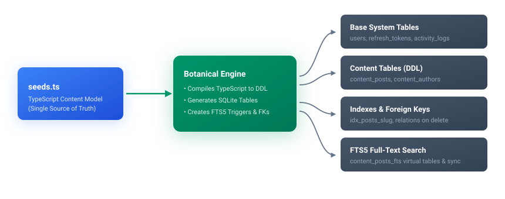
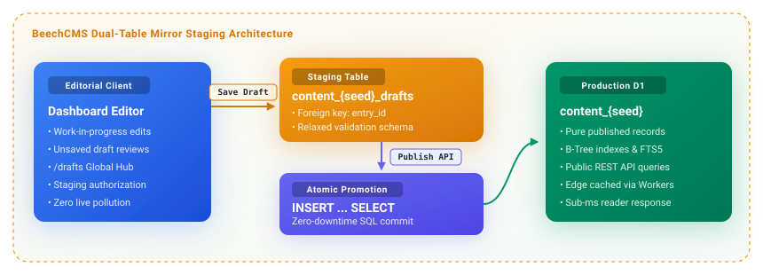

# Architecture Overview

This document provides a comprehensive overview of the **BeechCMS** architectural design, foundational invariants, and engineering principles.

BeechCMS is designed from the ground up as an **edge-native headless CMS** built on Cloudflare Workers, Cloudflare D1 (serverless SQLite), and Cloudflare R2 (zero-egress object storage).

## Monorepo Topology

BeechCMS is organized as a **pnpm + Turborepo** monorepo:

```text
BeechCMS/
├── apps/
│   ├── api/          # Cloudflare Workers Hono REST API engine
│   └── dashboard/    # React + Vite admin dashboard SPA
├── packages/
│   ├── core/         # @beechcms/core — Botanical Engine, schema compiler, validation
│   ├── widget-sdk/   # @beechcms/widget-sdk — Public SDK for dashboard widgets
│   └── client/       # @beechcms/client — Isomorphic TypeScript consumer client
├── docs/             # VitePress documentation
└── docker/           # Local development infrastructure containers
```

### Dependency Hierarchy & Boundaries

| Layer | Packages | Permitted Imports |
| :--- | :--- | :--- |
| **Applications** | `apps/api`, `apps/dashboard` | `@beechcms/core`, `@beechcms/widget-sdk`, third-party dependencies |
| **Shared Core** | `packages/core` | External dependencies only (zero app imports) |
| **Extensions** | `packages/widget-sdk` | `@beechcms/core`, React, TanStack Query |

Turborepo enforces a topological build graph: `@beechcms/core` is always compiled first, ensuring type safety and immediate compile-time feedback across all applications.

## Botanical Engine

At the heart of BeechCMS is the **Botanical Engine** (`packages/core/src/engine`). Rather than functioning as a runtime query translator, it acts as a **deterministic schema compiler**.

<p align="center">
  
</p>

### Key Responsibilities

1. **DDL Generation**: Compiles TypeScript Seed definitions into native SQLite table structures (`CREATE TABLE content_<seed>`).
2. **Dynamic Migrations**: Computes schema diffs and applies additive non-blocking migrations (`ALTER TABLE ... ADD COLUMN`).
3. **Optimized SQL Construction**: Builds parameter-bound SQL queries with automatic column mapping.
4. **Full-Text Search Synchronization**: Generates SQLite virtual tables (`fts_<seed>`) and database triggers for instant text search.

### Botanical Invariant & Stability

Every field in a Seed definition possesses a permanent identifier:
- **`branch.id` (`br_...`)**: Permanent logical handle that never changes.
- **`branch.alias` (`title`, `price`)**: Human-readable identifier used directly as the SQLite column name.

If a developer or editor renames an alias, the Botanical Engine updates SQL column names and triggers while maintaining stable relationships, automations, and search indexes.

## Per-Type SQL Model

Unlike headless CMS architectures that store content in monolithic JSON blob tables, BeechCMS compiles each Seed into a **dedicated physical SQLite table** in Cloudflare D1.

```sql
CREATE TABLE content_posts (
  id          TEXT    NOT NULL PRIMARY KEY, -- UUID v4
  slug        TEXT    NOT NULL UNIQUE,      -- URL identifier
  status      TEXT    NOT NULL DEFAULT 'draft'
                      CHECK (status IN ('draft', 'published', 'archived')),
  title       TEXT,                         -- Direct column from alias
  body        TEXT,                         -- Direct column from alias
  price       REAL,                         -- Native SQLite numeric type
  created_at  INTEGER NOT NULL DEFAULT (unixepoch()),
  updated_at  INTEGER NOT NULL DEFAULT (unixepoch())
);
```

### Advantages of Physical Tables

- **Zero Egress & Sub-ms Latency**: Co-located with Cloudflare Workers edge nodes.
- **Native B-Tree Indexes**: Automatic indexes on `status`, `created_at`, and any Branch with `policies: { filter: true }`.
- **Relational Integrity**: Enforces SQLite foreign key constraints (`ON DELETE SET NULL / CASCADE`) across Seeds.

## Privacy & Encryption

BeechCMS features **Application-Level Encryption (ALE)** and a 4-tier data classification model configured per Branch.

| Classification | Storage in D1 | Public API | Authenticated API | System Actor |
| :--- | :--- | :--- | :--- | :--- |
| `public` | Plaintext | `full` | `full` | `full` |
| `internal` | Plaintext | `hidden` (omitted) | `full` | `full` |
| `confidential` | Encrypted (`AES-256-GCM`) | `hidden` | Decrypted cleartext | Decrypted cleartext |
| `restricted` | Hash (`HMAC-SHA256`) | `hidden` | `hidden` | Internal only |

### Blind Index Search (`*_bidx`)

For `confidential` fields marked with `filter: true`, the Botanical Engine generates a deterministic **blind index column** (`<alias>_bidx`). Exact match queries (`eq`, `in`) are hashed before hitting SQL, allowing indexed search over encrypted records without decrypting table data.

## Dual-Table Staging & Drafts

For Seeds with `allowDrafts: true`, BeechCMS employs a **Dual-Table Mirror Architecture** rather than status columns in the main table:

- **Live Table (`content_<seed>`)**: Stores only published, active records served to the public website.
- **Draft Table (`content_<seed>_drafts`)**: Stores staged revisions referencing the main record (`entry_id`).

<p align="center">
  
</p>

This guarantees that public readers never query draft rows or suffer performance degradation from intermediate staging data.

## Media Architecture

BeechCMS uses a **Direct-to-R2 Presigned Upload** architecture:

1. **Presign**: The dashboard requests a secure presigned upload URL (`POST /upload/presign`).
2. **Direct Upload**: The client uploads binary assets directly to Cloudflare R2 via HTTP `PUT`—**zero binary payload flows through the Worker runtime**, preventing Worker memory and CPU limits.
3. **Confirmation**: The client calls `POST /upload/confirm` to record metadata in the `media_objects` database table.

## Vertical Slice Architecture

The API engine (`apps/api`) is structured around **Vertical Slice Architecture (VSA)**. Business capabilities are grouped into self-contained feature slices rather than technical layers:

```text
apps/api/src/features/
├── auth/             # Login, token rotation, password recovery
├── content/          # Content CRUD handlers & public read endpoints
├── automations/      # Workflow triggers & action executors
├── email/            # Extensible transactional email transport
├── media/            # Presigned uploads & orphan management
└── stats/            # Health, analytics, and metrics aggregation
```

### Thin Handlers & Repository Pattern

- **Handlers**: Parse inputs, validate schemas with Zod, and delegate data access to injected repositories.
- **Repositories**: Encapsulate SQL execution and cache management, enabling unit and integration testability with zero mock leakage.

## Subsystem Abstractions

To ensure testability and prevent vendor lock-in, external dependencies are isolated behind contracts defined in `@beechcms/core`:

| Abstraction | Interface (`@beechcms/core`) | Production Implementation | Testing Double |
| :--- | :--- | :--- | :--- |
| **Password Hashing** | `IHashProvider` | `BcryptHashProvider` (`bcryptjs`) | `InMemoryHashProvider` |
| **JWT Tokens** | `ITokenService` | `JoseTokenService` (`jose`) | `StaticTokenService` |
| **Rate Limiting** | `IRateLimiter` | `CloudflareRateLimiter` | `NoOpRateLimiter` |
| **Time & Clocks** | `IClock` | `SystemClock` | `FixedClock` |
| **ID Generation** | `IIdGenerator` | `SystemIdGenerator` (`crypto.randomUUID`) | `SequentialIdGenerator` |
| **Background Tasks** | `IScheduler` | `ExecutionContextScheduler` (`c.executionCtx`) | `NoOpScheduler` |
| **Background Queues** | `IQueueService` | `CloudflareQueueService` (`env.QUEUE`) | `InMemoryQueueService` |

## Automations Engine

The automations engine evaluates rules asynchronously on content writes and scheduled cron events without blocking HTTP responses:

- **Asynchronous Execution**: Dispatched via `IScheduler.waitUntil()` so client write latency remains sub-5ms.
- **Pure Condition Evaluation**: Filter rules are parsed and evaluated in-memory before executing external network calls.
- **Resilient Execution**: Individual action failures (e.g. third-party webhook timeouts) are logged and retried without failing the primary content transaction.

## Edge Performance & Caching

1. **Worker Cache API (`caches.default`)**: Public `GET /api/v1/public/:seed` responses are cached at edge points of presence with automatic invalidation on writes.
2. **FTS5 SQLite Triggers**: Full-text search queries execute directly against pre-indexed SQLite virtual tables in D1.
3. **Zero Cold Starts**: The lightweight Hono engine boots in under 1 millisecond across Cloudflare's 300+ global data centers.