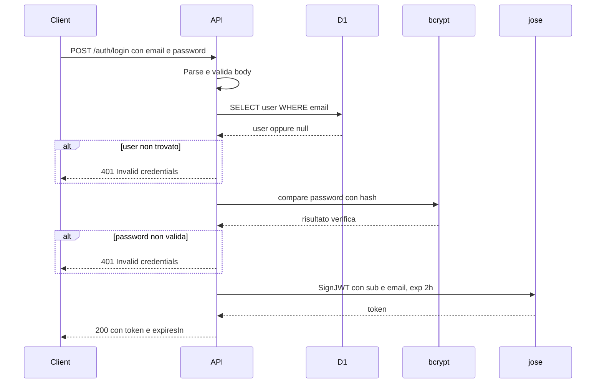

# Autenticazione Beech CMS

Documentazione del sistema di autenticazione JWT per l'API REST.

---

## 1. Flow

Il login segue questo flusso: ricezione credenziali → validazione input → query utente su D1 → verifica password con bcrypt → generazione JWT → risposta.



**Passaggi dettagliati:**

1. **Ricezione**: L'API riceve `email` e `password` nel body JSON della richiesta POST.
2. **Validazione**: Verifica che entrambi i campi siano presenti, di tipo stringa, e che l'email abbia formato valido (contiene `@`).
3. **Query D1**: Cerca l'utente con `SELECT id, email, password_hash FROM users WHERE email = ?` (prepared statement).
4. **Verifica password**: Usa `bcrypt.compare(plainPassword, storedHash)` per confrontare la password in chiaro con l'hash salvato.
5. **Generazione JWT**: Con `jose.SignJWT` crea un token con payload `{sub: userId, email}`, algoritmo HS256, scadenza 2 ore.
6. **Risposta**: Restituisce `{token, expiresIn: "2h"}` in JSON.

---

## 2. Security

| Misura | Descrizione |
|--------|-------------|
| **bcrypt** | Hashing password con salt (10 rounds). Le password non sono mai salvate in chiaro. |
| **Prepared statements** | D1 usa `.bind()` per i parametri; nessuna concatenazione SQL per evitare SQL injection. |
| **Messaggi generici** | "Invalid credentials" sia per utente non trovato che per password errata, per evitare user enumeration. |
| **JWT_SECRET** | In sviluppo: `wrangler.jsonc` vars. In produzione: usare `wrangler secret put JWT_SECRET` e rotazione periodica. |
| **Token in JSON** | Attualmente il token è restituito nel body. Per maggiore sicurezza futura considerare httpOnly cookie. |

---

## 3. API Reference

### POST /auth/login

**Request:** `Content-Type: application/json`

```json
{
  "email": "admin@beech.local",
  "password": "password123"
}
```

**Response:**

| Status | Descrizione | Body |
|--------|-------------|------|
| 200 | Login riuscito | `{ "token": "eyJ...", "expiresIn": "2h" }` |
| 400 | Body vuoto, malformato o campi mancanti | `{ "error": "Invalid request" }` |
| 401 | Credenziali errate (utente non trovato o password sbagliata) | `{ "error": "Invalid credentials" }` |
| 500 | Errore interno (es. database non raggiungibile) | `{ "error": "Database error" }` |

### Esempi curl

**Successo (200):**
```bash
curl -X POST https://api.example.com/auth/login \
  -H "Content-Type: application/json" \
  -d '{"email":"admin@beech.local","password":"password123"}'
```

**Validazione fallita (400):**
```bash
curl -X POST https://api.example.com/auth/login \
  -H "Content-Type: application/json" \
  -d '{"email":"invalid"}'
```

**Credenziali errate (401):**
```bash
curl -X POST https://api.example.com/auth/login \
  -H "Content-Type: application/json" \
  -d '{"email":"admin@beech.local","password":"wrong"}'
```
