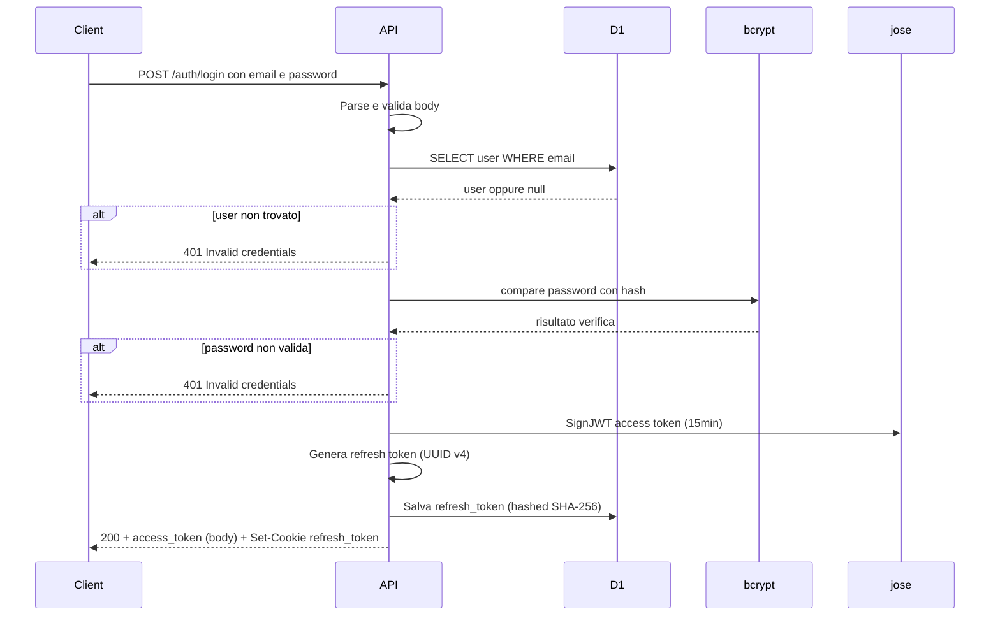
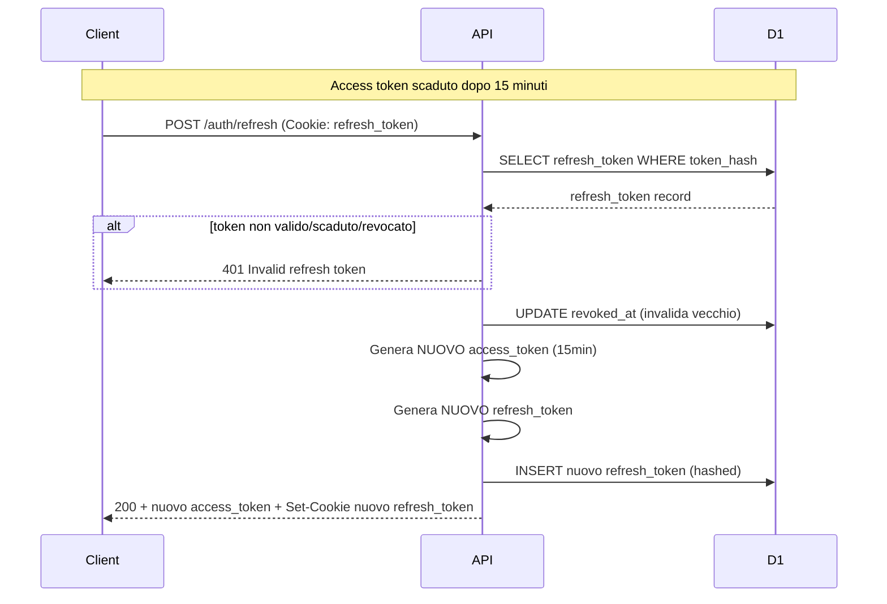
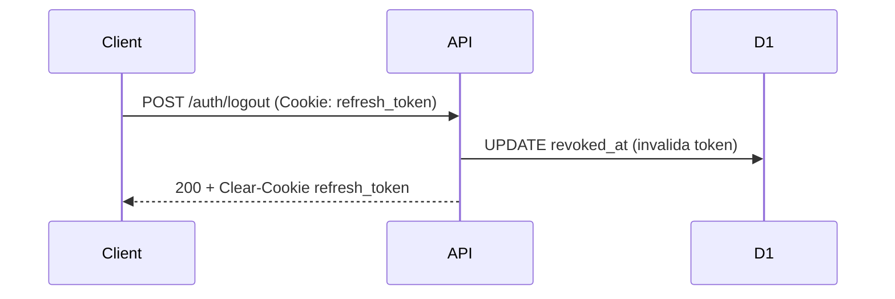

# Autenticazione Beech CMS

Documentazione del sistema di autenticazione JWT con Refresh Token per l'API REST.

---

## 1. Flow

Il sistema utilizza un approccio ibrido con:
- **Access Token**: JWT con scadenza breve (15 minuti) salvato in localStorage (rischio XSS accettato, vedi sezione Security)
- **Refresh Token**: Token opaco con scadenza lunga (7 giorni) salvato in httpOnly cookie
- **Rotazione automatica**: Ogni refresh genera un nuovo refresh token (invalida il vecchio in modo “single-use”, resistente a richieste parallele)

### 1.1 Login Flow



### 1.2 Refresh Token Flow



### 1.3 Logout Flow



**Passaggi dettagliati Login:**

1. **Ricezione**: L'API riceve `email` e `password` nel body JSON della richiesta POST.
2. **Validazione**: Verifica che entrambi i campi siano presenti, di tipo stringa, che l'email abbia formato valido (contiene `@`) e che la password abbia lunghezza 8-128 caratteri.
3. **Rate limiting** (se configurato): Verifica che non siano stati superati i 5 tentativi per IP+email negli ultimi 60 secondi.
4. **Query D1**: Cerca l'utente con `SELECT id, email, password_hash FROM users WHERE email = ?` (prepared statement).
5. **Verifica password**: Usa sempre `bcrypt.compare` (con hash dummy se utente non esiste) per evitare timing attack.
6. **Generazione Access Token**: Con `jose.SignJWT` crea un access token con payload `{sub: userId, email}`, algoritmo **HS256**, header `{ alg: 'HS256', typ: 'JWT' }`, scadenza **15 minuti** e, opzionalmente, campi `iss`/`aud` se configurati.
7. **Generazione Refresh Token**: Crea UUID v4 sicuro con `crypto.randomUUID()`.
8. **Salvataggio in DB**: Salva il refresh token hashato (SHA-256) nella tabella `refresh_tokens` con scadenza 7 giorni.
9. **Set Cookie**: Imposta il refresh token in httpOnly cookie (`HttpOnly`, `Secure` solo su HTTPS, `SameSite=Strict`, `Path=/auth`).
10. **Risposta**: Restituisce `{token, expiresIn: "15m"}` in JSON.

**Passaggi dettagliati Refresh:**

1. **Rate limiting** (se configurato): Verifica che non siano state superate le 20 richieste per IP negli ultimi 60 secondi.
2. **Ricezione Cookie**: L'API legge il `refresh_token` dal cookie inviato automaticamente dal browser.
3. **Validazione**: Cerca il token hashato in DB, verifica scadenza e che non sia stato revocato.
4. **Lookup Utente**: Recupera i dati utente (id, email) per generare nuovo access token.
5. **Rotazione**: Invalida il vecchio refresh token impostando `revoked_at` solo se il token è ancora valido (non scaduto e non già revocato). In caso di richieste parallele, solo la prima riesce; le successive ricevono `401 Invalid refresh token`.
6. **Generazione Nuovi Token**: Crea nuovo access token (15min) e nuovo refresh token (7 giorni).
7. **Salvataggio**: Salva il nuovo refresh token hashato in DB.
8. **Risposta**: Restituisce nuovo access token nel body + nuovo refresh token in cookie.

**Passaggi dettagliati Logout:**

1. **Ricezione Cookie**: L'API legge il `refresh_token` dal cookie.
2. **Revoca**: Imposta `revoked_at` nella tabella `refresh_tokens`.
3. **Clear Cookie**: Cancella il cookie `refresh_token` (Max-Age=0).
4. **Risposta**: Restituisce `{message: "Logged out"}`.

---

## 2. Security

| Misura | Descrizione |
|--------|-------------|
| **bcrypt** | Hashing password con salt (10 rounds). Le password non sono mai salvate in chiaro. |
| **Prepared statements** | D1 usa `.bind()` per i parametri; nessuna concatenazione SQL per evitare SQL injection. |
| **Messaggi generici** | "Invalid credentials" sia per utente non trovato che per password errata, per evitare user enumeration. |
| **JWT_SECRET** | In sviluppo: `wrangler.jsonc` vars. In produzione: usare `wrangler secret put JWT_SECRET` e rotazione periodica. Verifica JWT con algoritmo bloccato su HS256 e header `typ=JWT`. |
| **httpOnly Cookie** | Refresh token salvato in httpOnly cookie (XSS protection). Access token in localStorage per flessibilità API calls (rischio XSS accettato, mitigato tramite CSP e assenza di script inline). |
| **Token Rotation** | Ogni refresh genera un nuovo refresh token; il vecchio viene invalidato in modo atomico (`revoked_at` impostato solo se non già revocato/scaduto). Rileva e limita l’uso di token rubati o richieste parallele. |
| **Hash SHA-256** | Refresh token salvato hashato nel DB (come le password). |
| **SameSite=Strict** | Cookie con `SameSite=Strict` per protezione CSRF. |
| **Short-lived Access** | Access token scadenza 15 minuti invece di 2h. Riduce finestra di attacco. |
| **Revocazione** | Refresh token in DB possono essere invalidati manualmente (logout, ban utente). |
| **Rate Limiting** | Login: 5 tentativi per IP+email ogni 60 secondi. Refresh: 20 richieste per IP ogni 60 secondi. Protezione brute force. |
| **Timing Attack** | Sempre `bcrypt.compare` eseguito (anche con hash dummy se utente non esiste) per evitare user enumeration via timing. |
| **Validazione password** | Lunghezza 8-128 caratteri lato server. |
| **Secure Cookie** | Flag `Secure` applicato solo su HTTPS (localhost HTTP funziona in sviluppo). |
| **Security Headers** | X-Frame-Options, X-Content-Type-Options, Referrer-Policy, Permissions-Policy, Content-Security-Policy. |
| **Logging** | In produzione (`ENV=production`) non vengono loggati dettagli degli errori. |
| **Errori 500** | Messaggio generico "An error occurred" per non rivelare dettagli del sistema. |

---

## 2.1 Variabili d'ambiente (wrangler)

| Variabile | Descrizione | Default |
|-----------|-------------|---------|
| `JWT_SECRET` | Segreto per firma JWT (usare `wrangler secret put` in produzione) | - |
| `JWT_ISSUER` | (Opzionale) Valore `iss` del JWT; se impostato, viene verificato in lettura | - |
| `JWT_AUDIENCE` | (Opzionale) Valore `aud` del JWT; se impostato, viene verificato in lettura | - |
| `CORS_ORIGINS` | Origins CORS permessi, separati da virgola | `http://localhost:5173` |
| `ENV` | Ambiente: `development` o `production` (controlla logging) | `development` |

**Esempio wrangler.jsonc:**
```json
"vars": {
  "JWT_SECRET": "sviluppo-secret-cambiami",
  "CORS_ORIGINS": "http://localhost:5173,http://localhost:5174,https://dashboard.beech.local",
  "ENV": "development"
}
```

**Nota:** Includere `http://localhost:5174` se Vite usa quella porta (quando 5173 è occupata).

### Rate Limiting (Cloudflare API)

Richiede Wrangler 4.36+. Configurazione in `wrangler.jsonc`:

```json
"ratelimits": [
  {
    "name": "LOGIN_RATE_LIMITER",
    "namespace_id": "1001",
    "simple": { "limit": 5, "period": 60 }
  },
  {
    "name": "REFRESH_RATE_LIMITER",
    "namespace_id": "1002",
    "simple": { "limit": 20, "period": 60 }
  }
]
```

- **Login**: 5 tentativi per coppia IP+email ogni 60 secondi
- **Refresh**: 20 richieste per IP ogni 60 secondi

### nodejs_compat (necessario per bcryptjs)

`bcryptjs` richiede le API Node.js (modulo `crypto`). Aggiungere in wrangler.jsonc:

```json
"compatibility_flags": ["nodejs_compat"]
```

---

## 3. API Reference

### POST /auth/login

Autentica utente e genera access token + refresh token.

**Request:** `Content-Type: application/json`

```json
{
  "email": "admin@beech.local",
  "password": "password123"
}
```

**Response:**

| Status | Descrizione | Body | Headers |
|--------|-------------|------|---------|
| 200 | Login riuscito | `{ "token": "eyJ...", "expiresIn": "15m" }` | `Set-Cookie: refresh_token=...; HttpOnly; SameSite=Strict; Max-Age=604800; Path=/auth` (Secure solo su HTTPS) |
| 400 | Body vuoto, malformato, campi mancanti, password < 8 o > 128 caratteri | `{ "error": "Invalid request" }` | - |
| 401 | Credenziali errate (utente non trovato o password sbagliata) | `{ "error": "Invalid credentials" }` | - |
| 429 | Rate limit superato (5 tentativi/minuto per IP+email) | `{ "error": "Too many requests" }` | - |
| 500 | Errore interno | `{ "error": "An error occurred" }` | - |

**Note:**
- Access token restituito nel body, valido per 15 minuti
- Refresh token impostato come httpOnly cookie, valido per 7 giorni
- Il client salva l'access token in localStorage e usa il cookie automaticamente

---

### POST /auth/refresh

Ottieni nuovo access token usando il refresh token (inviato automaticamente come cookie).

**Request:** Nessun body necessario. Il cookie `refresh_token` viene inviato automaticamente dal browser.

**Response:**

| Status | Descrizione | Body | Headers |
|--------|-------------|------|---------|
| 200 | Refresh riuscito | `{ "token": "eyJ...", "expiresIn": "15m" }` | `Set-Cookie: refresh_token=...; HttpOnly; SameSite=Strict; Max-Age=604800; Path=/auth` (Secure solo su HTTPS) |
| 401 | Refresh token mancante | `{ "error": "Refresh token missing" }` | - |
| 401 | Refresh token invalido, scaduto, revocato o utente non trovato | `{ "error": "Invalid refresh token" }` oppure `{ "error": "User not found" }` | - |
| 429 | Rate limit superato (20 richieste/minuto per IP) | `{ "error": "Too many requests" }` | - |
| 500 | Errore interno | `{ "error": "An error occurred" }` | - |

**Note:**
- ROTAZIONE: Il vecchio refresh token viene invalidato (campo `revoked_at`)
- Viene generato un NUOVO refresh token e salvato in DB
- Il client riceve un nuovo access token nel body e un nuovo refresh token come cookie

---

### POST /auth/logout

Invalida il refresh token e cancella il cookie.

**Request:** Nessun body necessario. Il cookie `refresh_token` viene inviato automaticamente dal browser.

**Response:**

| Status | Descrizione | Body | Headers |
|--------|-------------|------|---------|
| 200 | Logout riuscito | `{ "message": "Logged out" }` | `Set-Cookie: refresh_token=; ... Max-Age=0; Path=/auth` (cancella cookie) |
| 500 | Errore interno | `{ "error": "An error occurred" }` | - |

**Note:**
- Il refresh token viene invalidato in DB (campo `revoked_at`) se presente nel cookie
- Il cookie viene sempre cancellato (Max-Age=0), anche se non era stato inviato
- Il client deve anche rimuovere l'access token da localStorage

---

## 4. Esempi curl

### Login (POST /auth/login)

**Successo (200):**
```bash
curl -v -X POST http://localhost:8787/auth/login \
  -H "Content-Type: application/json" \
  -d '{"email":"admin@beech.local","password":"password123"}'
```

Risposta:
```json
{"token":"eyJhbGc...","expiresIn":"15m"}
```
Header: `Set-Cookie: refresh_token=<uuid>; HttpOnly; SameSite=Strict; Max-Age=604800; Path=/auth` (Secure su HTTPS)

**Credenziali errate (401):**
```bash
curl -X POST http://localhost:8787/auth/login \
  -H "Content-Type: application/json" \
  -d '{"email":"admin@beech.local","password":"wrongpassword"}'
```
(Nota: password deve avere almeno 8 caratteri per superare la validazione)

---

### Refresh (POST /auth/refresh)

**Successo (200):**
```bash
curl -v -X POST http://localhost:8787/auth/refresh \
  -H "Cookie: refresh_token=<token_from_login>"
```

Risposta:
```json
{"token":"eyJhbGc...","expiresIn":"15m"}
```
Header: `Set-Cookie: refresh_token=<new_uuid>; ...`

**Token invalido (401):**
```bash
curl -X POST http://localhost:8787/auth/refresh \
  -H "Cookie: refresh_token=invalid-token"
```

---

### Logout (POST /auth/logout)

**Successo (200):**
```bash
curl -v -X POST http://localhost:8787/auth/logout \
  -H "Cookie: refresh_token=<token>"
```

Risposta:
```json
{"message":"Logged out"}
```
Header: `Set-Cookie: refresh_token=; ... Max-Age=0; Path=/auth`

---

## 5. Setup e migrazioni

### Migrazioni D1 (locale)

Per applicare le migrazioni al database locale:

```bash
cd apps/api
npm run db:migrate:local
```

Esegue in ordine: `0001_init.sql`, `0002_seed_admin.sql`, `0003_refresh_tokens.sql`.

---

## 6. Tabella Database

### refresh_tokens

```sql
CREATE TABLE refresh_tokens (
    id TEXT PRIMARY KEY,              -- UUID del token
    user_id TEXT NOT NULL,            -- Riferimento a users.id
    token_hash TEXT NOT NULL,         -- Hash SHA-256 del token
    expires_at INTEGER NOT NULL,      -- Unix timestamp scadenza (7 giorni)
    created_at INTEGER DEFAULT (unixepoch()),
    revoked_at INTEGER DEFAULT NULL,  -- NULL = attivo, timestamp = revocato
    FOREIGN KEY (user_id) REFERENCES users(id) ON DELETE CASCADE
);
```

**Indici:**
- `idx_refresh_user` su `user_id` (per trovare tutti i token di un utente)
- `idx_refresh_hash` su `token_hash` (per validazione veloce)
- `idx_refresh_expires` su `expires_at` (per cleanup periodico)

---

## 7. Manutenzione

### Pulizia Token Scaduti

Periodicamente (es. giornalmente) eseguire:

```sql
DELETE FROM refresh_tokens 
WHERE expires_at < unixepoch() OR revoked_at IS NOT NULL;
```

Può essere schedulato con Cloudflare Workers Cron Triggers.
