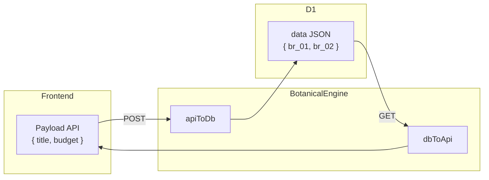

# Botanical Engine Beech CMS

Documentazione del layer di astrazione che disaccoppia gli alias dei campi (API) dagli ID interni immutabili (DB). Risolve il problema: *se rinomino un campo nel codice, i vecchi dati JSON nel DB non si rompono*.

---

## 1. Problema e soluzione

### Problema

Se il frontend invia `{ "titolo": "Progetto X" }` e in seguito rinominiamo il campo in `title`, i dati già salvati nel DB con chiave `titolo` diventano orfani. La lettura restituirebbe `{}` perché il nuovo codice cerca `title`.

### Soluzione

Il **Botanical Engine** introduce un layer di traduzione:

- **Nel DB** si salvano sempre chiavi immutabili (`br_01`, `br_02`, …)
- **Nelle API** si usano alias leggibili e mutabili (`title`, `budget`, …)
- Due funzioni pure (`apiToDb`, `dbToApi`) convertono in entrambe le direzioni

---

## 2. Terminologia

| Termine | Significato | Esempio |
|---------|-------------|---------|
| **Seed** | Definizione dello schema di un tipo di contenuto | "Progetti" (slug: `progetti`) |
| **Branch** | Definizione di un campo con `id`, `alias`, `label`, `type` | `br_01` → `title` (text) |
| **Tree** | Record salvato nel DB (entry) | Riga in `content_entries` |
| **Fruit** | Valore del dato | `"Sito Aziendale"`, `1000` |

### Attributi del Branch

| Attributo | Immutabile | Uso | Esempio |
|-----------|------------|-----|---------|
| `id` | Sì | Chiave nel JSON salvato su D1 | `br_01`, `br_x82` |
| `alias` | No | Chiave nel payload API (Frontend) | `title`, `budget` |
| `label` | No | Etichetta per la UI (Dashboard) | "Titolo Progetto" |
| `type` | No | Tipo del valore | `text`, `number`, `boolean`, `json`, `date` |

---

## 3. Architettura



### Flusso scrittura (POST)

1. Il client invia `{ "title": "Sito Aziendale", "budget": 5000 }`
2. `apiToDb(seed, payload)` mappa `title` → `br_01`, `budget` → `br_02`
3. Il DB salva `{ "br_01": "Sito Aziendale", "br_02": 5000 }`

### Flusso lettura (GET)

1. D1 restituisce `row.data` = `'{"br_01":"Sito Aziendale","br_02":5000}'`
2. `rowToEntry` fa il parse in oggetto
3. `dbToApi(seed, data)` mappa `br_01` → `title`, `br_02` → `budget`
4. L'API restituisce `{ "title": "Sito Aziendale", "budget": 5000 }`

---

## 4. Policy e limiti

### Alias non riconosciuti (apiToDb)

Se il frontend invia `{ "titlo": "Test" }` (typo) invece di `title`, il campo viene **ignorato** senza errore (policy safe). Il dato non viene salvato.

**TODO (Sprint Validazione Zod):** Aggiungere validazione campi obbligatori e opzionale warning per alias non riconosciuti.

### Chiavi DB sconosciute (dbToApi)

Chiavi nel DB non presenti nel Seed (es. dati legacy) vengono **ignorate**. Non vengono esposte alle API.

### Slug inesistente

Se lo slug non è registrato nel Seed Registry (es. `GET /api/content/xyz`), l'API restituisce `404` con `{ "error": "Seed not found" }`.

---

## 5. Struttura del codice

Il Botanical Engine vive nel pacchetto condiviso `@beech/core` (monorepo):

```
packages/core/
├── src/
│   ├── index.ts       # Barrel export del pacchetto
│   ├── types.ts       # Branch, Seed, DbPayload, ApiPayload
│   ├── engine.ts      # apiToDb, dbToApi (Translation Layer)
│   └── seeds.ts       # SEED_REGISTRY, getSeed, PROJECT_SEED
└── dist/              # Output compilato (main + .d.ts)

apps/api/src/
└── content.ts         # Handler CRUD che importano da @beech/core
```

**Uso:** Le app (API, Dashboard) importano con `import { getSeed, apiToDb, dbToApi } from '@beech/core'`.

Vedi [Architettura Monorepo](monorepo.md) per la struttura completa del progetto.

### Aggiungere un nuovo Seed

1. Definire il Seed in `packages/core/src/seeds.ts` (o in un file dedicato)
2. Registrarlo in `SEED_REGISTRY`:

```ts
export const BLOG_SEED: Seed = {
  slug: 'blog',
  label: 'Articoli Blog',
  branches: [
    { id: 'br_b1', alias: 'title', label: 'Titolo', type: 'text' },
    { id: 'br_b2', alias: 'body', label: 'Corpo', type: 'text' },
    { id: 'br_b3', alias: 'published', label: 'Pubblicato', type: 'boolean' },
  ],
}

export const SEED_REGISTRY: Record<string, Seed> = {
  progetti: PROJECT_SEED,
  blog: BLOG_SEED,
}
```

---

## 6. API Reference (payload con alias)

Le rotte content usano gli **alias** nel body e nella risposta. Lo slug deve esistere nel Seed Registry.

### POST /api/content/:slug

**Request:** `Content-Type: application/json`

Per `progetti` (PROJECT_SEED):

```json
{
  "title": "Sito Aziendale",
  "budget": 5000
}
```

**Response:**

| Status | Descrizione | Body |
|--------|-------------|------|
| 201 | Creazione riuscita | `{ "id": "uuid" }` |
| 400 | Slug o body invalido | `{ "error": "Invalid slug" }` o `{ "error": "Invalid JSON body" }` |
| 404 | Slug non registrato | `{ "error": "Seed not found" }` |
| 401 | Token mancante o invalido | `{ "error": "Unauthorized" }` |
| 500 | Errore database | `{ "error": "Database error" }` |

### GET /api/content/:slug

**Response:** Array di entry con `data` in formato alias.

Esempio per `progetti`:

```json
[
  {
    "id": "uuid-1",
    "schema_slug": "progetti",
    "data": { "title": "Sito Aziendale", "budget": 5000 },
    "created_at": 1700000000,
    "updated_at": 1700000000
  }
]
```

| Status | Descrizione |
|--------|-------------|
| 200 | Lista restituita |
| 404 | Slug non registrato |
| 401 | Token mancante o invalido |
| 500 | Errore database |

### GET /api/content/:slug/:id

Stessa struttura di `data` con alias. `404` se entry non trovata o slug non registrato.

---

## 7. Esempi curl

### Creare un progetto (POST)

```bash
curl -X POST http://localhost:8787/api/content/progetti \
  -H "Authorization: Bearer <token>" \
  -H "Content-Type: application/json" \
  -d '{"title":"Sito Aziendale","budget":5000}'
```

Risposta: `{"id":"<uuid>"}`

### Slug inesistente (404)

```bash
curl -X POST http://localhost:8787/api/content/xyz \
  -H "Authorization: Bearer <token>" \
  -H "Content-Type: application/json" \
  -d '{"title":"Test"}'
```

Risposta: `{"error":"Seed not found"}`

### Lista progetti (GET)

```bash
curl http://localhost:8787/api/content/progetti \
  -H "Authorization: Bearer <token>"
```

Risposta: array con `data` in formato `{ "title": "...", "budget": ... }`.

---

## 8. Seed di esempio: progetti

| Branch ID | Alias | Label | Type |
|-----------|-------|-------|------|
| `br_01` | `title` | Titolo | text |
| `br_02` | `budget` | Budget | number |

Payload API: `{ "title": "...", "budget": 123 }`  
Payload DB: `{ "br_01": "...", "br_02": 123 }`
