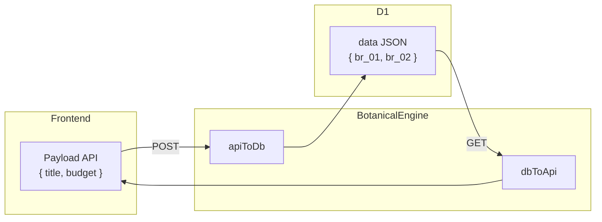

# Botanical Engine Beech CMS

Documentazione del layer di astrazione che disaccoppia gli alias dei campi (API) dagli ID interni immutabili (DB). Risolve il problema: *se rinomino un campo nel codice, i vecchi dati JSON nel DB non si rompono*.

---

## 1. Problema e soluzione

### Problema

Se il frontend invia `{ "titolo": "Progetto X" }` e in seguito rinominiamo il campo in `title`, i dati già salvati nel DB con chiave `titolo` diventano orfani. La lettura restituirebbe `{}` perché il nuovo codice cerca `title`.

### Soluzione

Il **Botanical Engine** introduce un layer di traduzione:

- **Nel DB** si salvano sempre chiavi immutabili (`br_01`, `br_02`, …)
- **Nelle API** si usano alias leggibili e mutabili (`title`, `budget`, …)
- Due funzioni pure (`apiToDb`, `dbToApi`) convertono in entrambe le direzioni

---

## 2. Terminologia

| Termine | Significato | Esempio |
|---------|-------------|---------|
| **Seed** | Definizione dello schema di un tipo di contenuto | slug: `progetti`, label: "Progetto", labelPlural: "Progetti" |
| **Branch** | Definizione di un campo con `id`, `alias`, `label`, `type` | `br_01` → `title` (text) |
| **Tree** | Record salvato nel DB (entry) | Riga in `content_entries` |
| **Fruit** | Valore del dato | `"Sito Aziendale"`, `1000` |

### Attributi del Branch

| Attributo | Immutabile | Uso | Esempio |
|-----------|------------|-----|---------|
| `id` | Sì | Chiave nel JSON salvato su D1 | `br_01`, `br_x82` |
| `alias` | No | Chiave nel payload API (Frontend) | `title`, `budget` |
| `label` | No | Etichetta per la UI (Dashboard) | "Titolo Progetto" |
| `type` | No | Tipo del valore | `text`, `number`, `boolean`, `json`, `date`, `richtext`, `file` |
| `format` | No | Variante semantica opzionale del campo (UI/validazione) | `asset-list` (su `file`), `markdown` (su `richtext`) |
| `multiple` | No | Cardinalita opzionale per campi media | `true` per liste media (`asset-list`) |
| `options` | No | Vocabolario predefinito (opzionale) per campi `tag`, `select`, `multiselect`. Lista statica definita nel Seed, non salvata nel DB. Usata come suggerimenti in fase di creazione (badge cliccabili in FieldEdit) e come opzioni nel dropdown dei filtri in ContentToolbar. | `['news', 'tutorial', 'release']` |

### Attributi del Seed

| Attributo | Obbligatorio | Uso | Esempio |
|-----------|--------------|-----|---------|
| `slug` | Sì | Identificativo del tipo (URL, API) | `progetti`, `blog` |
| `label` | Sì | Etichetta singolare per la UI | "Progetto", "Articolo Blog" |
| `labelPlural` | No | Etichetta plurale (liste, titoli). Se assente si usa `label` | "Progetti", "Articoli Blog" |
| `branches` | Sì | Lista dei campi (Branch) | v. sopra |

---

## 3. Architettura



### Flusso scrittura (POST)

1. Il client invia `{ "title": "Sito Aziendale", "budget": 5000 }`
2. `apiToDb(seed, payload)` mappa `title` → `br_01`, `budget` → `br_02`
3. Il DB salva `{ "br_01": "Sito Aziendale", "br_02": 5000 }`

### Flusso lettura (GET)

1. D1 restituisce `row.data` = `'{"br_01":"Sito Aziendale","br_02":5000}'`
2. `rowToEntry` fa il parse in oggetto
3. `dbToApi(seed, data)` mappa `br_01` → `title`, `br_02` → `budget`
4. L'API restituisce `{ "title": "Sito Aziendale", "budget": 5000 }`

---

## 4. Policy e limiti

### Alias non riconosciuti (apiToDb)

La foundation del core supporta due policy:

- `collect` (compatibilita): traccia alias sconosciuti senza bloccare
- `reject` (hardening): produce errore strutturato e rifiuta il payload

Per la Public API write (`/add`, `/edit`) la policy consigliata e **fail-closed** (`reject`) in ambienti deploy.

### Required fields e modalita operazione

Il core valida in modalita:

- `operation=create`
- `operation=update`

I branch possono definire:

- `requiredOnCreate?: boolean`
- `requiredOnUpdate?: boolean`

Questo consente enforcement schema-driven senza duplicare logica nelle app consumer.

### Chiavi DB sconosciute (dbToApi)

Chiavi nel DB non presenti nel Seed (es. dati legacy) vengono **ignorate**. Non vengono esposte alle API.

### Slug inesistente

Se lo slug non è registrato nel Seed Registry (es. `GET /api/content/xyz`), l'API restituisce `404` con `{ "error": "Seed not found" }`.

---

## 5. Struttura del codice

Il Botanical Engine vive nel pacchetto condiviso `@beech/core` (monorepo):

```
packages/core/
├── src/
│   ├── index.ts       # Barrel export del pacchetto
│   ├── types.ts       # Branch, Seed, DbPayload, ApiPayload
│   ├── engine.ts      # apiToDb, dbToApi (Translation Layer)
│   └── seeds.ts       # SEED_REGISTRY, getSeed, 5 seed realistici
└── dist/              # Output compilato (main + .d.ts)

apps/api/src/
└── content.ts         # Handler CRUD che importano da @beech/core
```

**Uso:** Le app (API, Dashboard) importano con `import { getSeed, apiToDb, dbToApi } from '@beech/core'`.

Vedi [Architettura Monorepo](monorepo.md) per la struttura completa del progetto.

### Aggiungere un nuovo Seed

1. Definire il Seed in `packages/core/src/seeds.ts` (o in un file dedicato)
2. Registrarlo in `SEED_REGISTRY`:

```ts
export const BLOG_SEED: Seed = {
  slug: 'blog',
  label: 'Articolo Blog',
  labelPlural: 'Articoli Blog',
  branches: [
    { id: 'br_b1', alias: 'title', label: 'Titolo', type: 'text' },
    { id: 'br_b2', alias: 'body', label: 'Corpo', type: 'text' },
    { id: 'br_b3', alias: 'published', label: 'Pubblicato', type: 'boolean' },
  ],
}

export const SEED_REGISTRY: Record<string, Seed> = {
  articoli: ARTICOLO_SEED,
  blog: BLOG_SEED,
}
```

---

## 6. API Reference (payload con alias)

Le rotte content usano gli **alias** nel body e nella risposta. Lo slug deve esistere nel Seed Registry.

### POST /api/content/:slug

**Request:** `Content-Type: application/json`

Per `articoli` (ARTICOLO_SEED):

```json
{
  "title": "Il mio primo articolo",
  "publishedAt": "2026-01-01"
}
```

**Response:**

| Status | Descrizione | Body |
|--------|-------------|------|
| 201 | Creazione riuscita | `{ "id": "uuid" }` |
| 400 | Slug o body invalido | `{ "error": "Invalid slug" }` o `{ "error": "Invalid JSON body" }` |
| 404 | Slug non registrato | `{ "error": "Seed not found" }` |
| 401 | Token mancante o invalido | `{ "error": "Unauthorized" }` |
| 500 | Errore database | `{ "error": "Database error" }` |

### GET /api/content/:slug

**Response:**

- Senza query params: array di entry (`ContentEntry[]`) con `id`, `schema_slug`, `slug`, `status`, `data` (alias), `created_at`, `updated_at`.
- Con query params (`search`, `sortBy`, `sortDir`, `filters`, `page`, `limit`): payload paginato `{ items, total, page, limit }`.

Esempio per `articoli`:

```json
[
  {
    "id": "uuid-1",
    "schema_slug": "articoli",
    "slug": "il-mio-primo-articolo",
    "status": "published",
    "data": { "title": "Il mio primo articolo", "publishedAt": "2026-01-01" },
    "created_at": 1700000000,
    "updated_at": 1700000000
  }
]
```

| Status | Descrizione |
|--------|-------------|
| 200 | Lista restituita (array o payload paginato a seconda delle query) |
| 404 | Slug non registrato |
| 401 | Token mancante o invalido |
| 500 | Errore database |

### GET /api/content/:slug/facets

Restituisce facets dinamiche per la UI dashboard:

```json
{
  "statuses": ["draft", "review", "published"],
  "tagsByColumnId": {
    "tags": ["cms", "react", "typescript"]
  }
}
```

`statuses` deriva dai valori distinti della colonna di sistema `status`; `tagsByColumnId` è calcolato per i branch tag (`json`).

### GET /api/content/:slug/:id

Stessa struttura di `data` con alias. `404` se entry non trovata o slug non registrato.

---

## 7. Esempi curl

### Creare un articolo (POST)

```bash
curl -X POST http://localhost:8787/api/content/articoli \
  -H "Authorization: Bearer <token>" \
  -H "Content-Type: application/json" \
  -d '{"title":"Il mio primo articolo","publishedAt":"2026-01-01"}'
```

Risposta: `{"id":"<uuid>"}`

### Slug inesistente (404)

```bash
curl -X POST http://localhost:8787/api/content/xyz \
  -H "Authorization: Bearer <token>" \
  -H "Content-Type: application/json" \
  -d '{"title":"Test"}'
```

Risposta: `{"error":"Seed not found"}`

### Lista articoli (GET)

```bash
curl http://localhost:8787/api/content/articoli \
  -H "Authorization: Bearer <token>"
```

Risposta: array con `data` in formato `{ "title": "...", "publishedAt": "..." }`.

### Lista articoli con query server-side

```bash
curl "http://localhost:8787/api/content/articoli?search=articolo&sortBy=title&sortDir=asc&page=1&limit=25" \
  -H "Authorization: Bearer <token>"
```

Risposta: `{ "items": [...], "total": 123, "page": 1, "limit": 25 }`

### Facets articoli

```bash
curl "http://localhost:8787/api/content/articoli/facets" \
  -H "Authorization: Bearer <token>"
```

---

## 8. Seed registrati

Il CMS include 5 seed realistici. Ognuno ha `labelPlural` per liste e sidebar.

### Articolo (`articoli`) — layout a due colonne (richtext)

| Branch ID | Alias | Label | Type |
|-----------|-------|-------|------|
| `art_01` | `title` | Titolo | text |
| `art_02` | `publishedAt` | Data pubblicazione | date |
| `art_03` | `coverImage` | Immagine copertina | file |
| `art_04` | `tags` | Tag | json |
| `art_05` | `body` | Corpo articolo | richtext |
| `art_06` | `metaTitle` | Meta titolo (SEO) | text |
| `art_07` | `metaDescription` | Meta descrizione (SEO) | text |

### Prodotto (`prodotti`) — layout a due colonne (richtext)

| Branch ID | Alias | Label | Type |
|-----------|-------|-------|------|
| `prd_01` | `name` | Nome | text |
| `prd_02` | `price` | Prezzo (€) | number |
| `prd_03` | `stock` | Quantità disponibile | number |
| `prd_04` | `active` | In vendita | boolean |
| `prd_05` | `coverImage` | Immagine principale | file |
| `prd_06` | `images` | Galleria immagini | file (`multiple: true`, `format: 'asset-list'`) |
| `prd_07` | `description` | Descrizione | richtext |
| `prd_08` | `metaTitle` | Meta titolo (SEO) | text |
| `prd_09` | `metaDescription` | Meta descrizione (SEO) | text |

### Membro (`team`) — layout a colonna singola (nessun richtext)

| Branch ID | Alias | Label | Type |
|-----------|-------|-------|------|
| `tm_01` | `name` | Nome | text |
| `tm_02` | `role` | Ruolo | text |
| `tm_03` | `bio` | Bio breve | text |
| `tm_04` | `photo` | Foto | file |
| `tm_05` | `linkedIn` | URL LinkedIn | text |
| `tm_06` | `active` | Visibile | boolean |
| `tm_07` | `metaTitle` | Meta titolo (SEO) | text |
| `tm_08` | `metaDescription` | Meta descrizione (SEO) | text |

### Testimonianza (`testimonianze`) — layout a colonna singola

| Branch ID | Alias | Label | Type |
|-----------|-------|-------|------|
| `tes_01` | `author` | Autore | text |
| `tes_02` | `company` | Azienda | text |
| `tes_03` | `quote` | Citazione | text |
| `tes_04` | `rating` | Valutazione (1-5) | number |
| `tes_05` | `date` | Data | date |
| `tes_06` | `photo` | Foto autore | file |
| `tes_07` | `active` | Pubblica | boolean |
| `tes_08` | `metaTitle` | Meta titolo (SEO) | text |
| `tes_09` | `metaDescription` | Meta descrizione (SEO) | text |

### Pagina (`pagine`) — layout a due colonne (richtext)

| Branch ID | Alias | Label | Type |
|-----------|-------|-------|------|
| `pag_01` | `title` | Titolo | text |
| `pag_02` | `coverImage` | Immagine hero | file |
| `pag_03` | `body` | Contenuto | richtext |
| `pag_04` | `metaTitle` | Meta titolo (SEO) | text |
| `pag_05` | `metaDescription` | Meta descrizione (SEO) | text |

---

## 9. Considerazioni sulle Performance

L'attuale implementazione del Botanical Engine dà priorità alla **leggibilità** e alla **semplicità**.

### Criticità O(N*M)
Le funzioni `apiToDb` e `dbToApi` utilizzano `.find()` o loop lineari sui branch del Seed per ogni chiave del payload. 
- **N** = numero di campi nel payload (es. 10 campi inviati dal frontend)
- **M** = numero di branch definiti nel Seed (es. 40 rami nel CMS)

L'operazione ha una complessità di **O(N*M)**. Sebbene trascurabile per schemi piccoli, può diventare un collo di bottiglia per "Seed" molto complessi o payload massivi.

**TODO (Ottimizzazione):** 
Implementare una cache di lookup (Map/Oggetto) nel Botanical Engine:
- `aliasToIdMap`: `Map<string, string>` (es. `title` -> `br_01`)
- `idToAliasMap`: `Map<string, string>` (es. `br_01` -> `title`)

Questi Map dovrebbero essere costruiti una sola volta per Seed (lazy loading) per portare la complessità a **O(N)**.

