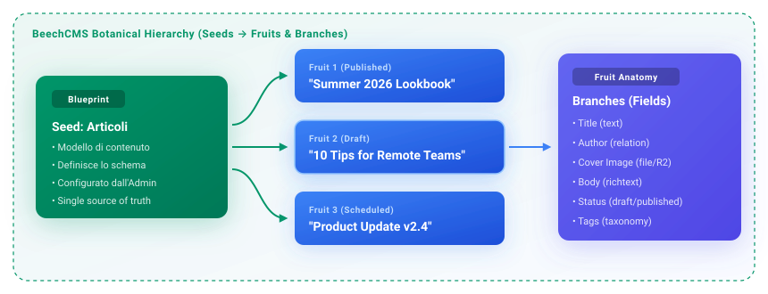

# Content Editor Guide

Welcome to the **BeechCMS Content Editor Guide**. This guide is designed for content editors, copywriters, marketers, and non-technical site owners who manage day-to-day content on a BeechCMS-powered website.

BeechCMS is built to be fast, dependable, and calm. Everything you need to create, edit, organize, and publish content is accessible through a clean, intuitive visual dashboard without touching code or database settings.

---

## 1. Understanding BeechCMS: The Basics

If you have used other content management systems, BeechCMS works similarly, but with cleaner separation between **content structure** and **content authoring**:

- **Seeds (Content Types / Blueprints)**: A *Seed* is a template created by your administrator or developer. It defines what kind of information a piece of content contains. Examples include **Articoli** (Blog Articles), **Release Notes**, **Authors**, or **Customer Tickets**.
- **Entries (Individual Items)**: An *Entry* is a single, concrete piece of content based on a Seed. For example, the article *"Announcing Our Spring Product Release"* is an entry within the **Articoli** Seed.
- **Branches (Fields)**: Each Seed consists of individual fields called *Branches*—such as Title, Body Text, Cover Image, Publish Date, or Category.

  

> [!NOTE]
> As an editor, your daily work revolves around creating and updating **Entries**. You don't need to configure database schemas or server settings; your administrator has already configured the appropriate Seeds and fields for your project.

---

## 2. Accessing the Dashboard & Security

### Logging In
1. Open your browser and navigate to your team's BeechCMS dashboard URL (usually `https://your-domain.com/admin` or `http://localhost:8787/admin` in local development).
2. Enter your work **Email** and **Password**.
3. Click **Sign in**.

<!-- SCREENSHOT: login-page – mostra il form di login con campi Email, Password, pulsante Sign in e link 'Forgot password' -->

### Forgot Password
If you forget your password:
1. Click the **Forgot password?** link on the login page.
2. Enter your email address and click **Send reset link**.
3. Check your inbox for a secure password reset email containing a one-time reset link.
4. Follow the link to enter and confirm your new password.

<!-- SCREENSHOT: forgot-password – schermata di richiesta reset password con campo email e pulsante di conferma -->

### Logging Out & Account Security
When using a shared workstation or finishing your work session:
1. Click your name/avatar in the bottom-left corner of the sidebar.
2. Select **Log out**.

<!-- SCREENSHOT: user-menu-logout – menu utente aperto nel footer della sidebar con il pulsante di logout -->

> [!TIP]
> Always log out when stepping away from shared devices. Sessions are securely tokenized and protected against unauthorized access.

---

## 3. Exploring the Interface

The BeechCMS workspace is divided into three primary zones: the **Sidebar**, the **Top Bar**, and the **Main Workspace**.

<!-- SCREENSHOT: dashboard-overview – vista d'insieme del pannello con sidebar a sinistra, top bar in alto e area contenuti centrale -->

### The Sidebar (Left Navigation)

The sidebar organizes everything you need into clear, functional sections:

- **Navigation**:
  - **Dashboard**: Your home overview with personalized greetings, quick statistics, and recent content activity.
  - **Analytics**: Key traffic, publication trends, and activity metrics.
- **Content Quick Access**:
  - **Create New**: Fast entry point to create content across any Seed.
  - **Drafts**: A centralized hub showing all work-in-progress drafts across all content types.
  - **Scheduled**: Content queued for automatic future publishing.
- **Content Groups (Seeds)**:
  - Your actual content types grouped logically (e.g., *Content*, *SaaS Platform*, *Support*).
  - For example: **Articoli** (Blog Articles), **Release Notes**, **Clienti**, **Ticket Supporto**.
- **Settings & User Profile**: Located at the bottom of the sidebar to manage personal profile details, notification preferences, and interface theme (Light / Dark mode).

<!-- SCREENSHOT: sidebar-seeds – dettaglio della sidebar con le sezioni Navigation, Drafts, Scheduled e i gruppi di Seeds con icone personalizzate -->

### The Top Bar (Header)
- **Sidebar Toggle**: Click the collapse icon to maximize your editing workspace.
- **Breadcrumbs**: Shows your exact location in the hierarchy (e.g., `Beech CMS > Contents > Articoli > Edit`). Click any segment to navigate backwards.
- **Notifications Bell**: Displays real-time alerts (e.g., when an automated workflow completes or scheduled content goes live).
- **Command Palette (`Cmd + K` or `Ctrl + K`)**: Instant search to jump to any Seed, entry, or setting from anywhere in the app.

<!-- SCREENSHOT: command-palette – finestra modale della Command Palette (Cmd+K) con ricerca rapida per sezioni e contenuti -->

---

## 4. Finding & Viewing Content

When you select a Seed from the sidebar (e.g., **Articoli**), you enter the **Listing View**. BeechCMS provides powerful tools to locate and manage entries swiftly.

<!-- SCREENSHOT: list-view-posts – vista tabellare dei contenuti con colonne Title, Status, Updated at, cover thumbnail, toolbar dei filtri e pulsante New Entry -->

### Switching Views: Table, Kanban, and Gallery

Depending on your Seed configuration, you can view your content in different visual layouts:

1. **Table View**: The classic spreadsheet-style layout. Ideal for scanning large numbers of entries, sorting by columns, and performing bulk operations.
2. **Kanban View**: Visual card columns grouped by status (e.g., *Draft*, *In Review*, *Published*, or ticket statuses like *Open*, *In Progress*, *Closed*). Drag and drop cards between columns to update their state.
3. **Gallery View**: Card-based grid featuring cover images and key summary text. Perfect for visual media, blog articles, and team profiles.

<!-- SCREENSHOT: view-switcher – selettore di vista nella toolbar con icone Table, Kanban e Gallery -->

### Searching & Filtering

- **Search Bar**: Type any keyword to instantly filter entries by title, author, or text fields.
- **Column Filters & Conditions**: Click **Filter** in the toolbar to add rules (e.g., `Status is Draft`, `Author equals "Flavio"`, or `Release Date is after 2026-01-01`).
- **Facet Filters**: Quickly click predefined chips to narrow down by status or category.
- **Sorting**: Click any column header to sort ascending or descending.

<!-- SCREENSHOT: filter-toolbar-open – popover del costruttore di filtri con condizioni AND/OR, selezione colonna, operatore e valore -->

### Table Density & Column Visibility
- **Density Selector**: Choose between *Compact*, *Normal*, or *Comfortable* row heights to suit your screen size.
- **Column Visibility**: Show or hide specific columns to keep your table focused on the data you care about.

### Quick Actions & Context Menus
- **Right-Click**: Right-clicking any row opens a contextual menu to edit, duplicate, filter by this cell value, or delete.
- **Bulk Selection**: Check the boxes on multiple rows to execute bulk actions (such as bulk status updates or deleting multiple entries at once).

<!-- SCREENSHOT: context-menu-row – menu contestuale tasto destro su una riga con opzioni Modifica, Filtra per questo valore, Elimina -->

---

## 5. Creating New Content

Imagine you want to publish a new blog post or create a release note. Here is the step-by-step workflow:

### Step 1: Open the Creation Form
- From the Seed listing page (e.g., **Articoli**), click the **+ New Entry** (or **+ Articolo**) button in the top right.
- Alternatively, go to **Create New** in the sidebar and pick your desired Seed.

<!-- SCREENSHOT: create-new-button – pulsante '+ New Entry' evidenziato nella toolbar della schermata di lista -->

### Step 2: Fill in the Required and Optional Fields
BeechCMS dynamically builds the form based on the Seed:

- **Required Fields (`*`)**: Must be completed before saving (e.g., Title, Slug, Status).
- **Text & Number Fields**: Type directly. Number fields may format currencies (e.g., `€ 1.250,00`) automatically.
- **Dropdowns & Selectors**: Choose from predefined options (e.g., `free`, `pro`, `enterprise`).
- **Date Pickers**: Select specific dates and times with a visual calendar.
- **Relations**: If an entry links to another Seed (for example, linking a Support Ticket or Subscription to a specific *Cliente*), search and select the related record from the autocomplete dropdown.

<!-- SCREENSHOT: editor-form-fields – form modale di creazione con campi titolo, slug generato, select a tendina, date picker e relazione cliente -->

### Step 3: Automatic Validation
The editor gives immediate, helpful feedback:
- If a required field is empty, it will be outlined in red with a clear helper message.
- If a field requires a unique value (such as an article slug or version number), the system prevents duplicates before saving.

---

## 6. Editing, Saving & Publishing (Drafts, Published & Scheduled)

BeechCMS gives you granular control over the lifecycle of your content.

<!-- SCREENSHOT: editor-action-bar – barra inferiore dell'editor con pulsanti 'Save Draft', menu a tendina 'Publish Draft', 'Discard Draft' e 'Delete' -->

### Content States Explained

| Status Badge | What It Means | Visibility on Live Website |
| :--- | :--- | :--- |
| Draft | Work in progress. Saved in the database but unpublished. | **Hidden** from the public site. Only visible to team members in the dashboard. |
| Published | Live and active content. | **Visible** immediately to all visitors and frontend consumers. |
| Scheduled | Set to go live automatically at a future date/time. | **Hidden** until the scheduled timestamp arrives. |

<!-- SCREENSHOT: status-badges – confronto visivo dei tre badge Draft (giallo), Published (verde) e Scheduled (blu) nella lista contenuti -->

### Publishing Actions

When editing an entry with drafts enabled:

1. **Save Draft**: Saves your current work without updating the public website. You can return and edit as many times as you like.
2. **Publish Draft**: Converts the draft into the active, live version of the record. The public site updates instantly.
3. **Discard Draft**: Reverts all unpublished changes back to the last published version (or deletes the draft if it was never published).
4. **Updating Published Content**: When you modify a published entry, saving it creates a draft stage, allowing you to preview and polish changes without breaking the live page.

> [!IMPORTANT]
> **Unsaved Changes Protection**: If you make modifications and accidentally attempt to close the window or navigate away, BeechCMS prompts you with a confirmation dialog so you never lose your work.

<!-- SCREENSHOT: unsaved-changes-dialog – modale di avviso 'Unsaved Changes' con opzioni 'Stay' ed 'Exit without saving' -->

### The Global Drafts & Scheduled Hubs
- **Drafts (`/drafts`)**: See every draft across the entire project in one unified table, showing who worked on it last and when it was modified.
- **Scheduled (`/scheduled`)**: View all upcoming releases on a timeline.

<!-- SCREENSHOT: global-drafts-hub – pagina /drafts che raccoglie bozze di articoli, release notes e pagine con avatar dell'autore e data ultima modifica -->

---

## 7. Working with Media & Images

BeechCMS makes handling images and assets effortless. Assets are optimized and served directly from high-speed edge storage.

<!-- SCREENSHOT: media-field-single – campo immagine con box di drag & drop, input URL HTTPS e anteprima immagine caricata -->

### Uploading Images
You have three ways to add an image to an entry:

1. **Drag and Drop**: Drag an image file from your computer directly into the media box.
2. **File Picker**: Click the **Upload** icon button to choose a file from your hard drive (`.png`, `.jpg`, `.jpeg`, `.webp`, `.svg`).
3. **External HTTPS Link**: Paste any valid HTTPS image URL into the input field. BeechCMS automatically tests and verifies that the image can render before saving.

### Managing Single vs. Multi-Image Galleries
- **Single Image Fields** (e.g., Cover Image, Avatar): Displays a large preview with a red **Delete (X)** button to remove or replace the asset.
- **Multi-Image / Asset Lists** (e.g., Product Galleries, Sliders): 
  - Upload multiple files in sequence.
  - Reorder images using the **Arrow Up / Arrow Down** buttons to change their display sequence on the website.
  - Remove individual images without affecting the rest of the gallery.

<!-- SCREENSHOT: media-field-multi – galleria multi-immagine con controlli di riordinamento (frecce su/giù) e pulsanti di eliminazione su ogni card -->

> [!TIP]
> **Recommended Image Specs**:
> - **Formats**: Modern formats like `.webp` or `.jpg` are recommended for photography; `.svg` or `.png` for icons and logos.
> - **Dimensions**: 1600–2400px width is ideal for full-width hero banners; 800–1200px for blog body images.
> - **File size**: Keep images under 3–5 MB for optimal website loading speed.

---

## 8. Mastering the Rich Text Editor

For long-form content (like blog articles or release notes), BeechCMS includes a modern, visual rich text editor:

<!-- SCREENSHOT: richtext-editor-toolbar – barra degli strumenti dell'editor TipTap con opzioni H1, H2, H3, Bold, Italic, Link, Quote, Bullet List, Code block e Image insert -->

- **Headings**: Use `H2` for main sections and `H3` for subsections. (Avoid multiple `H1` tags inside body text, as the page title serves as the main `H1`).
- **Formatting**: Bold, italic, strikethrough, inline code, and blockquotes.
- **Lists**: Ordered (numbered) and unordered (bulleted) lists.
- **Hyperlinks**: Highlight text, click the link icon, paste the URL, and press enter.
- **Embedded Images**: Insert images directly inline with your text.
- **Tables & Dividers**: Add horizontal dividers and structured tables when organizing comparison data.

---

## 9. Organizing & Filtering Your Workflow

### Seed Helper Descriptions
Your administrator can attach helper descriptions to Seeds. For example, under **Release Notes**, you might see:
> *"Use this section to publish customer-facing change logs for each app version."*

Always check these notes if you are unsure which content type to use.

### Saved Views and Filters
If you frequently review specific segments of content (e.g., *"My Draft Articles"* or *"High Priority Open Tickets"*), configure your filters and keep that tab bookmarked for quick daily access.

<!-- SCREENSHOT: seed-description-helper – testo di aiuto visualizzato sotto il titolo del Seed per guidare l'editor -->

---

## 10. Roles, Permissions & Safe Boundaries

BeechCMS provides distinct permissions to ensure content creators have total freedom to edit without the risk of accidentally breaking site architecture.

| Feature / Area | Content Editor | Administrator / Owner |
| :--- | :---: | :---: |
| **Create & Edit Entries** (Articles, Pages, Data) | ✅ Full Access | ✅ Full Access |
| **Publish & Manage Drafts** | ✅ Full Access | ✅ Full Access |
| **Upload Media & Manage Galleries** | ✅ Full Access | ✅ Full Access |
| **Personal Profile & Notification Settings** | ✅ Full Access | ✅ Full Access |
| **Customize Dashboard Layouts & Widgets** | 🔒 Read-Only | ✅ Full Access |
| **Seed & Branch Builder** (Changing Fields & Types) | 🔒 Protected | ✅ Full Access |
| **API Keys, Webhooks & System Integrations** | 🔒 Protected | ✅ Full Access |

<!-- SCREENSHOT: settings-profile – pagina Settings con il tab Profile attivo (modifica nome, email, avatar, password) -->

> [!NOTE]
> If you notice a lock icon or disabled button on certain system settings or Seed structures, that area is reserved for administrators. Contact your tech lead if you need a new custom field added to a Seed.

---

## 11. Troubleshooting & Common Questions

### 1. I published an article, but I don't see it on the live website.
- **Check the status badge**: Ensure the entry is truly **Published**, not saved as a **Draft** or **Scheduled** for a future date.
- **Frontend caching**: Static website generators or CDNs may take 30–60 seconds to refresh cached pages. Try a hard refresh in your browser (`Cmd + Shift + R` or `Ctrl + F5`).
- **Public Visibility**: Confirm with your admin that the Seed has `allowPublicRead` enabled.

### 2. My image upload failed or shows an error.
- **File format**: Ensure the file is an image (`.jpg`, `.png`, `.webp`, `.svg`, `.gif`).
- **External URL validation**: If pasting a link from another website, ensure it begins with `https://` (non-secure `http://` links are blocked) and points directly to an image file.

### 3. I cannot find an entry I worked on yesterday.
- Check the **Drafts** section (`/drafts`) in the sidebar.
- Clear any active search filters in the toolbar.
- Use the **Command Palette (`Cmd + K`)** to search across all Seeds simultaneously.

### 4. When should I contact my developer or administrator?
- When you need a **new field** added to a Seed (e.g., adding an "Estimated Reading Time" number field to blog posts).
- When a new team member needs an account invitation or role upgrade.
- When an automated notification or webhook fails to deliver.

---

## 12. Editor Best Practices Checklist

Before hitting **Publish**, run through this quick quality checklist:

- [ ] **Title & Headings**: Are headings formatted logically (`H2` -> `H3`)?
- [ ] **Slug**: Is the URL slug clean, lowercase, and hyphenated (e.g., `summer-product-update`)?
- [ ] **Images & Alt Text**: Are cover images uploaded and high resolution?
- [ ] **Links**: Do all external links work and use `https://`?
- [ ] **Relations**: Are all related records (like authors, categories, or clients) selected?
- [ ] **Preview & Proofread**: Have you read through the text once more for typos?

Happy editing! If you have suggestions for new features or workflows, share them with your team's BeechCMS administrator.
