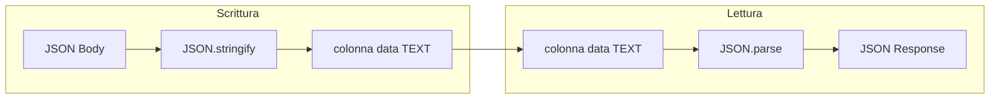

# Content Engine Beech CMS

Documentazione del motore CRUD Schema-Driven: architettura ibrida SQL/JSON per contenuti dinamici.

---

## 1. Architettura ibrida (Schema-less storage on SQL)

Beech CMS usa una **tabella SQL unica** (`content_entries`) per memorizzare **payload JSON dinamici**. Questo approccio combina:

- **Schema SQL stabile**: colonne fisse (`id`, `schema_slug`, `data`, `created_at`, `updated_at`) per metadati e indicizzazione
- **Payload flessibile**: la colonna `data` (TEXT) contiene JSON arbitrario, permettendo qualsiasi struttura senza migrazioni

**Vantaggi:**

| Aspetto | Beneficio |
|---------|-----------|
| **Un solo controller** | Nessun controller specifico per tipo di contenuto; la rotta `/:slug` si adatta dinamicamente |
| **Query SQL** | Filtri per `schema_slug`, ordinamento per `created_at`, ricerca full-text futura |
| **Consistenza** | Transazioni, foreign key, backup standard SQL |

**Trade-off:**

- La validazione dello schema JSON avviene a livello applicativo (TODO: Zod per schema definition)
- Nessun vincolo DB sui campi interni di `data`

---

## 2. Flusso dei dati

### Scrittura (POST)

```
JSON Body → JSON.stringify → colonna data (TEXT)
```

1. Il client invia un body JSON (es. `{ "titolo": "Progetto X", "tags": ["a", "b"] }`)
2. L'API lo stringifica con `JSON.stringify(body)` prima dell'INSERT
3. La colonna `data` riceve una stringa JSON valida

### Lettura (GET)

```
colonna data (TEXT) → JSON.parse → JSON Response
```

1. D1 restituisce `row.data` come stringa (es. `'{"titolo":"Progetto X"}'`)
2. `rowToEntry` esegue `JSON.parse(row.data)` per ottenere un oggetto
3. L'API restituisce al frontend un JSON con `data` come oggetto, non come stringa



**Parsing sicuro:** Se `data` contiene JSON corrotto, `JSON.parse` è avvolto in try/catch; l'API restituisce `data: {}` senza crashare.

---

## 3. API Reference dinamica

Le rotte `/:slug` e `/:slug/:id` si adattano a qualsiasi tipo di contenuto. Lo `slug` identifica il tipo (es. `progetti`, `blog`, `pagine`).

| Metodo | Path | Auth | Descrizione |
|--------|------|------|-------------|
| POST | `/api/content/:slug` | Bearer JWT | Crea una nuova entry per il tipo `slug` |
| GET | `/api/content/:slug` | Bearer JWT | Lista tutte le entry del tipo `slug` |
| GET | `/api/content/:slug/:id` | Bearer JWT | Dettaglio di una entry per ID |

### Esempi

**Progetti:**
```bash
# Creare un progetto
curl -X POST https://api.example.com/api/content/progetti \
  -H "Authorization: Bearer <token>" \
  -H "Content-Type: application/json" \
  -d '{"titolo":"Sito Aziendale","client":"Acme Corp"}'

# Lista progetti
curl https://api.example.com/api/content/progetti \
  -H "Authorization: Bearer <token>"

# Dettaglio progetto
curl https://api.example.com/api/content/progetti/<id> \
  -H "Authorization: Bearer <token>"
```

**Blog:**
```bash
# Creare un articolo
curl -X POST https://api.example.com/api/content/blog \
  -H "Authorization: Bearer <token>" \
  -H "Content-Type: application/json" \
  -d '{"title":"Hello World","body":"...","published":true}'

# Lista articoli
curl https://api.example.com/api/content/blog \
  -H "Authorization: Bearer <token>"
```

### Response

| Status | Descrizione | Body |
|--------|-------------|------|
| 201 | Creazione riuscita (POST) | `{ "id": "uuid" }` |
| 200 | Lista o dettaglio (GET) | Array o oggetto con `id`, `schema_slug`, `data`, `created_at`, `updated_at` |
| 400 | Slug/body invalido | `{ "error": "Invalid slug" }` o `{ "error": "Invalid JSON body" }` |
| 401 | Token mancante o invalido | `{ "error": "Unauthorized" }` |
| 404 | Entry non trovata (GET dettaglio) | `{ "error": "Not found" }` |
| 500 | Errore database | `{ "error": "Database error" }` |
