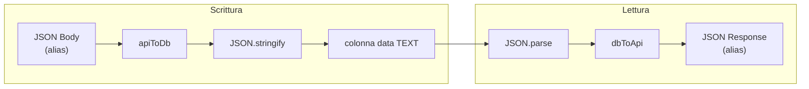

# Content Engine Beech CMS

Documentazione del motore CRUD Schema-Driven: architettura ibrida SQL/JSON per contenuti dinamici.

**Vedi anche:**
- [Botanical Engine](botanical-engine.md) — layer di traduzione alias ↔ ID interni
- [Media Engine](media-engine.md) — upload R2, campi tipo `file` (URL in `data`)
- [Architettura Monorepo](monorepo.md) — struttura `@beech/core` e pacchetti condivisi

---

## 1. Architettura ibrida (Schema-less storage on SQL)

Beech CMS usa una **tabella SQL unica** (`content_entries`) per memorizzare **payload JSON dinamici**. Questo approccio combina:

- **Schema SQL stabile**: colonne fisse (`id`, `schema_slug`, `slug`, `status`, `data`, `created_at`, `updated_at`) per metadati e indicizzazione
- **Payload flessibile**: la colonna `data` (TEXT) contiene JSON con chiavi interne (`br_xxx`), tradotte in alias leggibili dalle API

**Vantaggi:**

| Aspetto | Beneficio |
|---------|-----------|
| **Un solo controller** | Nessun controller specifico per tipo di contenuto; la rotta `/:slug` si adatta dinamicamente |
| **Query SQL** | Filtri per `schema_slug`, ordinamento per `created_at`, ricerca full-text futura |
| **Consistenza** | Transazioni, foreign key, backup standard SQL |
| **Botanical Engine** | Alias mutabili nelle API, ID immutabili nel DB — rinomine senza migrazioni |

**Trade-off:**

- La validazione dello schema JSON avviene a livello applicativo (TODO: Zod per schema definition)
- Nessun vincolo DB sui campi interni di `data`

---

## 2. Flusso dei dati

### Scrittura (POST)

```
JSON Body (alias) → apiToDb → JSON.stringify → colonna data (TEXT, br_xxx)
```

1. Il client invia un body JSON con alias (es. `{ "title": "Progetto X", "budget": 5000 }`)
2. `apiToDb(seed, body)` da `@beech/core` converte gli alias negli ID interni (`br_01`, `br_02`, …)
3. L'API stringifica il payload trasformato e lo salva in `data`

### Lettura (GET)

```
colonna data (TEXT, br_xxx) → JSON.parse → dbToApi → JSON Response (alias)
```

1. D1 restituisce `row.data` come stringa (es. `'{"br_01":"Progetto X","br_02":5000}'`)
2. `rowToEntry` (in `content.ts`) esegue `JSON.parse(row.data)` per ottenere un oggetto
3. `dbToApi(seed, data)` da `@beech/core` converte gli ID interni negli alias. Per campi di tipo `json`, se il valore è una stringa JSON (doppia serializzazione), viene fatto un double-parse per restituire oggetti/array.
4. L'API restituisce al frontend un JSON con `data` in formato alias



**Parsing sicuro:** Se `data` contiene JSON corrotto, `JSON.parse` è avvolto in try/catch; l'API restituisce `data: {}` senza crashare. Lo stesso approccio viene riusato anche quando si calcolano le `facets`, per evitare errori su righe con JSON non valido.

---

## 3. API Reference dinamica

Le rotte `/:slug` e `/:slug/:id` si adattano a qualsiasi tipo di contenuto. Lo `slug` identifica il tipo (es. `progetti`, `blog`, `pagine`).

| Metodo | Path | Auth | Descrizione |
|--------|------|------|-------------|
| POST | `/api/content/:slug` | Bearer JWT | Crea una nuova entry per il tipo `slug` |
| GET | `/api/content/:slug` | Bearer JWT | Lista entry del tipo `slug` (supporta query server-side per search/filter/sort/pagination) |
| GET | `/api/content/:slug/facets` | Bearer JWT | Restituisce facets dinamiche (`statuses`, `tagsByColumnId`) per alimentare UI filtri/condizioni |
| GET | `/api/content/:slug/:id` | Bearer JWT | Dettaglio di una entry per ID |
| PUT | `/api/content/:slug/:id` | Bearer JWT | Aggiorna una entry esistente |
| DELETE | `/api/content/:slug/:id` | Bearer JWT | Elimina una entry e i file R2 associati (vedi [Media Engine](media-engine.md)) |

### Esempi

**Progetti** (alias: `title`, `budget` — vedi [Botanical Engine](botanical-engine.md)):

```bash
# Creare un progetto
curl -X POST https://api.example.com/api/content/progetti \
  -H "Authorization: Bearer <token>" \
  -H "Content-Type: application/json" \
  -d '{"title":"Sito Aziendale","budget":5000}'

# Lista progetti (modalità legacy: senza query params)
curl https://api.example.com/api/content/progetti \
  -H "Authorization: Bearer <token>"

# Lista progetti (server-side query)
curl "https://api.example.com/api/content/progetti?search=sito&sortBy=title&sortDir=asc&page=1&limit=25" \
  -H "Authorization: Bearer <token>"

# Facets dinamiche (status/tags)
curl https://api.example.com/api/content/progetti/facets \
  -H "Authorization: Bearer <token>"

# Dettaglio progetto
curl https://api.example.com/api/content/progetti/<id> \
  -H "Authorization: Bearer <token>"

# Aggiornare un progetto
curl -X PUT https://api.example.com/api/content/progetti/<id> \
  -H "Authorization: Bearer <token>" \
  -H "Content-Type: application/json" \
  -d '{"title":"Sito Aggiornato","budget":6000}'

# Eliminare un progetto
curl -X DELETE https://api.example.com/api/content/progetti/<id> \
  -H "Authorization: Bearer <token>"
```

**Nota:** Lo slug deve essere registrato nel Seed Registry. Slug non esistenti restituiscono `404 Seed not found`.

**Blog** (da registrare come Seed):
```bash
# Creare un articolo
curl -X POST https://api.example.com/api/content/blog \
  -H "Authorization: Bearer <token>" \
  -H "Content-Type: application/json" \
  -d '{"title":"Hello World","body":"...","published":true}'

# Lista articoli
curl https://api.example.com/api/content/blog \
  -H "Authorization: Bearer <token>"
```

### Response

| Status | Descrizione | Body |
|--------|-------------|------|
| 201 | Creazione riuscita (POST) | `{ "id": "uuid" }` |
| 200 | Lista, facets, dettaglio (GET), aggiornamento (PUT), eliminazione (DELETE) | GET lista senza query: `ContentEntry[]`; GET lista con query (`search/sortBy/sortDir/filters/page/limit`): `{ items, total, page, limit }`; GET facets: `{ statuses, tagsByColumnId }`; GET dettaglio: `ContentEntry`; PUT/DELETE: `{ "success": true }` |
| 400 | Slug/body invalido | `{ "error": "Invalid slug" }` o `{ "error": "Invalid JSON body" }` |
| 401 | Token mancante o invalido | `{ "error": "Unauthorized" }` |
| 404 | Entry non trovata (GET dettaglio) | `{ "error": "Not found" }` |
| 404 | Slug non registrato | `{ "error": "Seed not found" }` |
| 500 | Errore database | `{ "error": "Database error" }` |
