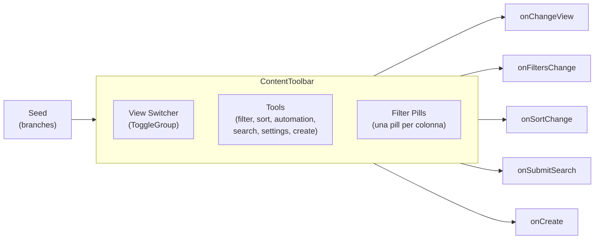

# Dashboard Components

Documentazione dei componenti UI riutilizzabili della dashboard Beech CMS.

**Vedi anche:**
- [Field Renderers](field-renderers.md) — Registry Pattern per display/edit campi schema-driven
- [Botanical Engine](botanical-engine.md) — tipi `Seed`, `Branch`, `BranchType`
- [Content Engine](content-engine.md) — API CRUD e struttura delle entry

---

## `ContentToolbar`

**File:** `apps/dashboard/src/components/content-toolbar.tsx`

Barra di controllo contestuale per le viste contenuto. Raggruppa in un'unica UI:

- **View Switcher** — ToggleGroup per passare tra le viste registrate (tabella, griglia, kanban, grafico)
- **Strumenti** — icone contestuali (filtri, ordinamento, automazione, ricerca, impostazioni, creazione) abilitabili/disabilitabili per singola vista
- **Filter Pills** — pill cliccabili Notion-like, una per colonna, con condizioni AND multiple



---

## Props

| Prop | Tipo | Default | Descrizione |
|------|------|---------|-------------|
| `seed` | `Seed` | — | Seed attivo; i suoi `branches` alimentano le colonne filtrabili e ordinabili |
| `views` | `UserViewInstance[]` | — | Viste disponibili per questo seed |
| `activeViewId` | `string` | — | ID della vista correntemente selezionata |
| `onChangeView` | `(viewId: string) => void` | — | Callback al cambio vista |
| `onCreateView` | `() => void` | `undefined` | Apre il flusso di creazione nuova vista (TODO: non ancora implementato) |
| `onRenameView` | `(viewId: string, label: string) => void` | `undefined` | Rinominazione della vista attiva; aggiorna ad es. `UserViewInstance.label` e il relativo toggle |
| `onCreate` | `() => void` | — | Apre il flusso di creazione nuova entry |
| `onOpenFilters` | `() => void` | `undefined` | ⚠️ **Deprecato** — non più richiamato internamente. Il menu Filtri è ora integrato nel settings sub-menu. Mantenuto per compatibilità API. |
| `onOpenSort` | `() => void` | `undefined` | ⚠️ **Deprecato** — non più richiamato internamente. Il menu Ordina è ora integrato nel settings sub-menu. Mantenuto per compatibilità API. |
| `onOpenAutomation` | `() => void` | `undefined` | Apre il pannello automazioni (richiamato dal bottone Zap in toolbar) |
| `onOpenSettings` | `() => void` | `undefined` | ⚠️ **Deprecato** — non più richiamato internamente. Mantenuto per compatibilità API. |
| `searchValue` | `string` | `""` | Valore controllato del campo di ricerca |
| `onSearchChange` | `(value: string) => void` | `undefined` | Aggiornamento del termine di ricerca |
| `onSubmitSearch` | `(value: string) => void` | `undefined` | Submit della ricerca (invio form) |
| `sortState` | `{ columnId: string \| null; desc: boolean }` | `undefined` | Stato ordinamento corrente |
| `onSortChange` | `(state) => void` | `undefined` | Callback al cambio ordinamento |
| `filters` | `ToolbarFiltersState` | `{}` | Stato filtri corrente (Record columnId → gruppo) |
| `onFiltersChange` | `(state: ToolbarFiltersState) => void` | `undefined` | Callback al cambio filtri |
| `availableTagsByColumnId` | `Record<string, string[]>` | `{}` | Tag disponibili per colonne di tipo `tags` |
| `pageSize` | `number` | `undefined` | Numero di righe per pagina (min 1, max 100). Se presente, mostra il controllo −/+ nel menu Impostazioni |
| `onPageSizeChange` | `(size: number) => void` | `undefined` | Callback per aggiornare il numero di righe per pagina |
| `columnVisibility` | `VisibilityState` (`@tanstack/react-table`) | `undefined` | Stato di visibilità delle colonne (id colonna → `true`/`false`) |
| `onColumnVisibilityChange` | `(visibility: VisibilityState) => void` | `undefined` | Callback per aggiornare la visibilità colonne |
| `groupBy` | `string \| null` | `null` | Colonna attiva per il raggruppamento (singola colonna). `null` disabilita il raggruppamento |
| `onGroupByChange` | `(columnId: string \| null) => void` | `undefined` | Callback al cambio raggruppamento |
| `dateGroupPrecision` | `{ year: boolean; month: boolean; day: boolean }` | `{ year: true, month: true, day: false }` | Granularità per il raggruppamento su colonne `date` (vedi sezione “Raggruppamento date”) |
| `onDateGroupPrecisionChange` | `(precision) => void` | `undefined` | Callback al cambio granularità date |
| `children` | `React.ReactNode` | `undefined` | Contenuto sotto la toolbar (tabella, kanban, ecc.). Se assente, la sezione inferiore non viene renderizzata |

---

## Tipi esportati

### `ViewType`

```ts
type ViewType = "table" | "grid" | "kanban" | "chart"
```

### `ToolbarTool`

```ts
type ToolbarTool = "filter" | "sort" | "automation" | "search" | "settings" | "create"
```

Ogni vista può abilitare un sottoinsieme di strumenti tramite `UserViewInstance.enabledTools`. Se non specificato, vengono abilitati tutti gli strumenti (`DEFAULT_ENABLED_TOOLS`).

### `UserViewInstance`

```ts
interface UserViewInstance {
  id: string
  label: string
  type: ViewType
  enabledTools: ToolbarTool[]
}
```

### `ToolbarFiltersState`

```ts
type ToolbarFiltersState = Record<string, ToolbarFilterGroup>
```

Record indicizzato per `columnId`. Ogni gruppo contiene una o più condizioni AND.

### `ToolbarFilterGroup`

```ts
interface ToolbarFilterGroup {
  columnId: string
  label: string
  type: FilterGroupType
  conditions: ToolbarFilterCondition[]
  selectOptions?: string[]  // per tipo "select"
}
```

### `ToolbarFilterCondition`

```ts
interface ToolbarFilterCondition {
  id: string
  op: FilterOperator
  value: string | number | boolean | null
}
```

### `FilterGroupType`

```ts
type FilterGroupType = "text" | "number" | "date" | "boolean" | "tags" | "select" | "system"
```

### `FilterOperator`

```ts
type FilterOperator = "eq" | "gt" | "gte" | "lt" | "lte" | "contains" | "is_empty" | "is_not_empty"
```

Gli operatori disponibili per tipo sono definiti dalla funzione pura `getOperatorOptions(type)`:

| Tipo | Operatori |
|------|-----------|
| `text`, `system` | `contains`, `eq`, `is_not_empty`, `is_empty` |
| `number`, `date` | `gt`, `lt`, `gte`, `lte`, `eq`, `is_not_empty`, `is_empty` |
| `boolean` | `eq`, `is_not_empty`, `is_empty` |
| `select` | `eq`, `is_not_empty`, `is_empty` |
| `tags` | `contains`, `is_not_empty`, `is_empty` |

---

## Derivazione delle colonne filtrabili da `seed.branches`

Il componente costruisce internamente l'elenco delle colonne filtrabili partendo dai `branches` del seed. Due colonne di sistema sono sempre presenti in cima:

| `columnId` | Tipo | Note |
|------------|------|------|
| `slug` | `system` | Identificatore URL dell'entry |
| `status` | `select` | Valori: `["draft", "published"]` |

I branch vengono mappati secondo questa logica:

| `branch.type` | `FilterGroupType` assegnato |
|---|---|
| `number` | `number` |
| `date` | `date` |
| `boolean` | `boolean` |
| `json` con alias contenente `"tag"` | `tags` |
| `text`, `richtext`, `file` | `text` |
| altri | `text` (fallback) |

---

## Esempio di utilizzo minimo

```tsx
import { ContentToolbar, type UserViewInstance } from "@/components/content-toolbar"

const views: UserViewInstance[] = [
  { id: "v1", label: "Tabella", type: "table", enabledTools: ["filter", "sort", "search", "create"] },
  { id: "v2", label: "Griglia", type: "grid", enabledTools: ["search", "create"] },
]

function ContentPage({ seed, entries }) {
  const [activeViewId, setActiveViewId] = useState("v1")
  const [filters, setFilters] = useState({})
  const [sortState, setSortState] = useState({ columnId: null, desc: true })
  const [searchValue, setSearchValue] = useState("")

  return (
    <ContentToolbar
      seed={seed}
      views={views}
      activeViewId={activeViewId}
      onChangeView={setActiveViewId}
      onCreate={() => navigate(`/content/${seed.slug}/create`)}
      filters={filters}
      onFiltersChange={setFilters}
      sortState={sortState}
      onSortChange={setSortState}
      searchValue={searchValue}
      onSearchChange={setSearchValue}
      onSubmitSearch={(q) => refetch({ search: q })}
    >
      <DataTable entries={entries} />
    </ContentToolbar>
  )
}
```

---

## Menu Impostazioni — struttura

Il bottone `settings` (icona ingranaggio) apre un `DropdownMenu` organizzato in quattro sezioni. Ogni voce secondaria usa `DropdownMenuSub` + `DropdownMenuPortal` + `DropdownMenuSubContent` per aprire un pannello laterale al passaggio del mouse.

```
Impostazioni vista
├── [input] Nome vista
│
├── Azioni rapide
│   ├── Filtra ▶  [stessa UI del bottone Filter in toolbar]
│   │              ricerca colonna + lista colonne → aggiunge condizione alla pill
│   └── Ordina ▶  [stessa UI del bottone Sort in toolbar]
│                  ricerca colonna + ↕ inverti direzione + lista colonne
│
├── Layout e stile
│   ├── Raggruppa ▶
│   │    ├── Nessun raggruppamento
│   │    ├── Consigliati
│   │    │    ├── Stato
│   │    │    ├── (boolean/date/select a bassa cardinalità)
│   │    │    └── [colonne date] ▶ Granularità: Giorno | Anno | Mese (mese+anno)
│   │    └── Altri campi (warning “Potrebbe generare molti gruppi”)
│   └── Colori condizionali ▶  (TODO)
│
└── Tabella
    ├── Colonne visibili ▶  ricerca colonna + toggle Eye/EyeOff per colonna
    └── Righe  [controllo −/+ senza hover, min 1 max 100]
```

Le voci "Filtra" e "Ordina" nel menu Impostazioni condividono lo stesso stato interno (`filterColumnSearchTerm`, `sortColumnSearchTerm`, `filteredSortableColumns`, ecc.) dei dropdown standalone presenti nella toolbar — non è necessaria alcuna prop aggiuntiva.

---

## Raggruppamento date (granularità)

Quando `groupBy` punta a una colonna `date`, il sottomenu “Granularità” permette una scelta **esclusiva** (una sola alla volta) e applica subito il raggruppamento:

- **Giorno**: raggruppa per giorno (include sempre l’anno nel label del gruppo)
- **Anno**: raggruppa per anno
- **Mese**: raggruppa per **mese + anno** (default)

Comportamento UX:

- La selezione applica immediatamente la nuova granularità e **chiude il menu**.
- Se era attivo un raggruppamento diverso, viene sostituito (raggruppamento a singola colonna).

---

## Note implementative

- **Strumenti per vista**: `enabledTools` di `UserViewInstance` determina quali icone appaiono nella toolbar. I tool non presenti nell'array vengono omessi dal DOM (non solo nascosti).
- **Filter Pills**: le pill appaiono solo se `children` è presente e se `Object.keys(filters).length > 0`. Una pill per colonna; ogni pill apre un dropdown con tutte le condizioni AND della colonna.
- **`generateConditionId`**: usa `Date.now()` + stringa casuale base-36. Sufficiente per unicità in sessione; non è un UUID persistente.
- **Focus campo ricerca**: gestito via `useEffect` su `isSearchOpen` per rispettare il ciclo di vita React (il DOM dell'input esiste solo dopo il render successivo alla transizione di stato).
- **Nome vista**: salvato tramite `onRenameView` su `Enter`, blur o chiusura del menu. I tasti singoli senza modifier non propagano al `DropdownMenu` per evitare conflitti con le shortcut di Radix UI.
- **Controllo Righe**: `DropdownMenuItem` con `onSelect` bloccato e hover disabilitato. Il click sui bottoni `−`/`+` usa `e.stopPropagation()` per non propagare al menu item genitore. Valori ammessi: 1–100.
- **Colonne visibili**: ogni colonna mostra `Eye` (visibile) o `EyeOff` (nascosta). Il sub-menu filtra le colonne tramite uno stato locale `columnSearchTerm` che viene resettato alla chiusura del menu Impostazioni.
- **`DropdownMenuPortal`**: tutti i `DropdownMenuSubContent` sono avvolti in `DropdownMenuPortal` per garantire il corretto z-index quando il menu è posizionato vicino ai bordi della viewport.
- **Grouping e aggiornamenti**: quando si cambia granularità su un raggruppamento `date`, la tabella forza un aggiornamento del modello di gruppi per riflettere immediatamente la nuova chiave di gruppo.

---

## TODO in sospeso

- **Persistenza viste**: `views`, `enabledTools` e la vista attiva devono provenire da una configurazione persistente per-utente, non da props statiche.
- **Flusso `onCreateView`**: la creazione/modifica/eliminazione di una vista utente non è ancora implementata; `onCreateView` è una callback stub.
- **Ricerca server-side**: `onSubmitSearch` deve essere collegato all'API `GET /api/content/:slug?search=...` con i parametri della vista attiva.
- **Colori condizionali**: evidenziazione righe in base a regole non ancora implementata.
