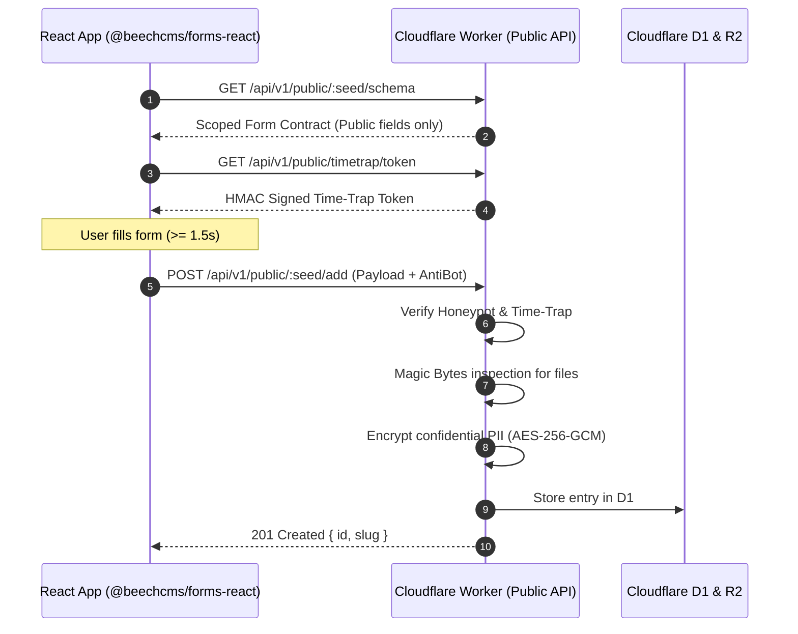

# Forms SDK & Protection

`@beechcms/forms-react` is an edge-native React toolkit for building secure, dynamic forms connected directly to your BeechCMS backend.

---

## Why Use the SDK

Building forms manually requires repetitive boilerplate: state management, validation, anti-spam, draft restoration, and file parsing.

| Challenge | Manual Implementation | With `@beechcms/forms-react` |
| :--- | :--- | :--- |
| **CMS Sync** | Manually update components & schemas on every CMS change | **Zero-Config Sync**: Updates immediately from the CMS |
| **Spam Defense** | Third-party CAPTCHAs that hurt conversion | **Invisible Anti-Bot**: HMAC Time-Trap + Camouflaged Honeypot |
| **Speed & CLS** | Network waterfalls cause layout shifts | **SWR Caching**: Cached in `sessionStorage` for 0ms mount |
| **Data Privacy** | Complex client/server cryptographic pipelines | **Zero-Trust Encryption**: PII encrypted at rest with AES-256-GCM |
| **User Experience** | Accidental refresh loses all typed data | **Draft Auto-Save**: Preserves form values across reloads |

---

## Interactive CLI Generator

Generate a customized form component for **React**, **Vue 3**, **Svelte 5**, or **Vanilla JS / Web Components** in seconds:

```bash
npx @beechcms/cli forms
# or using local beech CLI:
pnpm beech forms
```

The interactive wizard asks which framework you are using and scaffolds the component directly into `src/components/BeechForm.[tsx|vue|svelte|js]` with anti-bot defenses built-in.

---

## Installation (React SDK)

```bash
pnpm add @beechcms/forms-react
# or
npm install @beechcms/forms-react
```

---

## Quick Start

Render a complete, production-ready form in one line with `<BeechForm />`:

```tsx
import React from 'react'
import { BeechForm } from '@beechcms/forms-react'

export function ContactSection() {
  return (
    <div className="max-w-xl mx-auto p-6 bg-white rounded-lg shadow">
      <BeechForm
        seed="clienti"
        baseUrl="https://api.yourdomain.com"
        apiKey="your-public-write-api-key"
        locale="it"
        onSuccess={({ id }) => alert(`Success! ID: ${id}`)}
      />
    </div>
  )
}
```

### Under the Hood
1. **Dynamic Schema**: Loads public fields from `GET /api/v1/public/:seed/schema`.
2. **Auto-Rendering**: Generates inputs, dropdowns, textareas, and file uploaders.
3. **Anti-Bot Defense**: Injects invisible honeypot and verifies HMAC time token.
4. **Draft Storage**: Auto-saves typing progress to prevent data loss.

---

## Headless Mode (Custom UI)

For complete control over markup and styling (e.g. Tailwind CSS, Shadcn UI), use `useBeechForm`:

```tsx
import React from 'react'
import { useBeechForm, Honeypot } from '@beechcms/forms-react'

export function CustomContactForm() {
  const form = useBeechForm({
    seed: 'clienti',
    baseUrl: 'https://api.yourdomain.com',
    apiKey: 'your-public-write-api-key',
    onSuccess: (res) => alert(`Saved! ID: ${res.id}`),
  })

  if (form.isSuccess) {
    return <div className="p-4 bg-green-50 text-green-700 rounded">Thank you! Message sent.</div>
  }

  return (
    <form onSubmit={form.handleSubmit} className="space-y-4 max-w-lg mx-auto" noValidate>
      {/* 🛡️ 1-line invisible anti-bot protection */}
      <Honeypot form={form} />

      <div>
        <label className="block text-sm font-medium">Name *</label>
        <input {...form.register('name')} className="input-field" placeholder="Jane Doe" />
        {form.errors.name && <p className="text-red-500 text-xs">{form.errors.name}</p>}
      </div>

      <div>
        <label className="block text-sm font-medium">Email *</label>
        <input {...form.register('email')} type="email" className="input-field" placeholder="jane@company.com" />
        {form.errors.email && <p className="text-red-500 text-xs">{form.errors.email}</p>}
      </div>

      {form.serverError && <p className="text-red-600 text-sm">{form.serverError}</p>}

      <button type="submit" disabled={form.isSubmitting} className="btn-primary">
        {form.isSubmitting ? 'Sending...' : 'Send Message'}
      </button>
    </form>
  )
}
```

---

## Customization

### Field Filtering
Filter which fields to render without changing CMS definitions:

```tsx
<BeechForm
  seed="clienti"
  baseUrl="https://api.yourdomain.com"
  includeFields={['name', 'email', 'message']}
  excludeFields={['internal_notes']}
/>
```

### Localization
Switch languages (`it` | `en`) or pass custom dictionaries:

```tsx
<BeechForm
  seed="clienti"
  baseUrl="https://api.yourdomain.com"
  locale="it"
  translations={{
    submitButton: "Invia Richiesta",
    successTitle: "Ricevuto!",
  }}
/>
```

### File Uploads
Files are checked against Magic Bytes signatures and encoded automatically:

```tsx
<input
  type="file"
  accept=".pdf,.png,.jpg"
  onChange={(e) => form.handleFileChange('cv_attachment', e.target.files?.[0] ?? null)}
/>
```

### Anti-Bot Options
Customize honeypot decoy names or disable in test environments:

```tsx
<BeechForm
  seed="clienti"
  baseUrl="https://api.yourdomain.com"
  honeypotField="fax_number"
  disableAntiBot={process.env.NODE_ENV === 'test'}
/>
```

---

## Security Architecture



---

## Related Guides

- [Client SDK](/reference/client-sdk) — Official TypeScript client for data fetching.
- [Public API Reference](/reference/public-api) — Complete technical specification and endpoints.
- [Automations](/features/automations) — Triggering automatic emails on submission.
- [First Project](/start/first-project) — Step-by-step tutorial.
