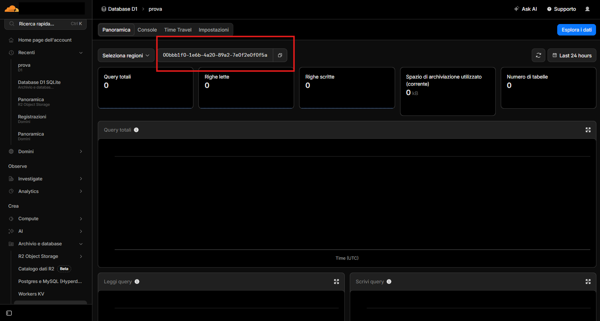

# BeechCMS — Building a Website

A complete walkthrough: from zero to a live website powered by BeechCMS as a headless CMS backend.

---

## Table of Contents

1. [What BeechCMS Is — and What You Can Build With It](#1-what-beechcms-is--and-what-you-can-build-with-it)
2. [Prerequisites](#2-prerequisites)
3. [Scaffolding a New Project](#3-scaffolding-a-new-project)
4. [Project Structure](#4-project-structure)
5. [Obtaining External Service Credentials](#5-obtaining-external-service-credentials)
   - [Cloudflare D1 (database)](#51-cloudflare-d1-database_id)
   - [Cloudflare R2 (media storage)](#52-cloudflare-r2-media-storage)
   - [Resend (email)](#53-resend-resend_api_key)
   - [Upstash QStash (scheduled tasks)](#54-upstash-qstash-qstash_token)
6. [Configuration](#6-configuration)
   - [wrangler.jsonc](#61-wranglerjsonc)
   - [.dev.vars](#62-devvars)
7. [Running Locally](#7-running-locally)
8. [Defining Content Types (Seeds)](#8-defining-content-types-seeds)
   - [Using the Dashboard UI (Recommended)](#81-using-the-dashboard-ui-recommended)
   - [Code-First with seeds.ts](#82-code-first-with-seedsts)
   - [Branch types](#83-branch-types)
   - [Number field options](#84-number-field-options)
   - [Branch policies](#85-branch-policies)
   - [Relation fields](#86-relation-fields)
   - [Dashboard config](#87-dashboard-config)
9. [The Dashboard — A Quick Tour](#9-the-dashboard--a-quick-tour)
10. [Consuming the Public API](#10-consuming-the-public-api)
    - [Authentication](#101-authentication)
    - [Discover the schema](#102-discover-the-schema)
    - [Read a list of entries](#103-read-a-list-of-entries)
    - [Read a single entry](#104-read-a-single-entry)
    - [Filter, sort, and paginate](#105-filter-sort-and-paginate)
    - [Submit a form entry](#106-submit-a-form-entry)
    - [Edit an existing entry](#107-edit-an-existing-entry)
    - [Response format](#108-response-format)
    - [Resolving relation fields](#109-resolving-relation-fields)
    - [Error format](#1010-error-format)
11. [Media (Images and Files)](#11-media-images-and-files)
    - [Serving media](#111-serving-media)
    - [Production CDN](#112-production-cdn)
    - [Media inside RichText](#113-media-inside-richtext)
12. [Automations](#12-automations)
13. [Schema Evolution](#13-schema-evolution)
14. [Deploying to Production](#14-deploying-to-production)
15. [Updating BeechCMS](#15-updating-beechcms)
16. [CLI Reference](#16-cli-reference)

---

## 1. What BeechCMS Is — and What You Can Build With It

BeechCMS is a **schema-driven headless CMS** that runs entirely on Cloudflare's edge infrastructure: Workers for compute, D1 (SQLite) for structured content, and R2 for media. You define your data model (called **Seeds**), and BeechCMS gives you:

- An **admin dashboard** at `/admin` for your editors to create, edit, and manage content.
- A **Public REST API** at `/api/v1/public/:seed` for your frontend to consume content without writing any backend code.
- A **media pipeline** backed by R2, with an optional CDN URL for direct delivery.
- **Automations** to trigger emails, webhooks, or field updates when content is created, updated, or deleted.

### Use cases

| What you're building | How BeechCMS fits |
|---|---|
| **Blog / editorial site** | Seeds for posts, authors, tags. Public read API for your Next.js / Nuxt / Astro frontend. |
| **Portfolio** | Seeds for projects, case studies, testimonials. Gallery seed for images. |
| **Marketing site** | Seeds for landing pages, features, team members, FAQs. Rich text fields for long-form content. |
| **Contact / lead capture** | A contact seed with `allowPublicPost: true` collects form submissions directly into D1. Automations send you email alerts. |
| **Product catalog** | Commerce seed with price, inventory, and rating fields. Public read API for your storefront. |
| **Event / job listings** | Date fields, draft workflow for unpublished drafts, public read when ready. |
| **Multi-editor team** | Role-based access (admin / editor), dashboard notifications, activity log. |

BeechCMS does **not** include frontend rendering — it is a backend-only headless CMS. You connect your frontend (React, Vue, Next.js, Astro, plain HTML, etc.) to its Public API.

---

## 2. Prerequisites

| Requirement | Notes |
|---|---|
| **Node.js 18+** | For running the CLI and Wrangler |
| **Cloudflare account** | Free tier is sufficient for development and small production sites |
| **`npx` / `npm`** | Comes with Node.js |
| **Wrangler** | Installed automatically by the scaffold (`devDependencies`) |

You do **not** need Docker to use BeechCMS from the npm package. Docker is only needed if you are developing BeechCMS itself from the monorepo source.

---

## 3. Scaffolding a New Project

Run the interactive wizard:

```bash
npx @beechcms/cms
```

The wizard asks for:

1. **Project name** — used as the directory name and Cloudflare resource prefix.
2. **Starter template** — pick one or more to pre-configure Seeds:
   - **Blog** — posts with rich text, cover image, tags, and authors.
   - **Gallery** — media items with image, tags, and a featured flag.
   - **Contact** — public form submissions with masked email and a read status.
   - **Commerce** — e-commerce product catalog with prices, inventory, and ratings.
   - **Tasks** — project management tasks with a progress slider.
   - **Empty** — a blank slate, no Seeds pre-configured.
3. **Cloudflare credentials** — Account ID, D1 database ID, R2 bucket, and keys. Skip to fill them in later.

After the wizard, a ready-to-use project is in `./<project-name>/`.

**Non-interactive mode** — skip all prompts with `--yes`. Add `--with-examples` to scaffold with the Blog template pre-configured:

```bash
npx @beechcms/cms my-project --yes --with-examples
```

---

## 4. Project Structure

```
my-project/
├── seeds.ts        ← optional code-first content type definitions
├── worker.ts       ← Cloudflare Worker entry point — never edit this
├── wrangler.jsonc  ← Cloudflare + app configuration
├── .dev.vars       ← local-only secrets (git-ignored)
└── package.json
```

`worker.ts` is generated and kept minimal:

```typescript
/// <reference types="@cloudflare/workers-types" />
import { createBeechApp } from '@beechcms/api'
import { SEED_REGISTRY } from './seeds'

export default createBeechApp({ seeds: Object.values(SEED_REGISTRY) })
```

The entire CMS engine, dashboard, and API live inside `node_modules/@beechcms/api` — updatable with `npm update @beechcms/api`.

---

## 5. Obtaining External Service Credentials

You need credentials from Cloudflare for the database and media storage. Email and scheduled tasks are optional.

### 5.1 Cloudflare D1 (`database_id`)

**Via Wrangler CLI (recommended):**

```bash
npx wrangler login
npx wrangler d1 create my-project-db
```

Copy the `database_id` (UUID format) printed in the terminal.

**Via Cloudflare Dashboard:**
1. Log in to [dash.cloudflare.com](https://dash.cloudflare.com).
2. Navigate to **Storage & Databases → D1**.
3. Click **Create database**, enter a name, and click **Create**.
4. Copy the **Database ID** from the details panel.



### 5.2 Cloudflare R2 (media storage)

**Create a bucket:**
1. Navigate to **Storage & Databases → R2**.
2. Click **Create bucket**, enter a name (e.g. `my-project-media`).

**Generate S3 API credentials:**
1. On the R2 home screen, click **Manage R2 API Tokens** (top-right).
2. Click **Create API Token**.
3. Set **Permissions** to **Object Read & Write**, scoped to your bucket.
4. Click **Create API Token**.
5. **Copy the Access Key ID and Secret Access Key immediately** — the secret is never shown again.

**Retrieve the S3 endpoint:**
1. Open your R2 bucket → **Settings** tab → **S3 API** section.
2. Copy the URL (e.g. `https://<ACCOUNT_ID>.r2.cloudflarestorage.com`).

> 📷 **Screenshot opportunity:** R2 API token creation dialog showing the permissions scope.

### 5.3 Resend (`RESEND_API_KEY`)

Required only if you want password-reset emails or automation email actions.

1. Log in to [resend.com](https://resend.com) and go to **API Keys**.
2. Click **Create API Key**, set permission to **Sending access**.
3. Copy the key (starts with `re_`).

**Verify your sending domain** (required for production emails):
1. Go to **Domains → Add Domain** in the Resend dashboard.
2. Add the DNS records (MX, SPF, DKIM) to your DNS provider.
3. Click **Verify**.

### 5.4 Upstash QStash (`QSTASH_TOKEN`)

Required only if you use cron-based automations (scheduled triggers).

1. Log in to [console.upstash.com](https://console.upstash.com).
2. Select **QStash** from the top navigation.
3. Copy the `QSTASH_TOKEN` from the **REST API** section.

---

## 6. Configuration

### 6.1 `wrangler.jsonc`

The scaffold pre-fills the values you provided during setup. Edit before running if you skipped credentials.

```jsonc
{
  "name": "my-project-api",
  "main": "worker.ts",
  "compatibility_date": "2025-01-01",

  "vars": {
    "JWT_SECRET": "...",               // Auto-generated — do not share
    "CORS_ORIGINS": "http://localhost:5173,https://my-site.com",
    "PUBLIC_READ_API_KEY":  "...",     // Shared with your frontend (read operations)
    "PUBLIC_WRITE_API_KEY": "...",     // Shared with your frontend (write operations)
    "APP_URL": "https://my-site.com",
    "MEDIA_BASE_URL": "https://api.my-site.com", // Base URL for the media proxy
    "MEDIA_CDN_URL":  "https://cdn.my-site.com"  // Optional: direct CDN/R2 domain
  },

  "assets": {
    "binding": "ASSETS",
    "directory": "node_modules/@beechcms/api/assets/dashboard"
  },

  "d1_databases": [{
    "binding": "DB",
    "database_name": "my-project-db",
    "database_id":   "xxxxxxxx-xxxx-xxxx-xxxx-xxxxxxxxxxxx",
    "migrations_dir": "node_modules/@beechcms/api/migrations"
  }],

  "r2_buckets": [{
    "binding": "MEDIA_BUCKET",
    "bucket_name": "my-project-media"
  }]
}
```

> **Never commit `JWT_SECRET`, `PUBLIC_READ_API_KEY`, or `PUBLIC_WRITE_API_KEY` to a public repository.**  
> In production, move secrets to [Wrangler secrets](#step-2--set-production-secrets) instead of plain `vars`.

### 6.2 `.dev.vars`

Optional for local development. Media uploads work automatically via Wrangler's local R2 emulation.

Fill in `.dev.vars` only if you want to test production-like R2 behaviour locally:

```bash
# .dev.vars — git-ignored, never deployed
R2_ACCESS_KEY_ID=your-access-key
R2_SECRET_ACCESS_KEY=your-secret-key
R2_ENDPOINT=https://<ACCOUNT_ID>.r2.cloudflarestorage.com
R2_BUCKET_NAME=my-project-media
```

---

## 7. Running Locally

```bash
npm install                     # first time only
npx beech onboard --local --yes # initialise D1 tables and load seeds.ts
npx wrangler dev                # start the Worker on http://localhost:8789
```

Open `http://localhost:8789/admin` — the setup wizard appears on first launch to create your admin account.

> 📷 **Screenshot opportunity:** The first-launch setup wizard asking for email and password.

### CORS in development

When `ENV` is not `production`, the API automatically allows any origin on `localhost` or `127.0.0.1` regardless of port. You do **not** need to add your frontend dev server to `CORS_ORIGINS` in `wrangler.jsonc`. Next.js on port 3000, Vite on 5173, Nuxt on 3001 — all work out of the box.

In production, only the origins listed in `CORS_ORIGINS` are allowed.

### API key echo

`npx beech init` prints the public API keys found in `wrangler.jsonc`:

```
API keys detected in wrangler.jsonc:

  PUBLIC_READ_API_KEY  = dev-****-key
  PUBLIC_WRITE_API_KEY = dev-****-key

Use these in your frontend as the X-API-Key header.
```

---

## 8. Defining Content Types (Seeds)

A **Seed** is a content type — a named schema that maps to a database table and a set of API endpoints. Seeds have **Branches** (fields), each with a type, alias (column name), and optional policies.

### 8.1 Using the Dashboard UI (Recommended)

Navigate to **Settings → Content Types** in the dashboard. Click **Add content type** and use the visual Seed Builder to:

- Name the content type, choose its public access level.
- Add fields (branches) by picking a type, entering a label and alias.
- Set field policies (visibility, public access, searchability).
- Configure the sidebar icon, group, and order.

Changes are applied to the database instantly — no CLI command needed.

> 📷 **Screenshot opportunity:** The Seed Builder UI showing a content type with several branches and field type selectors.

> 📷 **Screenshot opportunity:** The field policy panel showing visibility, public, and search toggles.

### 8.2 Code-First with `seeds.ts`

An alternative to the dashboard UI — useful for version-controlled bootstrapping or AI-agent onboarding. Define seeds in TypeScript and push them with a CLI command.

```typescript
import type { Seed } from '@beechcms/core'
import { defineSeed } from '@beechcms/core'

export const posts = defineSeed({
  slug: 'posts',              // → table name: content_posts, API path: /api/v1/public/posts
  label: 'Post',
  labelPlural: 'Posts',
  displayNameAlias: 'title',  // which field represents the entry in lists
  allowPublicRead: true,      // expose via unauthenticated Public API
  allowDrafts: true,          // enable draft workflow
  branches: [
    { id: 'br_01', alias: 'title',       label: 'Title',       type: 'text',     requiredOnCreate: true },
    { id: 'br_02', alias: 'publishedAt', label: 'Published at', type: 'date' },
    { id: 'br_03', alias: 'coverImage',  label: 'Cover image', type: 'file',     fileOptions: { accept: 'image' } },
    { id: 'br_04', alias: 'body',        label: 'Body',        type: 'richtext' },
    { id: 'br_05', alias: 'tags',        label: 'Tags',        type: 'tags' },
  ],
})

// Named map (recommended) — keyed by slug
export const SEED_REGISTRY: Record<string, Seed> = { posts }
```

**Important: every branch requires a stable `id`** in the format `br_[A-Za-z0-9]+` (e.g. `br_01`, `br_title`). This ID survives alias renames and is used internally by automations, layouts, and FTS triggers. Pick it once and never change it.

After editing `seeds.ts`, push the changes to the local database:

```bash
npx beech seed:load --local
```

> [!WARNING]
> **Dashboard UI vs. Code-First sync conflict.**  
> If you create or edit content types via the dashboard UI and then run `npx beech seed:load`, the definitions in `seeds.ts` **will overwrite** your dashboard changes.  
> **Choose one source of truth and stick to it.** Use the dashboard UI (recommended) or `seeds.ts` — not both.

### 8.3 Branch types

| Type | Description | Notes |
|---|---|---|
| `text` | Single-line string | Titles, slugs, URLs, short text |
| `number` | Integer or float | Prices, ratings, counts — see [number options](#84-number-field-options) |
| `boolean` | True / false toggle | Featured flag, active status |
| `date` | ISO 8601 date string | Publish date, event date |
| `richtext` | Structured rich text (TipTap) | Long-form content — render with `richTextToHtml()` from `@beechcms/core` |
| `file` | R2 asset URL or list of URLs | Images, PDFs, attachments — add `multiple: true` for multiple files |
| `tags` | Array of string tags | Keyword tags, categories — add `options: [...]` for a fixed vocabulary |
| `json` | Arbitrary JSON object or array | Structured data, nested config |
| `relation` | Reference to another Seed | Link entries across content types — see [Relation fields](#86-relation-fields) |

### 8.4 Number field options

The `number` type supports rich display formatting and custom input controls via `numberOptions`:

```typescript
{
  id: 'br_price',
  alias: 'price',
  label: 'Price',
  type: 'number',
  numberOptions: {
    format: 'currency',   // 'decimal' | 'currency' | 'percentage' | 'compact'
    currency: 'EUR',      // ISO 4217 code — required when format === 'currency'
    decimals: 2,
    control: 'input',     // 'input' | 'slider' | 'rating' | 'stepper'
    min: 0,
    max: 9999,
    step: 0.01,
  }
}
```

### 8.5 Branch policies

Policies control how a field is stored, returned, and indexed. All values are optional — defaults are applied automatically.

```typescript
{
  id: 'br_email',
  alias: 'email',
  label: 'Email',
  type: 'text',
  policies: {
    privacy:    'plain',    // 'plain' (default) | 'hash' | 'encrypt'
    visibility: 'masked',   // 'full' (default) | 'masked' | 'hidden'
    public:     false,      // exclude from Public API responses
    search:     false,      // exclude from full-text search
    filter:     true,       // show in dashboard filter panel
    sort:       true,       // allow sorting by this field
  }
}
```

| Policy | Values | Default | Effect |
|---|---|---|---|
| `privacy` | `plain`, `hash`, `encrypt` | `plain` | How the value is stored in D1 |
| `visibility` | `full`, `masked`, `hidden` | `full` | `masked` redacts part of the value; `hidden` omits it in the dashboard |
| `public` | boolean | `true` | `false` strips the field from all `/api/v1/public/*` responses |
| `search` | boolean | `true` | `false` excludes the field from full-text search indexing |
| `filter` | boolean | `true` | `false` hides the field from dashboard filter options |
| `sort` | boolean | `true` | `false` prevents sorting by this field in the dashboard |

### 8.6 Relation fields

Link entries across Seeds using the `relation` type. Specify `targetSeed` (the slug of the referenced Seed) and optionally `multiple: true` for a many-to-many relationship.

```typescript
// Single relation: each post has one author
{ id: 'br_06', alias: 'authorId', label: 'Author', type: 'relation', targetSeed: 'authors' }

// Multiple relations: each post can have many tags
{ id: 'br_07', alias: 'tagIds',   label: 'Tags',   type: 'relation', targetSeed: 'tags', multiple: true }
```

The Public API returns relation values as IDs (a string for single, an array of strings for multiple). See [Resolving relation fields](#109-resolving-relation-fields) for how to expand them in your frontend.

### 8.7 Dashboard config

Each Seed can include an optional `dashboard` field that controls how it appears in the sidebar. This config is ignored by the database and API — it only affects the admin UI.

```typescript
export const posts = defineSeed({
  slug: 'posts',
  // ...
  dashboard: {
    icon: 'Newspaper',      // Lucide icon name in PascalCase — defaults to 'Folder'
    group: 'Blog',          // sidebar group label — seeds with the same group are grouped together
    order: 1,               // sort position within the group (lower = higher)
    hidden: false,          // hide from sidebar entirely
    description: 'Blog posts and articles',  // tooltip in the sidebar
    features: {
      search:     true,     // show search bar (default: true)
      filter:     true,     // show column filters (default: true)
      export:     false,    // show CSV export button (default: false)
      bulkDelete: false,    // show bulk-delete action (default: false)
    },
  },
})
```

Any [Lucide](https://lucide.dev/icons/) icon name in PascalCase is valid. Unknown names fall back to `Folder`.

---

## 9. The Dashboard — A Quick Tour

After your first login, the dashboard has these main areas:

| Area | What it does |
|---|---|
| **Sidebar** | Lists all your Seeds, grouped by the `dashboard.group` you configured |
| **Content list** | Table view of entries for a selected Seed — search, filter, sort, export |
| **Entry editor** | Form to create or edit an entry, one field per Branch |
| **Media library** | Browse and manage all uploaded files in R2 |
| **Settings → Content Types** | Visual Seed Builder to add or edit content types |
| **Settings → Automations** | Create and manage automation rules |
| **Settings → Notifications** | Configure admin notification preferences |
| **Bento dashboard** | Widget-based overview of content stats and recent activity |

> 📷 **Screenshot opportunity:** The main dashboard sidebar with grouped Seeds and the bento stats grid.

> 📷 **Screenshot opportunity:** The content list table with search, filter, and sort controls.

> 📷 **Screenshot opportunity:** The entry editor with different field types (text, date, richtext, file).

---

## 10. Consuming the Public API

The Public API is designed for your frontend. It requires no user login — only an API key header.

**Base URL (local):** `http://localhost:8789/api/v1/public`  
**Base URL (production):** `https://your-worker.workers.dev/api/v1/public`

### 10.1 Authentication

| Operation | Header | Key variable in `wrangler.jsonc` |
|---|---|---|
| Read (`GET`) | `X-API-Key: <key>` | `PUBLIC_READ_API_KEY` |
| Write (`POST`, `PUT`) | `X-API-Key: <key>` | `PUBLIC_WRITE_API_KEY` |

### 10.2 Discover the schema

Before writing fetch calls, inspect which content types are publicly accessible and what fields they expose:

```
GET /api/v1/public/schema
X-API-Key: your-public-read-key
```

For a quick browser view:

```
GET /api/v1/public/schema.html
X-API-Key: your-public-read-key
```

The response lists every Seed with `allowPublicRead`, `allowPublicPost`, or `allowPublicEdit` enabled, along with each branch's alias, type, label, required flag, and public visibility policy.

> 📷 **Screenshot opportunity:** The HTML schema view in a browser, showing two or three seeds with their fields.

### 10.3 Read a list of entries

```
GET /api/v1/public/:seed
X-API-Key: your-public-read-key
```

The seed must have `allowPublicRead: true`.

```javascript
const res = await fetch('https://my-api.workers.dev/api/v1/public/posts', {
  headers: { 'X-API-Key': 'your-public-read-key' }
})
const { data, meta } = await res.json()
// data → array of entries
// meta → { total, page, limit, returned, seed }
```

### 10.4 Read a single entry

```
GET /api/v1/public/:seed/:id
X-API-Key: your-public-read-key
```

```javascript
const res = await fetch(`https://my-api.workers.dev/api/v1/public/posts/${id}`, {
  headers: { 'X-API-Key': 'your-public-read-key' }
})
const { data } = await res.json()
```

### 10.5 Filter, sort, and paginate

All query parameters are passed as URL search parameters:

| Parameter | Type | Description |
|---|---|---|
| `page` | number | Page number (default: 1) |
| `limit` | number | Entries per page (default: 25, max: 100) |
| `orderBy` | string | Field alias to sort by (e.g. `publishedAt`) |
| `orderDir` | `asc` \| `desc` | Sort direction (default: `desc`) |
| `search` | string | Full-text search query |
| `filter` | JSON string | Structured filter — see below |
| `latest` | number | Shortcut: return the N most recent entries (overrides pagination) |
| `fields` | string | Comma-separated list of aliases to include in the response |
| `all` | `true` | Return all entries in one page (up to 100) |

**Filtering** uses a JSON-encoded `filter` parameter:

```javascript
// Posts where status = 'published' AND tags include 'javascript'
const filter = JSON.stringify({
  logic: 'AND',
  where: [
    { field: 'status', op: 'eq',      value: 'published' },
    { field: 'tags',   op: 'has_tag', value: 'javascript' },
  ]
})

const res = await fetch(`/api/v1/public/posts?filter=${encodeURIComponent(filter)}`, {
  headers: { 'X-API-Key': 'your-public-read-key' }
})
```

**Available filter operators:** `eq`, `neq`, `gt`, `gte`, `lt`, `lte`, `contains`, `not_contains`, `starts_with`, `ends_with`, `is_empty`, `is_not_empty`, `in`, `not_in`, `has_tag`, `has_any_tag`, `has_all_tags`.

**Get the 5 latest entries:**

```javascript
const res = await fetch('/api/v1/public/posts?latest=5', {
  headers: { 'X-API-Key': 'your-public-read-key' }
})
```

### 10.6 Submit a form entry

```
POST /api/v1/public/:seed/add
X-API-Key: your-public-write-key
Content-Type: application/json
```

The seed must have `allowPublicPost: true`. The body must wrap field values in a `data` object:

```javascript
const res = await fetch('https://my-api.workers.dev/api/v1/public/messages/add', {
  method: 'POST',
  headers: {
    'Content-Type': 'application/json',
    'X-API-Key': 'your-public-write-key'
  },
  body: JSON.stringify({
    status: 'draft',         // 'draft' | 'review' | 'published' — defaults to 'draft'
    data: {
      name:    'Jane Doe',
      email:   'jane@example.com',
      message: 'Hello!'
    }
  })
})
const { data } = await res.json()
// data.id → ID of the created entry
```

### 10.7 Edit an existing entry

```
PUT /api/v1/public/:seed/edit/:id
X-API-Key: your-public-write-key
Content-Type: application/json
```

The seed must have `allowPublicEdit: true`. The body follows the same `{ data: {...} }` shape as `/add`.

### 10.8 Response format

**List response:**

```json
{
  "data": [
    { "id": "abc123", "slug": "my-first-post", "status": "published", "title": "My first post", "publishedAt": "2026-01-15" }
  ],
  "meta": {
    "total": 42,
    "page": 1,
    "limit": 25,
    "returned": 25,
    "seed": "posts"
  }
}
```

**Single entry response:**

```json
{
  "data": { "id": "abc123", "title": "My first post", "body": { ... } },
  "meta": { "seed": "posts" }
}
```

Fields with `policies.public: false` are stripped from all Public API responses automatically.

Every entry also exposes these system fields: `id`, `slug`, `status`, `created_at`, `updated_at`.

### 10.9 Resolving relation fields

When a Seed has a `relation` branch, the Public API returns IDs, not the referenced entries:

- **Single relation:** `"authorId": "user-uuid-1234"`
- **Multiple relations:** `"tagIds": ["tag-uuid-1", "tag-uuid-2"]`

The recommended approach is the **split-fetch** pattern — fetch related collections once and build a lookup map in memory:

```javascript
// 1. Fetch both collections in parallel
const [postsRes, authorsRes] = await Promise.all([
  fetch('/api/v1/public/posts', { headers: { 'X-API-Key': readKey } }),
  fetch('/api/v1/public/authors', { headers: { 'X-API-Key': readKey } }),
])
const { data: posts } = await postsRes.json()
const { data: authors } = await authorsRes.json()

// 2. Build a lookup map
const authorMap = Object.fromEntries(authors.map(a => [a.id, a]))

// 3. Resolve on the fly
const enrichedPosts = posts.map(post => ({
  ...post,
  author: authorMap[post.authorId] ?? null,
}))
```

This avoids heavy SQL JOINs on the Worker and keeps edge response times fast.

### 10.10 Error format

All errors follow [RFC 7807](https://www.rfc-editor.org/rfc/rfc7807) (`application/problem+json`):

```json
{
  "type": "https://beech.cms/errors/validation-error",
  "title": "Validation Error",
  "status": 422,
  "detail": "Request payload failed schema validation.",
  "errors": [
    { "field": "email", "message": "Required" }
  ]
}
```

| Status | Meaning |
|---|---|
| `401` | Missing or invalid API key |
| `403` | Operation not allowed on this Seed (public access not enabled) |
| `404` | Entry or Seed not found |
| `422` | Validation error — check `errors` array for field-level details |
| `429` | Rate limit exceeded |

---

## 11. Media (Images and Files)

Files are stored in Cloudflare R2 and tracked in D1. BeechCMS serves them through a managed proxy with proper caching and security headers.

### 11.1 Serving media

Access any uploaded file via the media proxy:

```
GET /api/media/:key
```

The `key` is the value stored in a `file` branch field.

```javascript
// Field value stored in D1: "1714900000-cover.jpg"
const imageUrl = `https://my-api.workers.dev/api/media/1714900000-cover.jpg`
```

### 11.2 Production CDN

If you point a CDN or custom domain directly at your R2 bucket, set `MEDIA_CDN_URL` in `wrangler.jsonc`. All `getUrl()` calls will then return the CDN URL instead of the proxy URL, reducing latency and Worker invocations.

```jsonc
"vars": {
  "MEDIA_CDN_URL": "https://cdn.my-project.com"
}
```

### 11.3 Media inside RichText

When rendering a `richtext` field, the HTML may contain relative media paths:

```html

```

Replace the relative path with the absolute API URL or your CDN URL before rendering:

```javascript
import { richTextToHtml } from '@beechcms/core'

const html = richTextToHtml(entry.body)
const resolved = html.replaceAll(
  '/api/media/',
  'https://my-api.workers.dev/api/media/'
)
```

---

## 12. Automations

Automations let you trigger actions based on content lifecycle events (`create`, `update`, `delete`) or a recurring schedule (`cron`). Actions include:

- **Send email** via Resend.
- **Fire a webhook** to any external URL with a templated payload.
- **Update a field** on the triggering entry or another entry.
- **Create a new entry** in any Seed.
- **Set a variable** — fetch a related collection for use in subsequent actions.

Automations are configured entirely via the dashboard under **Settings → Automations**. No code is needed.

> 📷 **Screenshot opportunity:** The Automation editor showing trigger, conditions, and action steps.

The full template grammar (accessing `{{this.fieldAlias}}`, collection aggregates, inline filters) is covered in [docs/automations.md](automations.md).

---

## 13. Schema Evolution

### Adding content types or fields (safe)

Adding new Seeds or new branches is non-destructive. The Botanical Engine automatically runs `CREATE TABLE` and `ALTER TABLE … ADD COLUMN` when you:

- Create a new Seed or field in the dashboard UI (immediate).
- Append to `seeds.ts` and run `npx beech seed:load --local`.

### Destructive operations (Danger Zone)

The dashboard provides a guarded **Danger Zone** under each content type's settings for irreversible changes:

1. **Hard delete a content type** — drops the table, FTS index, drafts table, and all related media from R2. Requires typing the Seed slug to confirm.
2. **Drop a field** — drops the database column. Requires typed confirmation (`<slug>.<alias>`).
3. **Rename a field alias** — renames the SQL column while keeping the stable `branch.id`. FTS triggers are automatically rebuilt.
4. **Change a field type** — migrates the column type via an atomic SQLite rebuild (temp table → copy with `CAST` → drop → rename).

All Danger Zone operations perform back-reference checks — they refuse to delete a Seed if another Seed references it via a `relation` field.

> 📷 **Screenshot opportunity:** The Danger Zone panel with the delete confirmation input.

---

## 14. Deploying to Production

### Step 1 — Create Cloudflare resources (if not done during scaffolding)

```bash
npx wrangler d1 create my-project-db
npx wrangler r2 bucket create my-project-media
```

Copy the `database_id` from the D1 output into `wrangler.jsonc`.

### Step 2 — Set production secrets

R2 credentials and other secrets must be set as Wrangler secrets so they are never visible in the Cloudflare dashboard:

```bash
npx wrangler secret put R2_ACCESS_KEY_ID
npx wrangler secret put R2_SECRET_ACCESS_KEY
npx wrangler secret put R2_ENDPOINT
npx wrangler secret put R2_BUCKET_NAME
npx wrangler secret put RESEND_API_KEY    # if using email
npx wrangler secret put QSTASH_TOKEN     # if using scheduled automations
```

### Step 3 — Deploy and synchronize

```bash
# Deploy the Worker code and apply system migrations
npm run deploy

# Synchronize your seeds.ts schema to production D1 (if using code-first)
npx beech seed:load
```

### Step 4 — Verify

Open your production Worker URL + `/admin` to reach the dashboard. The setup wizard creates your production admin account on first visit.

```bash
# Optional: verify remote D1 is correctly initialised
npx beech init --db --remote
```

---

## 15. Updating BeechCMS

Use `beech update` instead of `npm install` to ensure system migrations are applied alongside the package update:

```bash
npx beech update
```

This single command:
1. Installs `@beechcms/api@latest` and `@beechcms/core@latest`.
2. Applies any new system migrations to your local D1 database.
3. Prints next steps to sync local and remote schema.

Follow the printed instructions (usually `npx beech seed:load --local`, then `npm run deploy`, then `npx beech seed:load`).

---

## 16. CLI Reference

### Scaffolding

| Command | Description |
|---|---|
| `npx @beechcms/cms` | Scaffold a new project (interactive wizard) |
| `npx @beechcms/cms my-app --yes` | Non-interactive scaffold with defaults |
| `npx @beechcms/cms my-app --yes --with-examples` | Non-interactive scaffold with Blog template |

### Project setup

| Command | Description |
|---|---|
| `npx beech onboard [--local] [--yes]` | Provisions DB end-to-end: file check + init + seed:load |
| `npx beech init` | Check that all required project files are present |
| `npx beech init --db` | Check files + initialise local D1 system tables |
| `npx beech init --db --remote` | Verify that the remote D1 database is correctly initialised |

### Seed management

| Command | Description |
|---|---|
| `npx beech validate` | Validate `SEED_REGISTRY` for errors. Exits with code `1` if issues found — CI-friendly |
| `npx beech seed:create` | Interactive wizard: generate a new Seed definition and append it to `seeds.ts` |
| `npx beech seed:load --local` | Synchronize local D1 schema and register definitions |
| `npx beech seed:load` | Synchronize remote D1 schema and register definitions |
| `npx beech seed:load --diff --local` | Compare Seed definitions with current local DB schema |
| `npx beech seed:load --dry-run` | Print SQL that would be executed without touching the DB |

### Maintenance

| Command | Description |
|---|---|
| `npx beech update` | Update `@beechcms/api` and `@beechcms/core` to latest and apply system migrations |

### Development & deployment

| Command | Description |
|---|---|
| `npx wrangler dev` | Start the Worker locally on port 8789 |
| `npm run deploy` | Deploy the Worker to Cloudflare |
