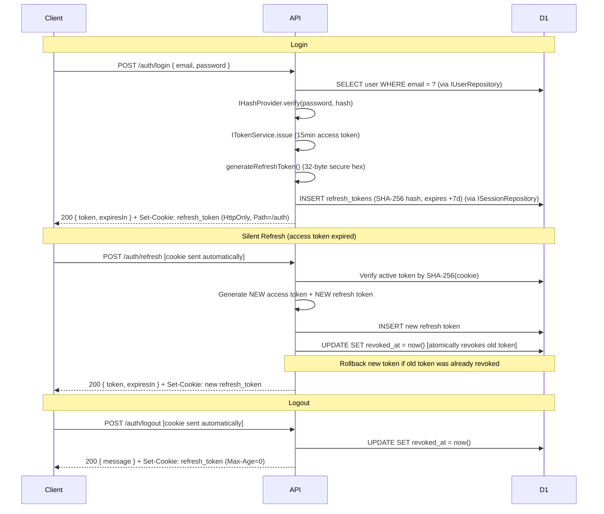

# Security Stack

## JWT Authentication

The internal API uses **JSON Web Tokens** signed with HMAC-SHA256 (`HS256`). Token issuance and verification are handled by `ITokenService` (implemented by `JoseTokenService` using the `jose` library — the only file in the project that imports jose). The middleware in `apps/api/src/middleware/auth.middleware.ts` intercepts every protected request:

```typescript
// apps/api/src/middleware/auth.middleware.ts
export function authMiddleware() {
  return async (c: Context<{ Bindings: Env; Variables: Variables }>, next: Next): Promise<Response | void> => {
    const authHeader = c.req.header('Authorization')
    if (!authHeader || !authHeader.startsWith('Bearer ')) {
      throw new HTTPException(401, { res: unauthorizedResponse() })
    }

    const token = authHeader.slice(7)
    if (!token) {
      throw new HTTPException(401, { res: unauthorizedResponse() })
    }

    const claims = await c.get('tokenService').verify(token)
    if (!claims) {
      throw new HTTPException(401, { res: unauthorizedResponse() })
    }

    c.set('jwtPayload', claims)
    await next()
  }
}
```

`ITokenService.verify()` returns `null` on any failure (expired, wrong signature, malformed) — it never throws. The concrete `JoseTokenService` enforces `typ: JWT` in the protected header and locks the algorithm to `HS256`. Both the secret and issuer/audience options are injected at startup via `authProvidersMiddleware`.

Access tokens have a **15-minute TTL** (900 seconds). They are stored **in-memory only** (`_accessToken` module variable in `apps/dashboard/src/lib/api.ts`) — never in `localStorage` or `sessionStorage`. The short TTL minimizes the attack window if a token is intercepted.

**Token payload shape:**

```typescript
export interface JwtClaims {
  sub: string;     // User ID (UUID)
  email?: string;
  name?: string;
  surname?: string;
  role?: string;
  [key: string]: unknown;
}
```

---

## Refresh Token Rotation

Beech implements **single-use refresh token rotation**. The protocol generates new tokens before revoking the previous token to avoid lockout during transient persistence issues:



**Parallel request protection:** Only the first concurrent refresh request succeeds. If a second request presents an already-revoked token, the server detects token replay, revokes the newly issued token, and returns `401 Invalid refresh token`.

Refresh tokens are stored **hashed** (SHA-256) in D1. Plaintext tokens never persist beyond the HTTP `Set-Cookie` header.

```sql
-- apps/api/migrations/0000_v040_base.sql
CREATE TABLE IF NOT EXISTS refresh_tokens (
    id          TEXT    NOT NULL PRIMARY KEY,
    user_id     TEXT    NOT NULL REFERENCES users(id) ON DELETE CASCADE,
    token_hash  TEXT    NOT NULL,
    expires_at  INTEGER NOT NULL,
    created_at  INTEGER NOT NULL DEFAULT (unixepoch()),
    revoked_at  INTEGER DEFAULT NULL
);

CREATE INDEX IF NOT EXISTS idx_refresh_user    ON refresh_tokens(user_id);
CREATE INDEX IF NOT EXISTS idx_refresh_hash    ON refresh_tokens(token_hash);
CREATE INDEX IF NOT EXISTS idx_refresh_expires ON refresh_tokens(expires_at);
```

**Cleanup:** Expired and revoked tokens should be purged periodically (e.g., via a Cloudflare Workers Cron Trigger):

```sql
DELETE FROM refresh_tokens WHERE expires_at < unixepoch() OR revoked_at IS NOT NULL;
```

---

## Security Hardening Summary

| Measure | Implementation |
|---|---|
| Password hashing | bcrypt, 10 salt rounds via `IHashProvider` (`BcryptHashProvider`) — passwords never stored in plaintext |
| Timing attack prevention | `IHashProvider.verify` always runs against a dummy hash when the user does not exist (`DUMMY_PASSWORD_HASH`) |
| SQL injection prevention | All D1 queries use `.prepare(...).bind(...)` prepared statements — no string interpolation |
| User enumeration prevention | Returns identical `401 Invalid credentials` whether the user is not found or the password does not match |
| Token storage | Refresh token: `HttpOnly`, `Secure`, `SameSite=Strict`, `Path=/auth` cookie. Access token: in-memory only (`_accessToken` in dashboard client) |
| JWT hardening | Algorithm locked to `HS256`; `typ: JWT` stamped in header |
| Short-lived access tokens | 15-minute TTL reduces the attack window |
| Rate limiting (login) | Dual-Key Token Bucket: IP bucket (capacity 10, refill 0.2/s) + Account bucket (capacity 5, refill 0.1/s) via in-engine `TokenBucketRateLimiter` |
| Rate limiting (refresh) | Token Bucket: IP bucket (capacity 20, refill 0.5/s) |
| Production error masking | Auth route errors catch 500s via `handleAuthError` and return `"An error occurred"`, hiding system details in production |
