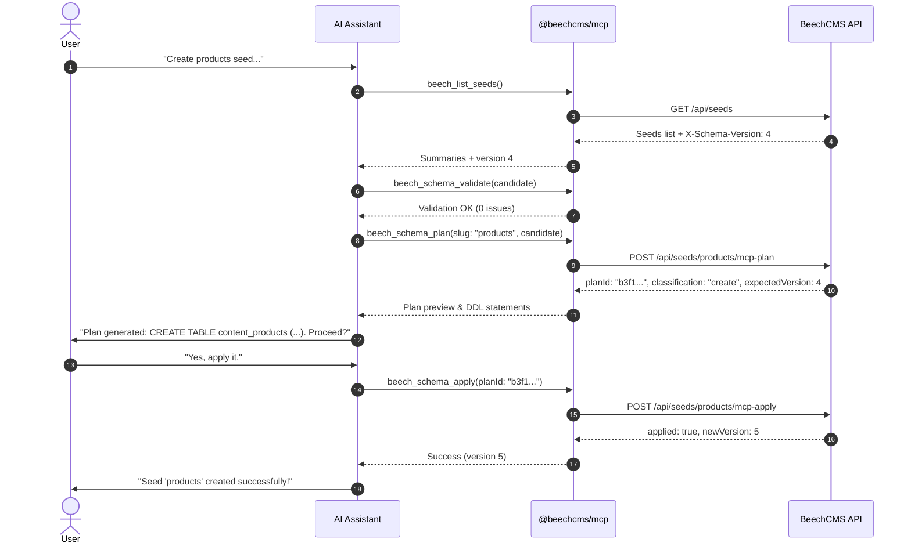

# AI & MCP Setup

BeechCMS includes a native **AI Control Plane** implemented as a Model Context Protocol (MCP) server (`@beechcms/mcp`). It enables AI coding assistants—including **Claude Desktop**, **Cursor**, **Antigravity**, and **VSCode**—to inspect your content models, validate definitions, plan migrations, and apply additive schema changes directly through the **Botanical Engine**.

---

## Why an AI Control Plane?

In BeechCMS, Cloudflare D1 is the sole runtime authority for schemas: there are no static `seeds.ts` configuration files to edit and manual SQL is prohibited.

Rather than giving AI agents raw database access or asking them to invent migrations, `@beechcms/mcp` connects agents directly to the BeechCMS Admin API over the standard **Stdio** transport:

- **Zero Database Exposure**: The MCP server never connects directly to Cloudflare D1 or SQLite. Every operation passes through API authentication and the Botanical Engine.
- **Server-Computed Plans**: Migration DDL is planned against the *physical* columns of your database (`PRAGMA table_info`), not inferred from local code.
- **Strict Additive Safety**: The MCP server strictly forbids destructive operations (dropping columns, changing field types, or deleting seeds). Destructive intent is caught early and rejected with pointers to dedicated admin endpoints.
- **Optimistic Concurrency Control (OCC)**: Every plan is tied to a schema version token (`registry_version`). Concurrent schema edits are detected atomically, preventing race conditions between multiple developers or agents.

---

## 1. Prerequisites

Before connecting an MCP client:

1. **Dependencies Installed**: Install workspace dependencies from the root of your BeechCMS project or monorepo:
   <PackageManagerTabs
     npm="npm install"
     pnpm="pnpm install"
     yarn="yarn install"
     bun="bun install"
   />
2. **Local Stack Running**: Ensure your local BeechCMS development server is active:
   ```bash
   pnpm beech dev
   # API running at http://localhost:8787 (or http://localhost:8789 depending on your port configuration)
   ```
3. **Admin Account**: You need credentials for an account with the `admin` role (created during onboarding or initial setup).

---

## 2. Build the MCP Server

From the root of your BeechCMS project or monorepo:

```bash
pnpm --filter @beechcms/mcp build
```

This compiles the TypeScript source and packages a Node.js ESM executable at `packages/mcp/dist/index.js`. The build uses `esbuild --packages=external`, so dependencies (`@modelcontextprotocol/sdk`, `@beechcms/core`) are **not** inlined into the bundle — `node_modules` must stay installed (step 1) for `node dist/index.js` to run.

---

## 3. Configure Your AI Client

Add the BeechCMS MCP server to your AI client configuration.

### Claude Desktop

Edit your `claude_desktop_config.json`:
- **macOS**: `~/Library/Application Support/Claude/claude_desktop_config.json`
- **Windows**: `%APPDATA%\Claude\claude_desktop_config.json`

```json
{
  "mcpServers": {
    "beechcms": {
      "command": "node",
      "args": ["/ABSOLUTE/PATH/TO/packages/mcp/dist/index.js"],
      "env": {
        "BEECH_API_URL": "http://localhost:8787"
      }
    }
  }
}
```

### Cursor

In Cursor, open **Settings > Features > MCP**, click **Add New MCP Server**, or configure `.cursor/mcp.json`:

```json
{
  "mcpServers": {
    "beechcms": {
      "command": "node",
      "args": ["/ABSOLUTE/PATH/TO/packages/mcp/dist/index.js"],
      "env": {
        "BEECH_API_URL": "http://localhost:8787"
      }
    }
  }
}
```

### Environment Variables

| Variable | Required | Default | Description |
|---|---|---|---|
| `BEECH_API_URL` | Optional | `http://localhost:8787` | BeechCMS API base URL (token endpoint + REST API origin). If unset and a `.dev.vars` file exists in the working directory, the server reads `BEECH_API_URL` from it. |
| `BEECH_AUTH_URL` | Optional | `BEECH_API_URL` | Origin the browser opens for `/oauth/authorize`. Must be the **dashboard** origin in local dev. |
| `BEECH_OAUTH_CLIENT_ID` | Optional | `beech-mcp` | Must match the registered OAuth client seeded in D1 (`apps/api/migrations/0000_v040_base.sql`). |
| `BEECH_OAUTH_SCOPE` | Optional | `schema:read schema:write` | Set to `schema:read` for a read-only agent. |
| `BEECH_OAUTH_TIMEOUT_MS` | Optional | `180000` | Browser round-trip budget, in milliseconds. |
| `BEECH_TOKEN_CACHE` | Optional | `~/.beechcms/mcp-tokens.json` | Cache override (tests, containers). |

> [!NOTE]
> The MCP server authenticates via the OAuth 2.1 authorization-code flow with PKCE, not a password. On first use it opens your system browser to `/oauth/authorize`; after you log in and approve the consent screen, the server exchanges the code for a short-lived access token and a refresh token, cached at `~/.beechcms/mcp-tokens.json` (mode `0600`). Later tool calls silently reuse or refresh that token. Revoke access any time from **Settings → Connected apps** in the dashboard — the next tool call re-opens the browser to re-authorize.

> [!NOTE]
> **Local dev**: the dashboard runs on Vite (`:5173`) while the API runs on `wrangler dev --port 8789`. Set `BEECH_AUTH_URL=http://localhost:5173` alongside `BEECH_API_URL=http://127.0.0.1:8789` — the Worker cannot serve the consent screen itself in dev.

### Troubleshooting

| Symptom | Cause |
|---|---|
| `400 invalid_client` | OAuth client seed (`beech-mcp`) not present in D1 — run `pnpm beech db:migrate` to apply the base migration. |
| `403 insufficient_scope` | Cached token is narrower than the tool needs — revoke and re-authorize with a wider `BEECH_OAUTH_SCOPE`. |
| Authorization timed out | Browser consent was not completed within `BEECH_OAUTH_TIMEOUT_MS` — re-run the tool. |

---

## 4. Install the Agent Skill

BeechCMS distributes an agent skill rule file (`SKILL.md`) located at:
```text
packages/mcp/SKILL.md
```

You can copy this into your project instructions (e.g., `.cursorrules`, `CLAUDE.md`, or your agent's system prompt) to teach your AI assistant the mandatory 4-step workflow:

```text
1. Inspect:   beech_list_seeds, beech_get_seed
2. Validate:  beech_schema_validate
3. Plan:      beech_schema_plan
4. Apply:     beech_schema_apply
```

---

## 5. Walkthrough: Interactive Schema Creation

Once configured, start a conversation with your AI assistant. Here is an example exchange:

### Prompt

> "Inspect our current seeds. Then create a new `products` seed with fields for `title` (text, required), `sku` (text), `price` (number), and `description` (richtext)."

### Agent Actions Under the Hood



1. **Inspect**: The agent calls `beech_list_seeds` to check for existing seeds and fetch the current `schemaVersion`.
2. **Validate**: The agent calls `beech_schema_validate` to verify relations, naming rules, and structure in `@beechcms/core`.
3. **Plan**: The agent calls `beech_schema_plan`. The API checks the physical database and returns exact DDL statements, safety classification (`create`), and a 10-minute temporary `planId`.
4. **Apply**: With confirmation, the agent invokes `beech_schema_apply({ planId })`. The API atomically executes the CAS guard, DDL, seed definition upsert, and version bump in a single `db.batch()`.

---

## 6. Safety & Guard Rails

- **Single-Use Plans**: Every `planId` can only be applied once and expires after 10 minutes.
- **Destructive Intent Blocked**: If an agent attempts to drop a branch or change a field type, `beech_schema_apply` immediately refuses with explicit reasons, instructing the user to use dedicated administrative endpoints.
- **Concurrent Drift Protection**: If another user or agent updates the schema while the assistant is planning, the apply call will fail with `409 Conflict`, prompting the assistant to re-plan against the latest schema.

---

## Next Steps

- Explore the complete [MCP Server Reference](/reference/mcp-server) for tool schemas, error tables, and architecture details.
- Read more about [Schema Modeling & Evolution](/build/schema-modeling).
- Check the [Seed Builder API](/reference/seed-builder) for raw REST endpoint documentation.
