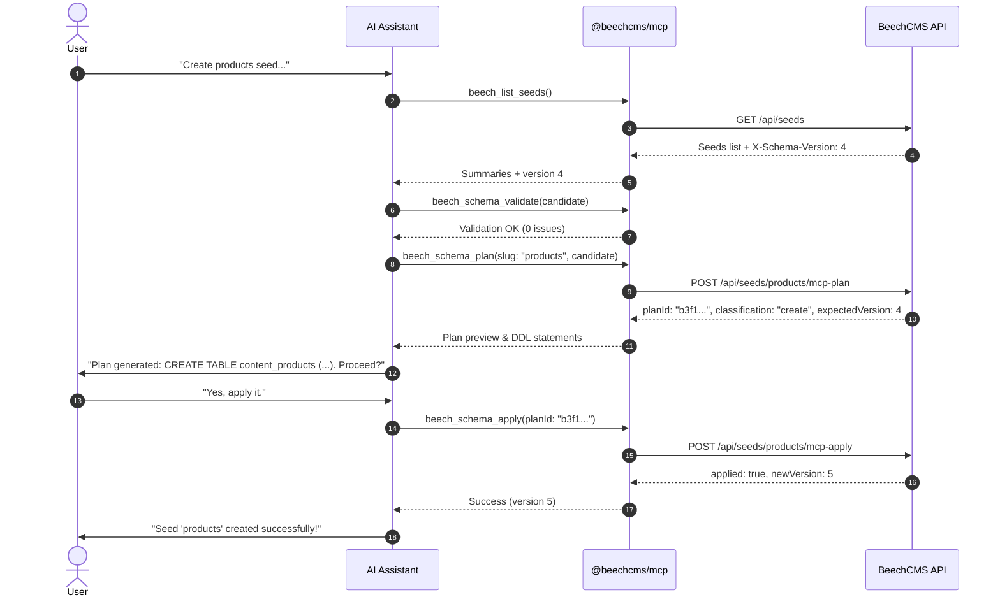

# AI & MCP Setup

BeechCMS includes a native **AI Control Plane** implemented as a Model Context Protocol (MCP) server (`@beechcms/mcp`). It enables AI coding assistants—including **Claude Desktop**, **Cursor**, **Antigravity**, and **VSCode**—to inspect your content models, validate definitions, plan migrations, and apply additive schema changes directly through the **Botanical Engine**.

---

## Why an AI Control Plane?

In BeechCMS, Cloudflare D1 is the sole runtime authority for schemas: there are no static `seeds.ts` configuration files to edit and manual SQL is prohibited.

Rather than giving AI agents raw database access or asking them to invent migrations, `@beechcms/mcp` connects agents directly to the BeechCMS Admin API over the standard **Stdio** transport:

- **Zero Database Exposure**: The MCP server never connects directly to Cloudflare D1 or SQLite. Every operation passes through API authentication and the Botanical Engine.
- **Server-Computed Plans**: Migration DDL is planned against the *physical* columns of your database (`PRAGMA table_info`), not inferred from local code.
- **Strict Additive Safety**: The MCP server strictly forbids destructive operations (dropping columns, changing field types, or deleting seeds). Destructive intent is caught early and rejected with pointers to dedicated admin endpoints.
- **Optimistic Concurrency Control (OCC)**: Every plan is tied to a schema version token (`registry_version`). Concurrent schema edits are detected atomically, preventing race conditions between multiple developers or agents.

---

## 1. Prerequisites

Before connecting an MCP client:

1. **Local Stack Running**: Ensure your local BeechCMS development server is active:
   ```bash
   pnpm beech dev
   # API running at http://localhost:8787 (or http://localhost:8789 depending on your port configuration)
   ```
2. **Admin Account**: You need credentials for an account with the `admin` role (created during onboarding or initial setup).

---

## 2. Build the MCP Server

From the root of your BeechCMS project or monorepo:

```bash
pnpm --filter @beechcms/mcp build
```

This compiles the TypeScript source and packages a self-contained Node.js ESM executable at `packages/mcp/dist/index.js`.

---

## 3. Configure Your AI Client

Add the BeechCMS MCP server to your AI client configuration.

### Claude Desktop

Edit your `claude_desktop_config.json`:
- **macOS**: `~/Library/Application Support/Claude/claude_desktop_config.json`
- **Windows**: `%APPDATA%\Claude\claude_desktop_config.json`

```json
{
  "mcpServers": {
    "beechcms": {
      "command": "node",
      "args": ["/ABSOLUTE/PATH/TO/packages/mcp/dist/index.js"],
      "env": {
        "BEECH_API_URL": "http://localhost:8787",
        "BEECH_EMAIL": "admin@example.com",
        "BEECH_PASSWORD": "your-admin-password"
      }
    }
  }
}
```

### Cursor

In Cursor, open **Settings > Features > MCP**, click **Add New MCP Server**, or configure `.cursor/mcp.json`:

```json
{
  "mcpServers": {
    "beechcms": {
      "command": "node",
      "args": ["/ABSOLUTE/PATH/TO/packages/mcp/dist/index.js"],
      "env": {
        "BEECH_API_URL": "http://localhost:8787",
        "BEECH_EMAIL": "admin@example.com",
        "BEECH_PASSWORD": "your-admin-password"
      }
    }
  }
}
```

### Environment Variables

| Variable | Required | Default | Description |
|---|---|---|---|
| `BEECH_API_URL` | Optional | `http://localhost:8787` | BeechCMS API base URL. If unset and a `.dev.vars` file exists in the working directory, the server reads `BEECH_API_URL` from it. |
| `BEECH_EMAIL` | **Yes** | — | Administrator email account. |
| `BEECH_PASSWORD` | **Yes** | — | Administrator password. |

> [!NOTE]
> The MCP server authenticates via `POST /auth/login` and receives a 15-minute JWT. It automatically handles token refreshing on 401 responses. Because schema endpoints are admin-protected, the credentials must belong to a user with role `admin`.

---

## 4. Install the Agent Skill

BeechCMS distributes an agent skill rule file (`SKILL.md`) located at:
```text
packages/mcp/SKILL.md
```

You can copy this into your project instructions (e.g., `.cursorrules`, `CLAUDE.md`, or your agent's system prompt) to teach your AI assistant the mandatory 4-step workflow:

```text
1. Inspect:   beech_list_seeds, beech_get_seed
2. Validate:  beech_schema_validate
3. Plan:      beech_schema_plan
4. Apply:     beech_schema_apply
```

---

## 5. Walkthrough: Interactive Schema Creation

Once configured, start a conversation with your AI assistant. Here is an example exchange:

### Prompt

> "Inspect our current seeds. Then create a new `products` seed with fields for `title` (text, required), `sku` (text), `price` (number), and `description` (richtext)."

### Agent Actions Under the Hood



1. **Inspect**: The agent calls `beech_list_seeds` to check for existing seeds and fetch the current `schemaVersion`.
2. **Validate**: The agent calls `beech_schema_validate` to verify relations, naming rules, and structure in `@beechcms/core`.
3. **Plan**: The agent calls `beech_schema_plan`. The API checks the physical database and returns exact DDL statements, safety classification (`create`), and a 10-minute temporary `planId`.
4. **Apply**: With confirmation, the agent invokes `beech_schema_apply({ planId })`. The API atomically executes the CAS guard, DDL, seed definition upsert, and version bump in a single `db.batch()`.

---

## 6. Safety & Guard Rails

- **Single-Use Plans**: Every `planId` can only be applied once and expires after 10 minutes.
- **Destructive Intent Blocked**: If an agent attempts to drop a branch or change a field type, `beech_schema_apply` immediately refuses with explicit reasons, instructing the user to use dedicated administrative endpoints.
- **Concurrent Drift Protection**: If another user or agent updates the schema while the assistant is planning, the apply call will fail with `409 Conflict`, prompting the assistant to re-plan against the latest schema.

---

## Next Steps

- Explore the complete [MCP Server Reference](/reference/mcp-server) for tool schemas, error tables, and architecture details.
- Read more about [Schema Modeling & Evolution](/build/schema-modeling).
- Check the [Seed Builder API](/reference/seed-builder) for raw REST endpoint documentation.
