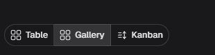
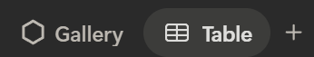
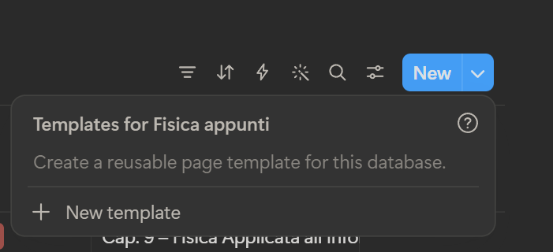
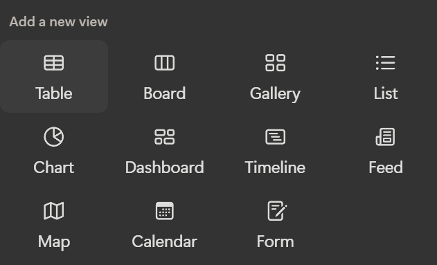

ok allora dobbiamo rivedere il sistema delle viste  , ora  vengono trattte come 3 possibilità distinte ma da oggi non sarà piu cosi . ogni seme è una tabella SQL che può essere interpretata in  n possibli liste . nei semi saremo ancora in grado di definire quali viste sono possibili e quali  no nel caos in cui l autore del seme non voglia lasicare la liberta di creare una vista .

da oggi sarà possibili creare tante più viste e l auttale sistema table gallery kanban viene elevato a TIPO DI VISTA . quindi ogni tipo di vsta può avere 1 o più viste se autorizzate dal seme e ciò che le caratterizza e che ogni vista può salvare la sua configurazioene di filtri ragruppamento e aspetto . La toolbar diventa universale a cambiare sono le voci delle impostazioni della toolbar che conteranno anche opzioni specifiche per TIPO DI VISTA. 

MODIFICHE ALLA GALLERY:
La gallery è l unico tipo di vista a non usare totalmente l entry editor come le alttre da oggi si passa all entry editor pure qui 

TOOLBAR:
 QUesto è l atuale sistema di switch delle viste che da oggi assomigleirà a  dove il titolo sarà personalzizabile (nelle impostazioni della vista) e il piu comparira quando si fa over . restera in linea con i tasti funzione della toolbar e parladno di toolbar il tastto new adesso avra anche un sotto menu per selezionare dei template per i nuovi entry. ma sara No OP per ora (assomigliera a questo )

NUOVE VISTE :
 prepareremo un harness per introdurre viste che ci faciliterà di gran lunga il lavoro . un interfaccia tra la tabella SQL , le funzioni della toolbar e la vista. Per ora le viste saranno No OP . ma harness servirà a facilitare la creazioni di nuove viste e va integrata nelle viste esistenti fornirà tutto il necesario per accedere alle proprietà di una vista generica una vista generica contiene  un seme (quindi la il sisema per effeuare operazioni sql integrato e in beech va solo reso "chiamabile" / interfaccizzato / forse e già un interfaccia e deve solo essere un ponte per collegare il seme alla visa ) un elemento che è il sistema di rappresentanza di un qualsiasi dato possiamo dire nella tabella è la row nella gallery e nella kanban è la card . in ogni scenario l elemento condivide ed espone delle proprietà per semplificare eventuali operazioni di visualizzazione per esempio i colori condizionali o la visibilità  degli elementi e via dicnedo .

le viste lavorano idealmente nello stesso spazio e nessuna può sconfinare nel layout rispetto alle altre quindi stessa griglia generale per tutte cosi da garantire lo stesso margine dal menu e dalla finestra e poi quello che succede dentro sta alla vista.